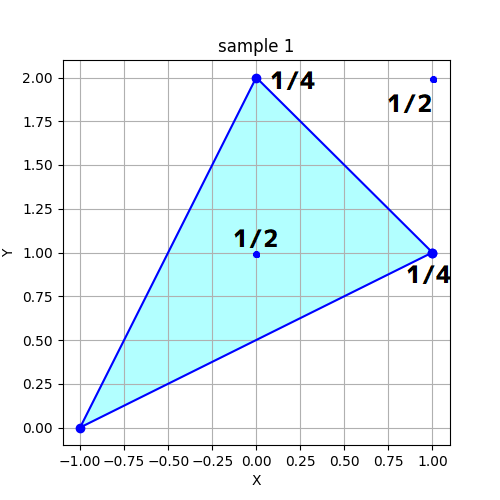
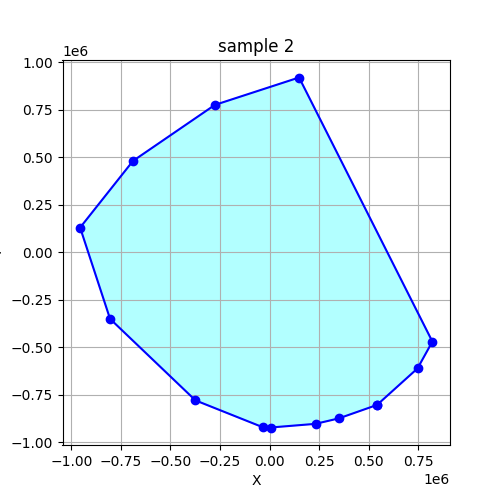

## 문제 설명

$2$차원 유클리드 공간 위에 $N$개의 꼭짓점을 가진 볼록 다각형 $P$가 주어집니다. $P$의 꼭짓점에는 $1,2,\cdots,N$의 번호가 붙어 있습니다. 꼭짓점 $i$ $(1\le i\le N)$는 좌표 $(X_i,Y_i)$에 있으며, $P$의 변은 꼭짓점 $i$와 꼭짓점 $i+1$을 잇는 $N$개의 선분입니다. 단, 꼭짓점 $N+1$은 꼭짓점 $1$을 나타냅니다.

$0$ 이상 $1$ 미만의 실수를 균등하게 $2$개 뽑아 $p,q$라고 합니다. $P$에 포함되는 모든 점을 $(p,q)$만큼 평행 이동한 다각형

$Q = \{(x+p,y+q)\mid (x,y)\in P\}$

의 내부에 포함되는 격자점 개수의 기댓값을 법 $998\,244\,353$에서의 값으로 구하세요.

구하는 기댓값은 항상 유리수가 된다는 것이 증명됩니다. 또한 이 문제의 제한 아래에서는 그 값을 서로소인 양의 정수 $P,Q$로 나타낸 기약분수 $\frac{P}{Q}$에 대해 $Q\not\equiv 0\pmod{998\,244\,353}$임을 증명할 수 있습니다.

이때 $R\times Q\equiv P\pmod{998\,244\,353}$이고 $0\le R<998\,244\,353$를 만족하는 정수 $R$이 유일하게 정해지므로, 이 $R$을 출력하세요.

## 입력

```text
$N$
$X_1\ Y_1$
$\vdots$
$X_N\ Y_N$
```

## 제한

- 입력은 모두 정수입니다.
- $3\le N\le 100$
- $P$는 볼록 다각형입니다.
- $P$의 넓이는 양수입니다.
- $-10^6\le X_i,Y_i\le 10^6$
- $(X_1,Y_1),\cdots,(X_N,Y_N)$은 $x$축의 양의 방향을 오른쪽, $y$축의 양의 방향을 위쪽으로 할 때 $P$의 꼭짓점을 반시계 방향으로 나열한 것입니다.
- $(X_i,Y_i),(X_{i+1},Y_{i+1}),(X_{i+2},Y_{i+2})$는 일직선 위에 있지 않습니다. 단, $(X_{N+1},Y_{N+1})$은 $(X_1,Y_1)$을, $(X_{N+2},Y_{N+2})$는 $(X_2,Y_2)$를 나타냅니다. $(1\le i\le N)$

## 출력

답을 출력하세요.

## 예제

### 예제 1 {file=""}

#### 입력

```text
3
1 1
0 2
-1 0
```

#### 출력

```text
499122178
```

다각형 $P$는 다음과 같습니다.



이 예제 설명에서는 평행 이동량 $p,q$를 각각 $a,b$로 나타냅니다.

다각형 $Q$의 내부에 포함될 확률이 양수인 격자점은 다음 $4$개입니다.

- $(0,1)$: $Q$의 내부에 포함되기 위한 필요충분조건은 $0\le a,b<1$, $2a-1<b<\frac{a}{2}+\frac{1}{2}$이며, 확률은 $\frac{1}{2}$입니다.
- $(0,2)$: $Q$의 내부에 포함되기 위한 필요충분조건은 $0\le a<\frac{b}{2}<1$이며, 확률은 $\frac{1}{4}$입니다.
- $(1,1)$: $Q$의 내부에 포함되기 위한 필요충분조건은 $0\le b<\frac{a}{2}<1$이며, 확률은 $\frac{1}{4}$입니다.
- $(1,2)$: $Q$의 내부에 포함되기 위한 필요충분조건은 $0\le a,b<1$, $1<a+b$이며, 확률은 $\frac{1}{2}$입니다.

따라서 $Q$의 내부에 포함되는 격자점 개수의 기댓값은 $\frac{3}{2}$입니다. $2\times499\,122\,178\equiv3\pmod{998\,244\,353}$이므로 $499\,122\,178$을 출력합니다.

### 예제 2 {file=""}

#### 입력

```text
13
541787 -802804
745984 -610628
821010 -469321
148557 920322
-276352 776016
-689247 481241
-955894 130548
-804935 -349606
-374167 -778760
-33915 -920255
5303 -921478
231589 -902268
348969 -873524
```

#### 출력

```text
68155167
```

다각형 $P$는 다음과 같습니다.


