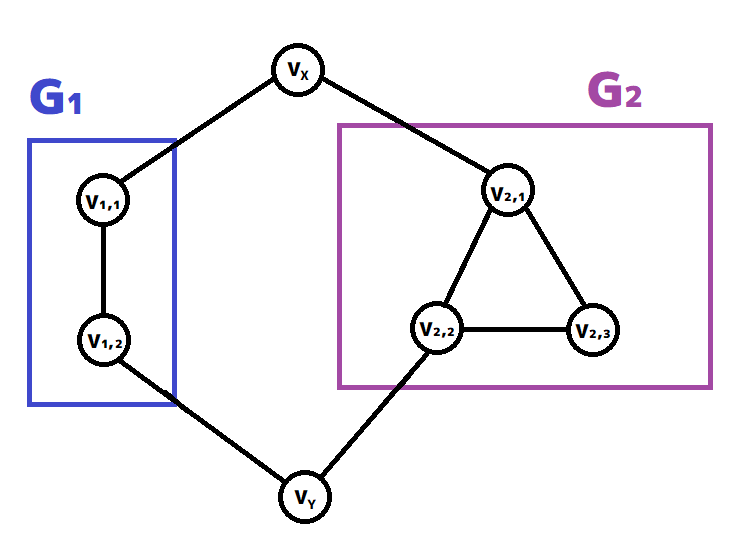

이 문제의 실행 시간 제한은 $5.000$초입니다.

## 문제 설명

$K$개의 연결 단순 무향 그래프 $G_1,G_2,\ldots,G_K$가 주어집니다. 각 그래프 $G_i$에는 $N_i$개의 정점과 $M_i$개의 간선이 있으며, 정점에는 각각 $V_{i,1},V_{i,2},\ldots,V_{i,N_i}$라는 번호가 붙어 있습니다. 그래프 $G_i$의 $j$번째 간선은 정점 $V_{i,A_{i,j}}$와 $V_{i,B_{i,j}}$를 연결합니다.

다음과 같이 연결 무향 그래프 $G$를 만듭니다.

1. $G$의 정점은 $V_X$, $V_Y$, $V_{i,j}\ (1\leq i\leq K,\ 1\leq j\leq N_i)$이며, 총 $2+\sum_{i=1}^K N_i$개입니다.
2. 모든 $1\leq i\leq K$에 대해 그래프 $G_i$에 포함된 $M_i$개의 간선을 그래프 $G$에 모두 추가합니다.
3. 모든 $1\leq i\leq K$에 대해 $V_X$와 $V_{i,1}$ 사이, $V_Y$와 $V_{i,2}$ 사이에 간선을 추가합니다.

$G$의 **스패닝 트리 개수**를 $998\,244\,353$으로 나눈 나머지를 구하세요.

## 입력

입력은 다음 형식으로 주어집니다.

```text
$K$
$\text{graph}_1$
$\text{graph}_2$
$\vdots$
$\text{graph}_K$
```

$\text{graph}_i$는 그래프 $G_i$의 입력을 나타내며, 다음 형식으로 주어집니다.

```text
$N_i\ M_i$
$A_{i,1}\ B_{i,1}$
$A_{i,2}\ B_{i,2}$
$\vdots$
$A_{i,M_i}\ B_{i,M_i}$
```

## 제한

- 입력은 모두 정수입니다.
- $2\leq K\leq210$
- 그래프 $G_i$는 연결되어 있습니다.
- 그래프 $G_i$는 단순합니다. 즉, 자기 루프나 다중 간선을 포함하지 않습니다.
- $2\leq N_i\leq60$
- $1\leq M_i\leq\frac{N_i(N_i-1)}{2}$
- $1\leq A_{i,j}<B_{i,j}\leq N_i$

## 출력

답을 출력하세요.

## 예제

### 예제 1 {file=""}

#### 입력

```text
2
2 1
1 2
3 3
1 2
2 3
1 3
```

#### 출력

```text
17
```

입력은 다음과 같이 해석합니다.

- $1$번째 줄의 `2`는 $K$의 값을 나타냅니다.
- $2$번째 줄의 `2 1`은 그래프 $G_1$의 정점 수가 $2$, 간선 수가 $1$임을 나타냅니다.
- $3$번째 줄의 `1 2`는 그래프 $G_1$에서 정점 $V_{1,1}$과 $V_{1,2}$ 사이에 간선이 있음을 나타냅니다.
- $4$번째 줄의 `3 3`은 그래프 $G_2$의 정점 수가 $3$, 간선 수가 $3$임을 나타냅니다.
- $5$번째 줄의 `1 2`는 그래프 $G_2$에서 정점 $V_{2,1}$과 $V_{2,2}$ 사이에 간선이 있음을 나타냅니다.
- $6$번째 줄의 `2 3`은 그래프 $G_2$에서 정점 $V_{2,2}$와 $V_{2,3}$ 사이에 간선이 있음을 나타냅니다.
- $7$번째 줄의 `1 3`은 그래프 $G_2$에서 정점 $V_{2,1}$과 $V_{2,3}$ 사이에 간선이 있음을 나타냅니다.

그래프 $G$는 다음과 같습니다.



이 그래프의 스패닝 트리 개수는 총 $17$개이므로 $17$을 출력합니다.

### 예제 2 {file=""}

#### 입력

```text
4
7 13
1 5
2 7
3 4
5 6
1 2
3 7
2 5
1 3
3 5
4 5
5 7
2 3
1 4
7 17
2 5
2 3
2 7
1 2
3 6
3 4
5 6
3 7
1 3
2 6
2 4
1 5
3 5
1 4
6 7
1 6
5 7
4 3
3 4
2 4
1 3
5 8
1 3
2 3
2 4
1 5
3 5
3 4
1 4
4 5
```

#### 출력

```text
469335995
```
