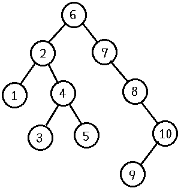

## 문제 설명

$1$부터 $N$까지의 수를 $1$개씩 포함하는 길이 $N$의 수열 $A$를 사용하여 이진 탐색 트리를 구축합니다.

수열 $A$의 $i$번째 원소를 $A_i$라고 합니다. $(1\le i\le N)$

이진 탐색 트리는 다음과 같이 구축합니다.

- $A_1$을 이진 탐색 트리의 루트 노드로 만듭니다.
- $i=2$부터 $i=N$까지 $i$의 오름차순으로 $A_i$를 다음과 같이 이진 탐색 트리에 배치합니다.
  1. 이진 탐색 트리의 루트 노드를 현재 노드로 합니다.
  2. $A_i$가 현재 노드의 값보다 작을 때, 현재 노드의 왼쪽 자식이 존재하면 왼쪽 자식을 현재 노드로 합니다. 왼쪽 자식이 존재하지 않으면 $A_i$를 왼쪽 자식으로 배치합니다. $A_i$가 현재 노드의 값보다 클 때, 현재 노드의 오른쪽 자식이 존재하면 오른쪽 자식을 현재 노드로 합니다. 오른쪽 자식이 존재하지 않으면 $A_i$를 오른쪽 자식으로 배치합니다.
  3. $A_i$의 배치 위치가 정해질 때까지 위 $2$번 단계를 반복합니다.

구축이 완료된 이진 탐색 트리에서 $A_i$가 배치된 노드의 깊이를 $B_i$, 그 자손 수를 $C_i$라고 합니다.

수열 $A$에 대응하는 깊이의 수열 $B$와 자손 수의 수열 $C$를 구하세요.

깊이는 루트 노드에서 대상 노드까지의 간선 수를 의미합니다. 루트 노드의 깊이는 $0$입니다.

## 입력

```text
$N$
$A_1\ A_2\ A_3\ \cdots\ A_{N-1}\ A_N$
```

$1$번째 줄에 수열 $A$의 길이 $N$이 주어집니다. $2$번째 줄에 수열의 각 원소 $A_i$가 공백으로 구분되어 주어집니다.

## 제한

- $10\le N\le 200\,000=2\times 10^5$
- $1\le A_i\le N\ (1\le i\le N)$
- $i\ne j$일 때 $A_i\ne A_j\ (1\le i,j\le N)$

## 출력

```text
$B_1\ B_2\ B_3\ \cdots\ B_{N-1}\ B_N$
$C_1\ C_2\ C_3\ \cdots\ C_{N-1}\ C_N$
```

$1$번째 줄에 깊이의 수열 $B$를, $2$번째 줄에 자손 수의 수열 $C$를 각각 공백으로 구분하여 출력하세요.

마지막에 줄바꿈을 출력하세요.

## 예제

### 예제 1 {file=""}

#### 입력

```text
10
6 2 4 7 5 8 10 1 9 3
```

#### 출력

```text
0 1 2 1 3 2 3 2 4 3
9 4 2 3 0 2 1 0 0 0
```

이진 탐색 트리는 다음 그림과 같이 구축됩니다.



### 예제 2 {file=""}

#### 입력

```text
10
10 9 8 7 6 5 4 3 2 1
```

#### 출력

```text
0 1 2 3 4 5 6 7 8 9
9 8 7 6 5 4 3 2 1 0
```

### 예제 3 {file=""}

#### 입력

```text
10
5 6 4 7 3 8 2 9 1 10
```

#### 출력

```text
0 1 1 2 2 3 3 4 4 5
9 4 3 3 2 2 1 1 0 0
```

### 예제 4 {file=""}

#### 입력

```text
20
10 7 4 9 16 6 13 15 18 17 3 8 2 20 19 14 12 5 1 11
```

#### 출력

```text
0 1 2 2 1 3 2 3 2 3 3 3 4 3 4 4 3 4 5 4
19 8 5 1 9 1 4 1 3 0 2 0 1 1 0 0 1 0 0 0
```

### 예제 5 {file=""}

#### 입력

```text
20
10 5 15 3 7 13 17 1 4 6 9 11 14 16 19 2 8 12 18 20
```

#### 출력

```text
0 1 1 2 2 2 2 3 3 3 3 3 3 3 3 4 4 4 4 4
19 8 9 3 3 3 4 1 0 0 1 1 0 0 2 0 0 0 0 0
```
