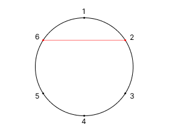
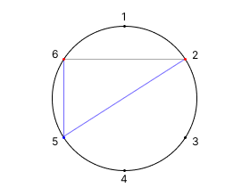
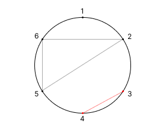
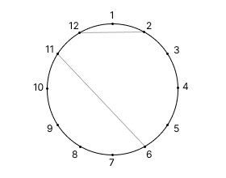

## 문제 설명

원주 위에 $N$개의 점이 같은 간격으로 놓여 있고, 시계 방향으로 $1$부터 $N$까지 번호가 매겨져 있습니다. 처음에 원주 위에는 $M$개의 현이 그어져 있으며, $i$번째 현은 점 $P_i$와 점 $Q_i$를 연결합니다. **이 현들 사이에는 교점이 존재하지 않는다고 보장됩니다.**

茜ちゃん과 葵ちゃん은 다음 순서로 게임을 합니다.

### 게임

게임이 끝날 때까지 다음 동작을 반복합니다. 게임이 끝났을 때 패배하지 않은 쪽이 승리합니다.

### 동작

다음 순서대로 행동합니다. 행동할 수 없으면 그 플레이어가 패배하고 즉시 게임이 끝납니다.

1. 茜ちゃん은 다음 조건을 모두 만족하는 $2$개의 점 $A$, $B$를 선택하고 현 $AB$를 긋습니다.

   - 점 $A$와 점 $B$는 모두 어떤 현의 끝점도 아닙니다.
   - 현 $AB$는 현재 존재하는 어떤 현과도 교차하지 않습니다.

2. 葵ちゃん은 다음 조건을 모두 만족하는 점 $C$를 선택하고 현 $AC$와 현 $BC$를 긋습니다.

   - 점 $C$는 어떤 현의 끝점도 아닙니다.
   - 현 $AC$와 현 $BC$는 현 $AB$를 제외한 현재 존재하는 어떤 현과도 교차하지 않습니다.

$2$명의 플레이어가 최선을 다했을 때 어느 쪽이 승리하는지 판정하세요.

## 입력

입력은 다음 형식으로 표준 입력에서 주어집니다.

```text
$N\ M$
$P_1\ Q_1$
$P_2\ Q_2$
$\vdots$
$P_M\ Q_M$
```

$1$번째 줄에 점의 개수 $N$과 처음에 그어진 현의 개수 $M$이 주어집니다. 다음 $M$개의 줄에 각 현의 양 끝점 $P_i$, $Q_i$가 주어집니다.

## 제한

- $3 \leq N \leq 10^6$
- $0 \leq M \leq \min\left(2 \times 10^5,\left\lfloor\frac{N}{2}\right\rfloor\right)$
- $1 \leq P_i,Q_i \leq N$ ($i=1,2,\ldots,M$)
- $P_1,P_2,\ldots,P_M,Q_1,Q_2,\ldots,Q_M$는 서로 다릅니다.
- 서로 다른 정수 $i$, $j$에 대해, 점 $P_i$와 점 $Q_i$를 연결하는 현과 점 $P_j$와 점 $Q_j$를 연결하는 현이 교차하는 경우는 존재하지 않습니다.
- 입력은 모두 정수입니다.

## 출력

$2$명의 플레이어가 최선을 다했을 때 茜ちゃん이 승리하면 `Akane`을, 葵ちゃん이 승리하면 `Aoi`를 출력하세요.

## 예제

### 예제 1 {file=""}

#### 입력

```text
6 0
```

#### 출력

```text
Akane
```

처음에는 현이 $1$개도 그어져 있지 않습니다.

예를 들어 다음과 같은 순서로 게임이 진행됩니다. 이 예에서는 $2$명의 플레이어가 최선을 다하고 있다고 할 수 없음에 주의하세요.

- 茜ちゃん이 점 $2$와 점 $6$을 선택하고, 이 $2$개의 점을 연결하는 현을 긋습니다.
- 葵ちゃん이 점 $5$를 선택하고, 점 $2$와 점 $5$, 점 $6$과 점 $5$를 각각 연결하는 현을 긋습니다.
- 茜ちゃん이 점 $3$과 점 $4$를 선택하고, 이 $2$개의 점을 연결하는 현을 긋습니다.
- 葵ちゃん은 선택할 수 있는 점이 존재하지 않습니다. 따라서 葵ちゃん이 게임에서 패배하고 茜ちゃん이 게임에서 승리합니다.



$\to$



$\to$



$2$명의 플레이어가 최선을 다했을 때 茜ちゃん이 승리함을 보일 수 있습니다.

### 예제 2 {file=""}

#### 입력

```text
12 2
2 12
11 6
```

#### 출력

```text
Aoi
```

처음에는 다음과 같은 도형이 되어 있습니다.



이때 葵ちゃん이 적절하게 행동하면 반드시 승리할 수 있습니다.

### 예제 3 {file=""}

#### 입력

```text
20 3
14 8
1 17
5 6
```

#### 출력

```text
Akane
```
