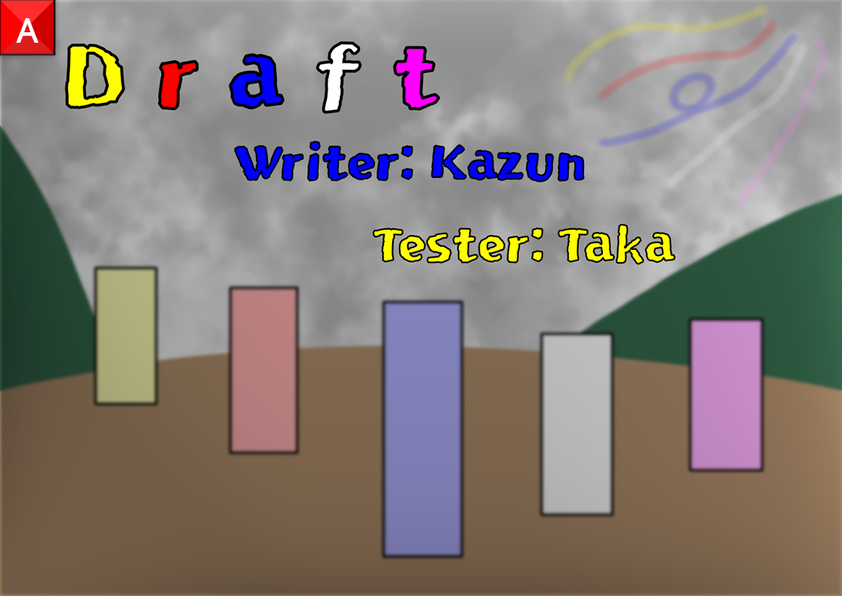

▶ 문제 비주얼을 공개합니다.



## 이야기

틈새바람에 의해 날아오른 재는 새로운 시작으로 향하는 문으로 이어져 갑니다...

## 문제 설명

$5$개의 모놀리스($1$덩어리의 바위 기둥)가 있습니다. 각 모놀리스의 높이는 $A$, $B$, $C$, $D$, $E$입니다.

이 $5$개 모놀리스 중 가장 높은 모놀리스의 높이를 $X$, 가장 낮은 모놀리스의 높이를 $Y$라고 할 때, 차이 $X-Y$를 구하세요.

**$T$개의 테스트 케이스에 대해 답하세요.**

## 입력

입력은 다음 형식으로 표준 입력에서 주어집니다.

```text
$T$
$\mathrm{Testcase}_1$
$\vdots$
$\mathrm{Testcase}_T$
```

각 테스트 케이스는 다음 형식입니다.

```text
$A\ B\ C\ D\ E$
```

## 제한

- $1 \leq T \leq 100$
- 각 테스트 케이스에 대해 다음 제한을 만족합니다.
  - $1 \leq A \leq 10^9$
  - $1 \leq B \leq 10^9$
  - $1 \leq C \leq 10^9$
  - $1 \leq D \leq 10^9$
  - $1 \leq E \leq 10^9$
- 입력은 모두 정수입니다.

## 출력

출력은 $T$줄입니다. $t$번째 줄($1 \leq t \leq T$)에 $t$번째 테스트 케이스에 대한 답을 정수로 $1$줄에 출력하세요.

마지막에 개행을 잊지 마세요.

## 예제

### 예제 1 {file="0_sample_1.txt"}

#### 입력

```text
3
158 172 161 159 154
1000 1000 5000 5000 5000
46 46 46 46 46
```

#### 출력

```text
18
4000
0
```

[$1$번째 테스트 케이스] $5$개 모놀리스의 높이는 $158$, $172$, $161$, $159$, $154$이므로 $X=172$, $Y=154$입니다. 따라서 $X-Y=172-154=18$입니다.

[$2$번째 테스트 케이스] $A$, $B$, $C$, $D$, $E$가 서로 다르다고 할 수는 없습니다.

[$3$번째 테스트 케이스] $A=B=C=D=E$일 수 있습니다. 이 경우 $X$, $Y$는 모두 $A(=B=C=D=E)$이므로 $X-Y=A-A=0$입니다.
