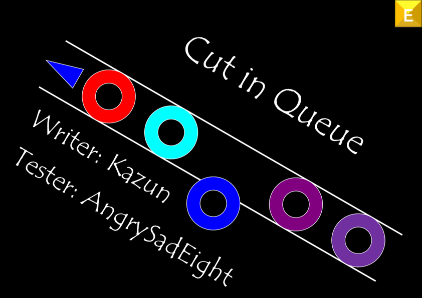

**문제 비주얼**

▶ 문제 비주얼 공개



## 문제 설명

$(1, 2, \dots, N)$의 순열 $A$가 주어집니다. 또한 길이가 $Q$인 정수열 $B$가 있고, $B$의 $j$번째 항 $B_j$는 $N+j$입니다. 즉,

$B=(N+1, N+2, \dots, N+Q)$

입니다.

이 $A$, $B$에 대해 다음 $Q$개의 연산을 순서대로 수행하세요.

- Type I: $1\ a$ 형식으로 주어집니다. $B$의 $1$번째 항을 $b$라 하고, $B$에서 그 $1$번째 항을 삭제합니다. 그 후 $a$의 값에 따라 다음 $2$가지 동작 중 $1$가지를 수행합니다. $a$는 $0$ 또는 이 질의가 주어졌을 때 $A$에 존재하는 정수임이 보장됩니다.
  - $a=0$일 때: $A$의 끝에 $b$를 추가합니다.
  - $a\neq 0$일 때: $A$에서 값이 $a$인 항의 바로 앞에 $b$를 삽입합니다.

  이 질의가 주어질 때 $B$가 비어 있지 않음이 보장됩니다.

- Type II: $2$ 형식으로 주어집니다. $A$에서 $1$번째 항을 삭제합니다. 이 질의가 주어질 때 $A$가 비어 있지 않음이 보장됩니다.

- Type III: $3\ k$ 형식으로 주어집니다. $A$의 $k$번째 항을 출력합니다. 이 질의가 주어질 때 $A$의 길이를 $\lvert A\rvert$라 하면 $1\leq k\leq \lvert A\rvert$가 성립함이 보장됩니다.

## 입력

입력은 표준 입력에서 주어집니다.

```text
$N$
$A_1\ A_2\ \cdots\ A_N$
$Q$
$\textrm{Query}_1$
$\textrm{Query}_2$
$\vdots$
$\textrm{Query}_Q$
```

각 질의 $\textrm{Query}_q$는 다음 $3$가지 형식 중 $1$가지로 주어집니다.

- Type I

  ```text
  $1\ a$
  ```

- Type II

  ```text
  $2$
  ```

- Type III

  ```text
  $3\ k$
  ```

## 제한

- $1\leq N\leq 3\times 10^5$
- $A$는 $(1,2,\dots,N)$의 순열입니다.
- $1\leq Q\leq 3\times 10^5$
- 각 질의에 대해 다음 제한을 만족합니다.
  - Type I: $a$는 $0$ 또는 이 질의가 주어질 때 $A$에 존재하는 정수입니다.
  - Type II: 이 질의가 주어질 때 $A$는 비어 있지 않습니다.
  - Type III: 이 질의가 주어질 때 $A$의 길이를 $\lvert A\rvert$라 하면 $1\leq k\leq \lvert A\rvert$입니다.
- 입력은 모두 정수입니다.
- Type III 질의가 $1$개 이상 주어집니다.

## 출력

$Q$개의 질의 중 Type III 질의가 $Q_3$개였다고 합니다. 이때 $Q_3$줄을 출력합니다.

$r$번째 줄에는 $r$번째 Type III 질의의 답을 정수로 출력하세요. 여기서 $1\leq r\leq Q_3$입니다.

마지막에 개행을 출력하세요.

## 예제

### 예제 1 {file="0_sample_1.txt"}

#### 입력

```text
5
3 5 2 4 1
7
1 2
1 0
2
3 5
2
1 6
3 1
```

#### 출력

```text
1
8
```

처음에 $A=(3,5,2,4,1)$, $B=(6,7,8,9,10,11,12)$입니다. 각 질의는 다음과 같이 처리됩니다.

- ($1$번째 질의) $B$의 $1$번째 항인 $b=6$을 삭제하고, $A$에서 $a=2$인 항의 바로 앞에 $b=6$을 삽입합니다. 이 질의 처리 후 $A=(3,5,6,2,4,1)$, $B=(7,8,9,10,11,12)$가 됩니다.
- ($2$번째 질의) $B$의 $1$번째 항인 $b=7$을 삭제합니다. $a=0$이므로 $A$의 끝에 $b=7$을 삽입합니다. 이 질의 처리 후 $A=(3,5,6,2,4,1,7)$, $B=(8,9,10,11,12)$가 됩니다.
- ($3$번째 질의) $A$의 $1$번째 항을 삭제합니다. 이 질의 처리 후 $A=(5,6,2,4,1,7)$, $B=(8,9,10,11,12)$가 됩니다.
- ($4$번째 질의) $A$의 $5$번째 항은 $1$입니다. 따라서 $1$을 출력합니다.
- ($5$번째 질의) $A$의 $1$번째 항을 삭제합니다. 이 질의 처리 후 $A=(6,2,4,1,7)$, $B=(8,9,10,11,12)$가 됩니다.
- ($6$번째 질의) $B$의 $1$번째 항인 $b=8$을 삭제하고, $A$에서 $a=6$인 항의 바로 앞에 $b=8$을 삽입합니다. 이 질의 처리 후 $A=(8,6,2,4,1,7)$, $B=(9,10,11,12)$가 됩니다.
- ($7$번째 질의) $A$의 $1$번째 항은 $8$입니다. 따라서 $8$을 출력합니다.

### 예제 2 {file="0_sample_2.txt"}

#### 입력

```text
1
1
9
2
1 0
3 1
2
1 0
3 1
2
1 0 
3 1
```

#### 출력

```text
2
3
4
```

$A$가 비어 있을 때 Type II 질의가 주어지지는 않지만, $A$가 비게 될 수는 있습니다.
