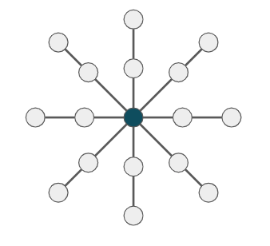
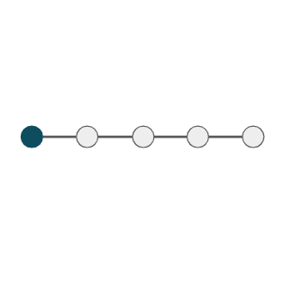
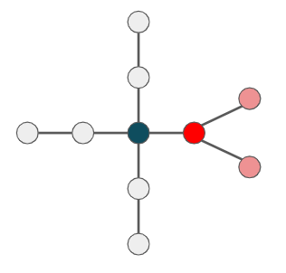
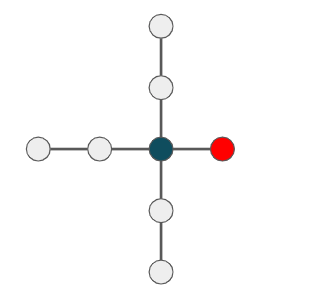

## 문제 설명

$N$개의 정점으로 이루어진 무방향 트리 $T$가 주어집니다. 정점에는 $1, 2, \cdots, N$의 번호가 붙어 있고, 각 $i$ ($1 \leq i \leq N-1$)번째 간선은 정점 $u_i$와 정점 $v_i$를 연결합니다.

다음 조건을 만족하는 정점 $x$가 존재하는 그래프를 **아름다운 성게 나무**라고 합니다.

- 그래프는 무방향 트리입니다.
- 정점 $x$를 루트로 삼은 트리에서 잎의 집합을 $S$라고 할 때, 다음 조건을 모두 만족합니다.
  - $S$에 포함되는 서로 다른 정점의 쌍 $(u,v)$의 최소 공통 조상은 $x$입니다.
  - $u \in S$에 대하여 $x$와 $u$ 사이의 거리 $d(x,u)$는 모두 같습니다.

예를 들어 다음과 같은 그래프는 **아름다운 성게 나무**입니다. 조건을 만족하는 정점 $x$를 남색으로 표시한 예입니다.





반면 다음과 같은 그래프는 **아름다운 성게 나무**가 아닙니다.





$T$의 부분 그래프 중 아름다운 성게 나무의 정점 수의 최댓값을 구하세요. 문제의 제약 아래에서 $T$의 부분 그래프에는 아름다운 성게 나무가 항상 존재합니다.

## 입력

```text
$N$
$u_1\ v_1$
$u_2\ v_2$
$\vdots$
$u_{N-1}\ v_{N-1}$
```

## 제한

- $2 \leq N \leq 2 \times 10^5$
- $1 \leq u_i < v_i \leq N$
- 주어지는 그래프는 무방향 트리입니다.
- 입력은 모두 정수입니다.

## 출력

아름다운 성게 나무의 정점 수의 최댓값을 출력하세요.

## 예제

### 예제 1 {file="01_sample_1.txt"}

#### 입력

```text
8
1 2
2 3
2 4
2 5
5 6
5 7
5 8
```

#### 출력

```text
5
```

### 예제 2 {file="01_sample_2.txt"}

#### 입력

```text
2
1 2
```

#### 출력

```text
2
```
