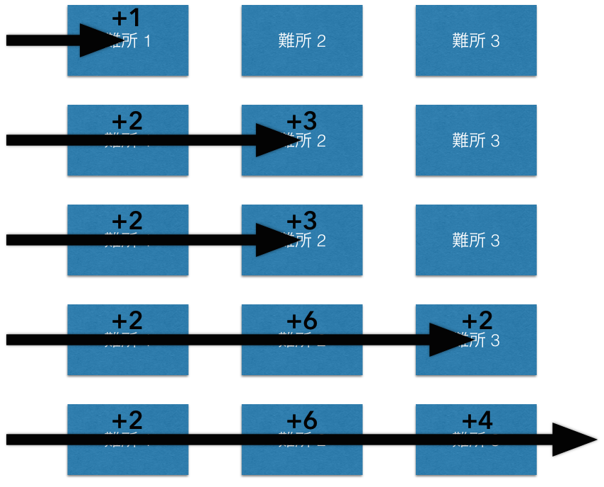

## 문제 설명

Geometry Dash는 $N$개의 난관으로 이루어진 스테이지를 클리어하는 게임입니다. 게임 제작자인 당신은 필요한 클리어 시간이 최대가 되도록 $N$개 난관의 순서를 정하려고 합니다.

게임의 클리어 시간은 다음과 같이 계산됩니다.

$N$개의 난관에는 각각 통과에 필요한 시간 $T_i$와 난이도 $D_i$($i=1,2,\ldots,N$)가 정해져 있으며, 난관은 정해진 순서대로 통과해야 합니다. $i$번째 난관은 도달하기 직전까지의 도달 횟수가 $D_i$회 이상이면 통과할 수 있습니다. 단, 도달 횟수는 각 난관마다 독립적으로 셉니다.

도달 횟수가 $D_i$회 미만이면 도달한 뒤 $T_i/2$ 시간이 지나고 시작 지점으로 돌아가 다시 $1$번째 난관부터 진행합니다.

클리어 시간은 정해진 순서로 $N$개의 난관을 모두 통과하는 데 필요한 시간의 합입니다. 난관 사이를 이동하는 시간과 시작 지점으로 돌아가는 시간은 무시합니다.

예를 들어 $3$개의 난관이 앞에서부터 $T = \{2, 6, 4\}$, $D = \{1, 2, 1\}$ 순서로 놓여 있다면, 클리어 시간은 $33$이며 다음 그림처럼 계산됩니다.



그림의 “難所 $1$”, “難所 $2$”, “難所 $3$”은 각각 난관 $1$, 난관 $2$, 난관 $3$을 뜻합니다.

클리어 시간이 최대가 되도록 $N$개 난관의 순서를 계산해 출력하세요. 후보가 여러 개면 어느 것이든 출력해도 됩니다.

## 입력

```text
$N$
$T_1\ T_2\ \dots\ T_N$
$D_1\ D_2\ \dots\ D_N$
```

## 제한

- $2 \le N \le 10^5$
- $1 \le T_i \le 10^4$
- $1 \le D_i \le 10^4$

## 출력

$N$개의 정수 $X_i$를 공백으로 구분해 $1$줄에 출력하세요. $i$번째 정수 $X_i$는 입력에서 $X_i$번째 난관이 순서상 $i$번째에 놓인다는 뜻입니다.

## 예제

### 예제 1 {file=""}

#### 입력

```text
3
2 6 4
1 2 1
```

#### 출력

```text
3 2 1
```

입력으로 주어진 순서의 역순으로 배치하면 클리어 시간이 최대가 됩니다.

### 예제 2 {file=""}

#### 입력

```text
5
1 1 1 1 1
1 1 1 1 1
```

#### 출력

```text
1 2 3 4 5
```

후보가 여러 개이면 어느 것을 출력해도 됩니다.

### 예제 3 {file=""}

#### 입력

```text
10
1 1 1 1 1 1 1 1 1 1
10 16 253 190 469 12 29 57 797 584
```

#### 출력

```text
1 6 2 7 8 4 3 5 10 9
```

### 예제 4 {file=""}

#### 입력

```text
7
2 7 3 6 8 1 1
6 1 67 56 56 1 21
```

#### 출력

```text
2 6 1 5 4 7 3
```

