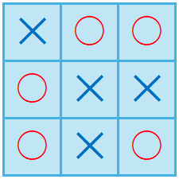

## 문제 설명

양의 정수 $H,W$가 주어집니다. 세로 $H$칸, 가로 $W$칸인 보드 중 다음 조건을 만족하는 것을 $1$개 출력하세요.

주어진 제한 아래에서 다음 조건을 만족하는 보드가 반드시 존재한다는 것을 증명할 수 있습니다.

**조건:**

- 모든 칸은 `O` 또는 `X`입니다(모두 영문 대문자).
- `O`와 `X` 어느 것도 세로, 가로, 대각선 방향으로 $3$개 이상 연속해서 놓이지 않습니다.

더 정확하게는 왼쪽에서 $x$번째, 위에서 $y$번째 칸의 문자를 $c_{x,y}(1\leq x\leq W,1\leq y\leq H)$라고 합니다. 이때 다음 조건 중 $1$개 이상을 만족하는 $(x,y)$의 순서쌍도 존재하지 않아야 합니다.

- $x\leq W-2$이고 $c_{x,y}=c_{x+1,y}=c_{x+2,y}$
- $y\leq H-2$이고 $c_{x,y}=c_{x,y+1}=c_{x,y+2}$
- $x\leq W-2,y\leq H-2$이고 $c_{x,y}=c_{x+1,y+1}=c_{x+2,y+2}$
- $x\leq W-2,y\leq H-2$이고 $c_{x,y+2}=c_{x+1,y+1}=c_{x+2,y}$

## 입력

입력은 다음 형식으로 주어집니다.

```text
$H\ W$
```

## 제한

- $1\leq H,W\leq 3\,000$
- 입력은 모두 정수입니다.

## 출력

조건을 만족하는 보드를 각 행이 $W$개의 문자로 이루어진 $H$개의 행으로 출력하세요(자세한 내용은 출력 예제를 확인하세요).

마지막에 줄바꿈을 출력하세요.

## 예제

### 예제 1 {file=""}

#### 입력

```text
3 3
```

#### 출력

```text
XOO
OXX
OXO
```

이 출력 예제는 다음 이미지와 같은 보드를 나타냅니다.



이 보드는 모든 칸이 `O` 또는 `X`이고, `O`와 `X` 어느 것도 $3$개 이상 연속해서 놓이지 않았으므로 조건을 만족합니다.

이외에도 조건을 만족하는 보드는 존재하지만, 그중 $1$개를 출력하면 됩니다.

### 예제 2 {file=""}

#### 입력

```text
3 4
```

#### 출력

```text
XOXO
XOOX
OXOX
```
