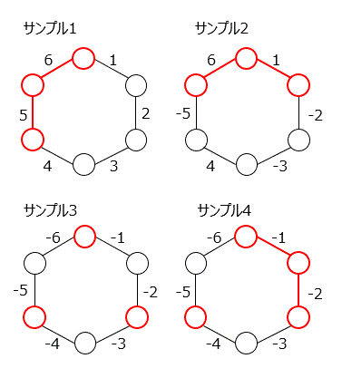

## 참고

이 문제는 [Advent Calendar Contest Advent Calendar 2015](http://www.adventar.org/calendars/912)의 $17$일차 문제로 만들어졌습니다.

## 이야기

어느 날 yuki さん은 길을 걷다가 대단해 보이는 [사이클 그래프](https://ja.wikipedia.org/wiki/%E9%96%89%E8%B7%AF%E3%82%B0%E3%83%A9%E3%83%95)가 떨어져 있는 것을 발견했습니다.

## 문제 설명

그래프는 $n$개의 간선과 정점으로 이루어져 있고, 간선에는 시계 방향으로 $1$부터 $n$까지의 번호가 붙어 있습니다. 간선 $i$의 가치는 $w_i$입니다.

흥미를 느낀 yuki さん은 이 그래프를 주워 가기로 했습니다. 가방에는 정점 $m$개가 정확히 들어가므로 정점 $m$개의 유도 부분 그래프를 가져갑니다. 즉, 어떤 간선의 양 끝 정점을 가져가기로 했다면 그 간선도 반드시 가져가야 합니다.

부분 그래프의 가치는 포함된 간선 가치의 합으로 정의합니다. 가져갈 수 있는 그래프 가치의 최댓값을 구하세요.

## 입력

```text
$n\ m$
$w_1\ w_2\ w_3\ \cdots\ w_n$
```

- 모든 입력은 정수입니다.

## 제한

- $3 \le n \le 3\,000$
- $0 \le m \le n$
- $-300 \le w_i \le 300$

## 출력

답을 $1$줄에 출력하세요.

마지막에 개행을 출력하세요.

## 예제



그림의 ‘サンプル1’, ‘サンプル2’, ‘サンプル3’, ‘サンプル4’는 각각 예제 1, 예제 2, 예제 3, 예제 4를 뜻합니다.

### 예제 1 {file=""}

#### 입력

```text
6 3
1 2 3 4 5 6
```

#### 출력

```text
11
```


### 예제 2 {file=""}

#### 입력

```text
6 3
1 -2 -3 4 -5 6
```

#### 출력

```text
7
```


### 예제 3 {file=""}

#### 입력

```text
6 3
-1 -2 -3 -4 -5 -6
```

#### 출력

```text
0
```


### 예제 4 {file=""}

#### 입력

```text
6 4
-1 -2 -3 -4 -5 -6
```

#### 출력

```text
-3
```
