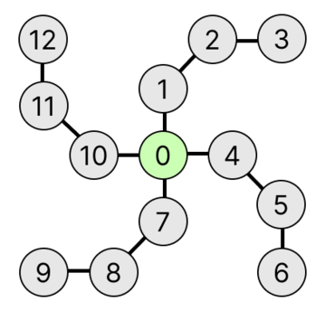

## 문제 설명

다음 절차로 만들어지는 무방향 그래프를 팔의 개수가 $X$, 팔의 길이가 $Y$인 **岩井 스타 그래프**라고 정의합니다.

- $0$부터 $XY$까지의 번호가 각각 부여된 $XY+1$개의 정점을 준비합니다.
- $i=0,1,\ldots,X-1$의 순서로 다음 작업을 반복합니다.
  - 정점 $iY+1$과 정점 $iY+2$, 정점 $iY+2$와 정점 $iY+3$, $\ldots$, 정점 $iY+Y-1$와 정점 $iY+Y$를 각각 무방향 간선으로 연결합니다.
  - 정점 $0$과 정점 $iY+1$을 무방향 간선으로 연결합니다.

이 岩井 스타 그래프에는 $N$명의 岩井星人さん이 있습니다. $k$번째 ($1\leq k\leq N$) 岩井星人さん은 정점 $U_k$에서 정점 $V_k$까지 간선을 따라 이동합니다.

각 岩井星人さん에 대해 이동이 끝날 때까지 지나가는 간선 수의 최솟값을 각각 구하세요.

## 입력

입력은 다음 형식으로 표준 입력에서 주어집니다.

```text
$X\ Y\ N$
$U_1\ V_1$
$U_2\ V_2$
$\vdots$
$U_N\ V_N$
```

$1$번째 줄에 정수 $X$, $Y$, $N$이 주어집니다. 다음 $N$개의 줄에 $k$번째 岩井星人さん의 출발 정점과 도착 정점인 정수 $U_k$, $V_k$가 공백으로 구분되어 주어집니다.

## 제한

- $1\leq X,Y\leq 10^6$
- $1\leq N\leq 2\times 10^5$
- $0\leq U_i<V_i\leq XY$
- 입력으로 주어지는 값은 모두 정수입니다.

## 출력

$N$줄을 출력하세요. $k$번째 줄에는 $k$번째 岩井星人さん의 이동이 끝날 때까지 지나가는 간선 수의 최솟값을 출력하세요.

## 예제

### 예제 1 {file=""}

#### 입력

```text
4 3 3
0 3
11 12
3 4
```

#### 출력

```text
3
1
4
```

팔의 개수가 $4$, 팔의 길이가 $3$인 岩井 스타 그래프는 다음과 같습니다.



예를 들어 $1$번째 岩井星人さん은 정점 $0\to1\to2\to3$의 순서로 지나가면 이동이 끝납니다. 이때 지나가는 간선 수는 최솟값인 $3$개입니다.

### 예제 2 {file=""}

#### 입력

```text
1000000 1000000 2
1000000 1000000000000
998244353 1000000007
```

#### 출력

```text
2000000
244360
```

정점 번호가 $32$비트 정수형의 범위에 들어가지 않을 수 있음에 주의하세요.
