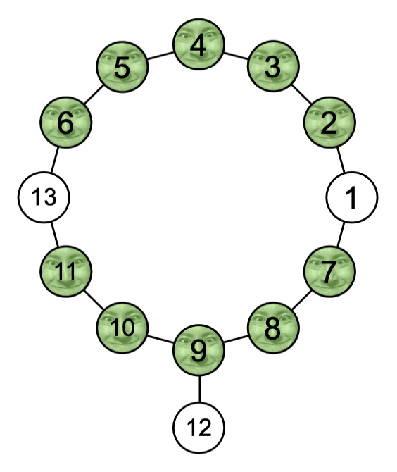

## 이야기

지구인 高橋君은

[$5$명의 岩井星人을 모아서 합체시키고, 최강의 岩井星人인 巨岩石星人을 만들고 싶어요~](https://youtu.be/o6SKHa2c6Z4?si=YsXW14pgDyEmnv_w&t=208)

라고 생각하여 岩井星에 관광을 왔습니다.

그러나 岩井星에서는 岩井星人의 합체가 불법 행위로 금지되어 있었습니다.

낙담한 高橋君은 岩井星의 공원을 산책하고 있었지만, 岩井星人을 $5$번 연속으로 만나면 **욕망**을 억누르지 못하고 만난 岩井星人을 巨岩石星人으로 만들어 버립니다.

불법 행위를 저지르지 않고 산책할 수 있는 길이 존재하는지 高橋君에게 알려 주세요!

## 문제 설명

지구인 高橋君은 岩井星의 공원 안을 산책하려고 합니다.

공원은 $N$개의 정점과 $M$개의 간선으로 이루어진 단순 연결 무방향 그래프로 나타낼 수 있습니다.

정점에는 정점 $1$, 정점 $2$, $\dotsc$, 정점 $N$과 같이 번호가 붙어 있으며, $1 \leq i \leq M$인 $i$번째 간선은 정점 $U_i$와 정점 $V_i$를 연결합니다. 高橋君은 $i$번째 간선을 통해 정점 $U_i$와 정점 $V_i$ 사이를 양방향으로 이동할 수 있습니다.

$K$개의 정점 $A_1, A_2, \dotsc, A_K$에는 岩井星人이 있으며, 岩井星人은 정점 사이를 이동하지 않습니다.

高橋君은 정점 $1$에서 정점 $N$까지 이동합니다.

이동 중 岩井星人을 $5$번 연속으로 만나면 욕망을 억누르지 못하게 되므로 그러한 경로로는 이동할 수 없습니다. 구체적으로 정점 $1$에서 정점 $N$까지 이동하는 경로를 정점 열 $(v_0, v_1, \dotsc, v_t)$로 나타냈을 때, 岩井星人이 있는 정점만으로 이루어진 길이 $5$의 연속 부분열 $(v_i, v_{i+1}, v_{i+2}, v_{i+3}, v_{i+4})$가 존재하면 그 경로로는 이동할 수 없습니다.

高橋君이 정점 $1$에서 정점 $N$까지 이동하는 경로가 존재하는지 판정하세요. 존재한다면 그러한 경로 중 최단 거리를, 존재하지 않는다면 $-1$을 출력하세요.

## 입력

입력은 다음 형식으로 표준 입력에서 주어집니다.

```text
$N\ M$
$U_1\ V_1$
$U_2\ V_2$
$\vdots$
$U_M\ V_M$
$K$
$A_1\ A_2\ \cdots\ A_K$
```

## 제한

- $3 \leq N \leq 10^5$
- $N - 1 \leq M \leq \min\left(\frac{N(N-1)}{2}, 10^5\right)$
- $1 \leq U_i < V_i \leq N$
- 주어지는 그래프는 단순하고 연결되어 있습니다.
- $0 \leq K \leq N - 2$
- $2 \leq A_1 < A_2 < \dotsc < A_K \leq N - 1$
- 모든 입력값은 정수입니다.

## 출력

高橋君이 정점 $1$에서 정점 $N$까지 이동하는 경로가 존재한다면 그러한 경로 중 최단 거리를, 존재하지 않는다면 $-1$을 출력하세요.

## 예제

### 예제 1 {file="01_sample_01.txt"}

#### 입력

```text
13 13
1 2
2 3
3 4
4 5
5 6
6 13
1 7
7 8
8 9
9 10
9 12
10 11
11 13
10
2 3 4 5 6 7 8 9 10 11
```

#### 출력

```text
8
```



$(1, 2, 3, 4, 5, 6, 13)$과 같이 이동하는 경로는 岩井星人을 $5$번 연속으로 만나게 되므로 이동할 수 없습니다.

$(1, 7, 8, 9, 12, 9, 10, 11, 13)$과 같이 이동하는 경로는 岩井星人을 $5$번 연속으로 만나는 일이 없으므로 정점 $N$까지 이동할 수 있습니다.

이 경로가 정점 $1$에서 정점 $N$까지 이동할 수 있는 경로 중 거리가 가장 짧으므로 답은 $8$입니다.

### 예제 2 {file="01_sample_02.txt"}

#### 입력

```text
7 6
1 2
2 3
3 4
4 5
5 6
6 7
5
2 3 4 5 6
```

#### 출력

```text
-1
```

어떻게 이동하더라도 高橋君은 욕망을 억누르지 못합니다.

### 예제 3 {file="01_sample_03.txt"}

#### 입력

```text
3 2
1 2
2 3
0
```

#### 출력

```text
2
```

공원에 岩井星人이 $1$명도 없을 수도 있습니다.
