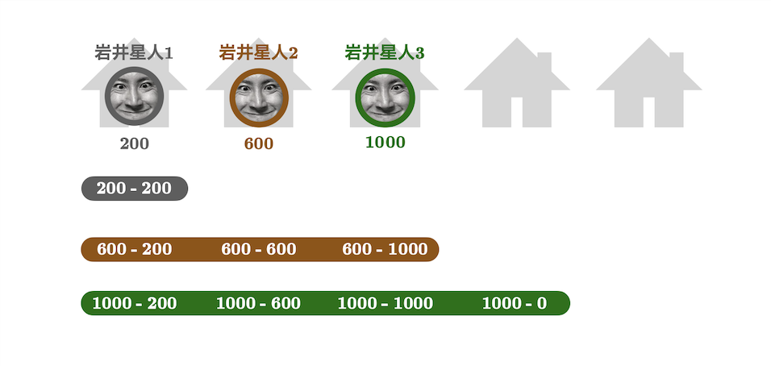
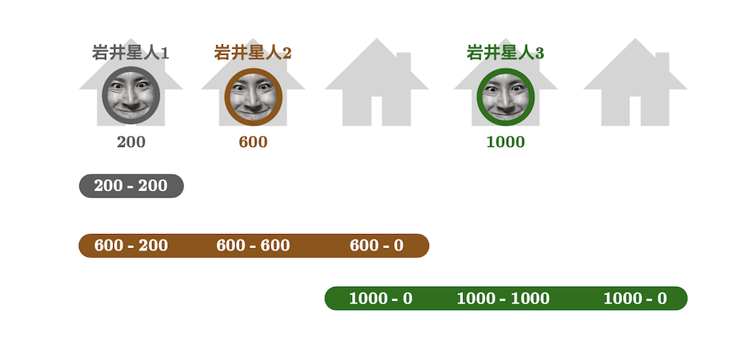
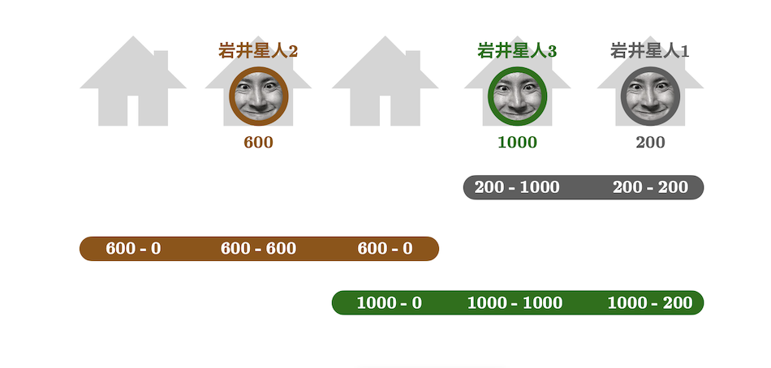

## 문제 설명

岩井星에는 岩井星人 $1,\dotsc,N$이 살고 있습니다.

또한 岩井星에는 집 $1,\dotsc,M$이 있으며, 각 $i\ (1\leq i\leq N)$에 대해 岩井星人 $i$는 집 $i$에 살고 있습니다.

각 岩井星人은 프로그래밍 능력의 높이를 나타내는 **레이트**라는 수치를 가지고 있으며, 岩井星人 $i$의 레이트는 $A_i$입니다.

또한 岩井星人 $i$는 집 $L_i,L_i+1,\dotsc,R_i$에 사는 岩井星人을 같은 고향에 사는 것으로 간주합니다.

각 $j\ (1\leq j\leq M)$에 대해 $B_j$를 집 $j$에 사는 岩井星人의 레이트로 정의합니다. 집 $j$에 岩井星人이 살지 않는 경우에는 $B_j=0$으로 정의합니다. 岩井星人 $i$의 고향에서의 [천재도](https://youtu.be/gotj9O_QnVo?si=pAh5ePMlU99VidGt&t=245)는 다음과 같이 정의됩니다.

$\sum_{j=L_i}^{R_i}(A_i-B_j)$

단, 뒤에서 설명하듯이 $B_j$와 $L_i,R_i$의 값은 갱신되므로 천재도도 그에 따라 갱신된다는 점에 주의하세요.

이제 $Q$번의 이벤트가 발생합니다. $k$번째 이벤트에서 岩井星人 $X_k$는 집 $Y_k$로 이사하고, 새롭게 집 $U_k,U_k+1,\dotsc,V_k$에 사는 岩井星人을 같은 고향에 사는 것으로 간주하게 됩니다. 이때 $L_{X_k},R_{X_k}$의 값은 각각 $U_k,V_k$로 갱신됩니다.

단, 이벤트 $k$ 직전에는 집 $Y_k$에 岩井星人이 살고 있지 않음이 보장됩니다.

각 이벤트가 발생한 직후 岩井星人의 천재도 총합을 출력하세요.

## 입력

입력은 다음 형식으로 표준 입력에서 주어집니다.

```text
$N\ M$
$A_1\ L_1\ R_1$
$A_2\ L_2\ R_2$
$\vdots$
$A_N\ L_N\ R_N$
$Q$
$X_1\ Y_1\ U_1\ V_1$
$X_2\ Y_2\ U_2\ V_2$
$\vdots$
$X_Q\ Y_Q\ U_Q\ V_Q$
```

$1$번째 줄에 岩井星人의 수 $N$과 집의 수 $M$이 주어집니다.
다음 $N$개 줄의 $i$번째 줄에는 岩井星人 $i$의 레이트와 초기 고향 범위 $L_i,R_i$가 주어집니다.
다음 줄에 이벤트 횟수 $Q$가 주어집니다.
다음 $Q$개 줄의 $k$번째 줄에는 이벤트에서 이사하는 岩井星人 $X_k$, 이사할 집 $Y_k$, 새로운 고향 범위 $U_k,V_k$가 주어집니다.

## 제한

- $1\leq N<M\leq 2\times 10^5$
- $0\leq A_i\leq 10^8$
- $1\leq L_i\leq R_i\leq M$
- $1\leq Q\leq 2\times 10^5$
- $1\leq X_k\leq N$
- $1\leq Y_k\leq M$
- 이벤트 $k$ 직전에 집 $Y_k$에는 岩井星人이 살고 있지 않습니다.
- $1\leq U_k\leq V_k\leq M$
- 입력은 모두 정수입니다.

## 출력

$Q$개 줄에 출력하세요.

$k$번째 줄에는 이벤트 $k$가 발생한 직후 岩井星人의 천재도 총합을 출력하세요.

## 예제

### 예제 1 {file=""}

#### 입력

```text
3 5
200 1 1
600 1 3
1000 1 4
2
3 4 3 5
1 5 4 5
```

#### 출력

```text
3000
2200
```



이벤트 $1$ 직후 천재도는 각각 $0,1\,000,2\,000$이므로 총합은 $3\,000$입니다.



이벤트 $2$ 직후 천재도는 각각 $-800,1\,200,1\,800$이므로 총합은 $2\,200$입니다.



### 예제 2 {file=""}

#### 입력

```text
5 10
9 1 2
1 1 3
8 2 3
1 1 5
9 4 7
3
1 8 6 8
5 6 6 6
2 5 2 5
```

#### 출력

```text
31
5
6
```

이벤트 $1$ 직후 $B$는 $(0,1,8,1,9,0,0,9,0,0)$이 됩니다. 이때 천재도는 각각 $18,-6,7,-14,26$이고 총합은 $31$입니다.

이벤트 $2$ 직후 $B$는 $(0,1,8,1,0,9,0,9,0,0)$이 됩니다. 이때 천재도는 각각 $9,-6,7,-5,0$이고 총합은 $5$입니다.

이벤트 $3$ 직후 $B$는 $(0,0,8,1,1,9,0,9,0,0)$이 됩니다. 이때 천재도는 각각 $9,-6,8,-5,0$이고 총합은 $6$입니다.

### 예제 3 {file=""}

#### 입력

```text
2 8
10 1 3
15 4 5
2
1 5 1 3
2 1 6 8
```

#### 출력

```text
35
60
```

岩井星人은 이사해도 고향으로 간주하는 집이 바뀌지 않을 수 있으며, 인연이나 연고가 전혀 없는 집을 고향으로 간주할 수도 있습니다.

### 예제 4 {file=""}

#### 입력

```text
2 200000
9 1 15
181 2 2
3
2 3 5 9
2 181181 1 200000
2 2 2 2
```

#### 출력

```text
850
36199936
-55
```
