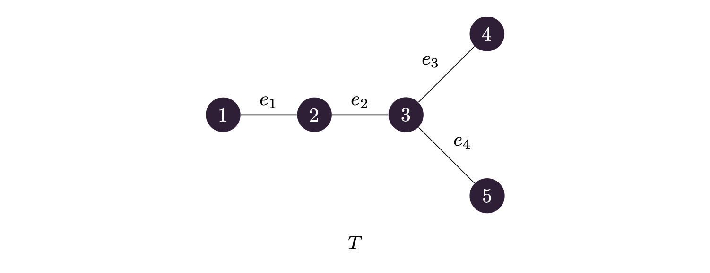
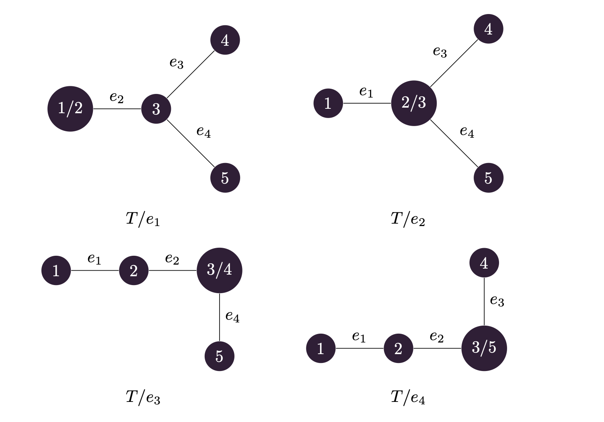

## 문제 설명

트리 $U$의 스코어를 $\displaystyle\sum_{x \in V} \max_{y \in V} \operatorname{d}(x,y)$로 정의합니다. 여기서 $V$는 $U$의 정점 집합이고, $\operatorname{d}(x,y)$는 $U$에서 정점 $x$와 정점 $y$ 사이의 거리, 즉 $x$에서 $y$로 이동할 때 사용하는 간선 수의 최솟값입니다.

즉, $U$의 스코어는 모든 정점 $x$에 대해 $x$에서 가장 먼 정점까지의 거리를 더한 값입니다.

정점에 $1$부터 $N$까지 번호가 붙은 $N$개 정점의 트리 $T$가 주어집니다. $T$의 $i$번째 간선 $e_i$는 정점 $a_i$와 정점 $b_i$를 연결합니다.

각 $k=1,2,\dots,N-1$에 대해 $T$에서 간선 $e_k$를 축약해 만든 $N-1$개 정점의 트리 $T/e_k$의 스코어를 구하세요.

## 입력

```text
$N$
$a_1\ b_1$
$a_2\ b_2$
$\vdots$
$a_{N-1}\ b_{N-1}$
```

## 제한

입력은 모두 정수입니다.

- $2\le N\le2\times10^5$
- $1\le a_i,b_i\le N$
- 주어지는 그래프는 트리입니다.

## 출력

$N-1$줄에 걸쳐 출력하세요. $k$번째 줄($1\le k\le N-1$)에는 $T/e_k$의 스코어를 출력하세요.

## 예제

### 예제 1 {file=""}

#### 입력

```text
5
1 2
2 3
3 4
3 5
```

#### 출력

```text
7
7
10
10
```

아래 그림은 $T$를 나타냅니다.



아래 그림은 $T/e_1$, $T/e_2$, $T/e_3$, $T/e_4$를 나타냅니다. 그림에서 $a/b$는 축약할 때 정점 $a$와 정점 $b$가 합쳐져 만들어지는 새로운 정점을 나타냅니다.



$T/e_1$의 스코어는 다음과 같이 계산됩니다.

- 정점 $1/2$에서 가장 먼 정점까지의 거리는 $2$입니다.
- 정점 $3$에서 가장 먼 정점까지의 거리는 $1$입니다.
- 정점 $4$에서 가장 먼 정점까지의 거리는 $2$입니다.
- 정점 $5$에서 가장 먼 정점까지의 거리는 $2$입니다.

따라서 $T/e_1$의 스코어는 $2+1+2+2=7$입니다.

$T/e_3$의 스코어는 다음과 같이 계산됩니다.

- 정점 $1$에서 가장 먼 정점까지의 거리는 $3$입니다.
- 정점 $2$에서 가장 먼 정점까지의 거리는 $2$입니다.
- 정점 $3/4$에서 가장 먼 정점까지의 거리는 $2$입니다.
- 정점 $5$에서 가장 먼 정점까지의 거리는 $3$입니다.

따라서 $T/e_3$의 스코어는 $3+2+2+3=10$입니다.

### 예제 2 {file=""}

#### 입력

```text
2
1 2
```

#### 출력

```text
0
```

$T/e_1$은 정점 $1$개, 간선 $0$개의 트리이므로 스코어는 $0$입니다.

### 예제 3 {file=""}

#### 입력

```text
10
1 2
2 3
2 4
4 5
4 6
6 7
7 8
7 9
9 10
```

#### 출력

```text
43
43
38
44
37
37
44
38
38
```
