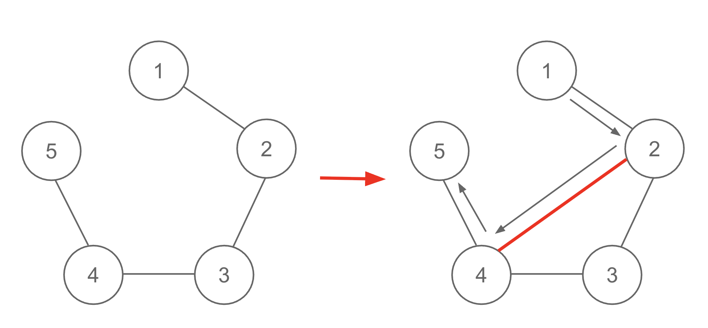

## 문제 설명

$N$개의 정점과 $M$개의 간선으로 이루어진 단순 무방향 그래프 $G$가 주어집니다.

$G$의 정점에는 정점 $1$, 정점 $2$, ..., 정점 $N$의 번호가 붙어 있습니다. $i$번째 간선($1\le i\le M$)은 정점 $u_i$와 정점 $v_i$를 연결합니다.

처음에 $G$의 정점 $s$에 말 $1$개가 놓여 있습니다. 이 말을 다음 규칙에 따라 이동시킵니다.

- 말이 놓인 정점에서 간선으로 연결된 정점 $1$개를 선택하고, 말을 그 정점으로 이동시킵니다. 연결된 간선이 $1$개도 없다면 아무것도 하지 않습니다.

$G$에 자기 자신으로 이어지는 간선도 아니고 평행 간선도 아닌 무향 간선을 최대 $1$개 추가할 수 있습니다.

이 간선을 추가한 뒤 말을 정확히 $K$회 이동하여 정점 $t$에 말이 놓인 상태로 만들 수 있는지 판정하세요.

## 입력

입력은 다음 형식으로 표준 입력에서 주어집니다.

```text
$N\ M\ K\ s\ t$
$u_1\ v_1$
$u_2\ v_2$
$\vdots$
$u_M\ v_M$
```

$1$번째 줄에 정점 수 $N$, 간선 수 $M$, 이동 횟수 $K$, 시작 정점 $s$, 도착 정점 $t$가 주어집니다.

이후 $M$개의 줄에 $i$번째 간선이 연결하는 $2$개의 정점 $u_i$, $v_i$가 주어집니다.

## 제한

- $2\le N\le 2\,000$
- $0\le M\le\min\left(\frac{N(N-1)}{2},2\,000\right)$
- $1\le K\le 10^{18}$
- $1\le s,t\le N$
- $s\ne t$
- $1\le u_i<v_i\le N$
- $i\ne j$라면 $(u_i,v_i)\ne(u_j,v_j)$
- 입력은 모두 정수입니다.

## 출력

정확히 $K$회 이동하여 정점 $t$에 말이 놓인 상태로 만들 수 있다면 `Yes`를, 불가능하다면 `No`를 출력하세요. 마지막에 개행 문자를 출력하세요.

## 예제

### 예제 1 {file=""}

#### 입력

```text
5 4 3 1 5
1 2
2 3
3 4
4 5
```

#### 출력

```text
Yes
```

예를 들어 정점 $2$와 정점 $4$를 연결하는 무향 간선을 추가하면, $(1\mathbin{\to}2\mathbin{\to}4\mathbin{\to}5)$와 같이 말을 이동하여 정확히 $3$회 이동한 뒤 정점 $5$에 말이 놓인 상태로 만들 수 있습니다.



### 예제 2 {file=""}

#### 입력

```text
6 6 4 1 6
1 2
2 3
1 3
4 5
5 6
4 6
```

#### 출력

```text
Yes
```

주어지는 그래프가 연결 그래프라는 보장은 없음에 주의하세요.
