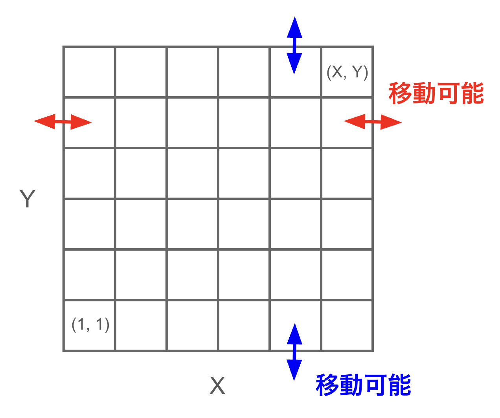
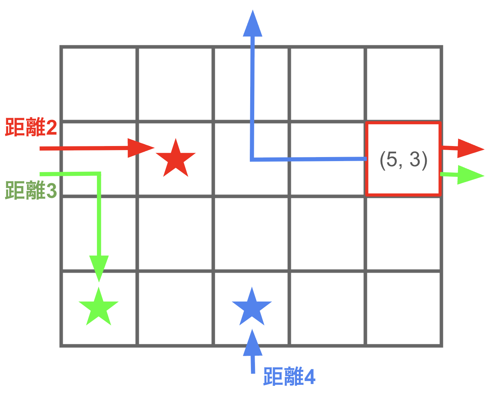

## 문제 설명

가로 $X$칸, 세로 $Y$칸의 격자가 있습니다. 이 격자의 왼쪽에서 $x$번째, 아래쪽에서 $y$번째 칸을 $(x,y)$로 나타냅니다.

격자 위에는 $N$개의 목적지가 있으며, 각각의 위치는 $(x_i,y_i)$입니다.

이 격자에서 $2$개의 칸 사이의 **거리**를 다음과 같이 정의합니다.

- $1$회 이동할 때마다 상하좌우로 인접한 칸 중 $1$개로 이동할 수 있을 때, 어떤 칸에서 다른 칸으로 도달하는 데 필요한 최소 이동 횟수입니다. 단, 격자의 오른쪽 끝과 왼쪽 끝, 위쪽 끝과 아래쪽 끝은 서로 연결되어 있어 자유롭게 이동할 수 있습니다. 구체적으로 칸 $(1,y)$와 칸 $(X,y)$ 사이, 칸 $(x,1)$과 칸 $(x,Y)$ 사이는 $1$회의 이동으로 이동할 수 있습니다.



격자에서 칸 $1$개를 자유롭게 선택했을 때, 선택한 칸과 $N$개의 목적지 사이 거리의 합은 최대 얼마인지 구하세요.

## 입력

입력은 다음 형식으로 표준 입력에서 주어집니다.

```text
$N\ X\ Y$
$x_1\ y_1$
$x_2\ y_2$
$\vdots$
$x_N\ y_N$
```

## 제한

- $1 \leq N \leq 2 \times 10^5$
- $1 \leq X,Y \leq 10^9$
- $1 \leq x_i \leq X$
- $1 \leq y_i \leq Y$
- 입력은 모두 정수입니다.

## 출력

격자에서 칸 $1$개를 선택했을 때, 선택한 칸과 $N$개의 목적지 사이 거리의 합의 최댓값을 출력하세요. 마지막에 줄바꿈을 출력하세요.

## 예제

### 예제 1 {file=""}

#### 입력

```text
3 5 4
1 1
2 3
3 1
```

#### 출력

```text
9
```

예를 들어 칸 $(5,3)$을 선택하면 다음과 같습니다.

- 칸 $(5,3)$과 목적지 $1$인 $(1,1)$ 사이의 거리는 $3$입니다.
- 칸 $(5,3)$과 목적지 $2$인 $(2,3)$ 사이의 거리는 $2$입니다.
- 칸 $(5,3)$과 목적지 $3$인 $(3,1)$ 사이의 거리는 $4$입니다.

따라서 거리의 합은 $9$입니다. 이보다 거리의 합을 크게 만들 수 있는 칸은 존재하지 않으므로 답은 $9$입니다.



### 예제 2 {file=""}

#### 입력

```text
2 2 2
1 1
1 1
```

#### 출력

```text
4
```

여러 목적지가 같은 칸에 존재할 수도 있습니다.

### 예제 3 {file=""}

#### 입력

```text
4 9 9
1 1
1 9
9 1
9 9
```

#### 출력

```text
32
```
