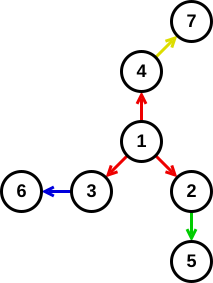
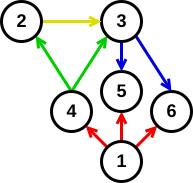

## 문제 설명

岩井星은 마을 $1,\ \dots,\ N$과 특수한 도로 $1,\ \dots,\ M$으로 이루어져 있습니다. 도로 $i$를 이용하면 마을 $X_i$에서 $C_i$분이 걸려 마을 $L_i$부터 $R_i$ 중 $1$곳으로 이동할 수 있습니다.

岩井星에서는 어떤 $2$개의 마을 사이를 이동하는 최단 시간을 효율적으로 구하는 알고리즘이 존재하는지는 오랫동안 미해결 문제였습니다. 그러나 $29$세인 岩井星人さん은 마을 $1$에서 마을 $N$까지 이동하는 최단 시간을 구하는 알고리즘을 발명했다고 주장하며, 이를 「Iwaijkstra법」이라고 이름 붙여 논문을 발표했습니다.

### Iwaijkstra법

다음 알고리즘을 실행합니다.

- $\mathrm{que}$를 우선순위 큐로 하고, 숫자 쌍 $(0,1)$을 추가합니다.
- $\mathrm{dist}$를 길이 $N$인 배열로 하고, $\mathrm{dist}_1$에 $0$을, 나머지 원소에 $\inf$를 대입합니다.
- $\mathrm{vis}$를 길이 $N$인 배열로 하고, 모든 원소에 `false`를 대입합니다.
- $\mathrm{que}$가 빌 때까지 다음을 반복합니다.
  - $\mathrm{que}$ 안의 숫자 쌍 중 왼쪽 원소가 가장 작은 숫자 쌍을 고릅니다. 그런 원소가 여러 개라면 오른쪽 원소도 가장 작은 쌍을 고릅니다. 그중 $1$개를 $(a,b)$로 기억합니다.
  - **$\mathrm{que}$에서 숫자 쌍 $(a,b)$를 $1$개 삭제합니다.**
  - $\mathrm{dist}_i<a$인 모든 $i$에 대해 $\mathrm{vis}_i$에 `true`를 대입합니다.
  - $\mathrm{dist}_b=a$라면, 다음을 수행합니다.
    - $X_j=b$인 모든 $j$에 대해, 그리고 $L_j\leq k\leq R_j$인 모든 $k$에 대해 $\mathrm{vis}_k=$`false`라면 $\mathrm{dist}_k$에 $\min(\mathrm{dist}_k,a+C_j)$를 대입하고 $\mathrm{que}$에 숫자 쌍 $(a+C_j,k)$를 추가합니다.
- 의사코드의 마지막 줄에서는 $\mathrm{dist}_N$을 출력합니다.

자세한 내용은 구현 예시도 참고하세요.

岩井星人さん은 거의 모든 연산을 순식간에 끝낼 수 있지만, 유일하게 **$\mathrm{que}$에서 삭제하는 처리**는 매우 복잡해서 시간이 오래 걸린다는 것을 깨달았습니다.

岩井星에서 이 알고리즘을 실행했을 때 $\mathrm{que}$에서 몇 번 삭제하는지 구하세요. 이 횟수가 $10^{18}$을 초과하거나 알고리즘이 종료하지 않는다면 `Too Many`를 출력하세요.

#### C++ 구현 예시

```cpp
#include <bits/stdc++.h>
using namespace std;

long long iwaijkstra(int n, int m, vector<int> x, vector<int> l, vector<int> r, vector<int> c){
	multiset<pair<long long, int>> que;
	que.emplace(0, 1);
	vector<long long> dist(n, 1e18), vis(n);
	dist[0] = 0;
	int ans(0);
	while(!que.empty()){
		auto [a, b] = *que.begin();
		que.erase(que.begin()), ++ans;
		for (int i(0); i < n; ++i) if (dist[i] < a) vis[i] = true;
		if (vis[b - 1]) continue;
		for (int i(0); i < m; ++i) if (x[i] == b){
			for (int j(l[i] - 1); j < r[i]; ++j) if (!vis[j]) {
			    dist[j] = min(dist[j], a + c[i]);
			    que.emplace(a + c[i], j + 1);
			}
		}
	}
	cout << ans << endl;
	return dist.back();
}
```

[C++ 실행 예시](https://yukicoder.me/run/5ff52949b3f01)

#### Python 구현 예시

```python
import heapq

def iwaijkstra(n,m,x,l,r,c):
    que = []
    heapq.heappush(que, (0, 1))
    dist = [10 ** 18] * n
    dist[0] = 0
    vis = [False] * n
    ans = 0
    while len(que) > 0:
        a, b = que[0]
        heapq.heappop(que)
        ans += 1
        for i in range(n):
            if dist[i] < a:
                vis[i] = True
        if vis[b-1]: continue
        for i in range(m):
            if x[i] == b:
                for j in range(l[i] - 1, r[i]):
                    if not vis[j]:
                        dist[j] = min(dist[j], a + c[i])
                        heapq.heappush(que, (a + c[i], j + 1))
    print(ans)
    return dist[n-1]
```

[Python 실행 예시](https://yukicoder.me/run/a3dc38d1b2041)

## 입력

```text
$N\ M$
$X_1\ L_1\ R_1\ C_1$
$\vdots$
$X_M\ L_M\ R_M\ C_M$
```

## 제한

- $1\leq N,M\leq 100\,000$
- $1\leq X_i\leq N$
- $1\leq L_i\leq R_i\leq N$
- $0\leq C_i\leq 10^9$
- 입력은 모두 정수입니다.
- 정점 $1$에서 모든 정점으로 이동할 수 있습니다.

## 출력

$\mathrm{que}$에서 숫자 쌍을 삭제하는 횟수를 출력하세요.

횟수가 $10^{18}$을 초과하거나 알고리즘이 종료하지 않는다면 `Too Many`를 출력하세요.

마지막에 줄 바꿈을 출력하세요.

## 예제

### 예제 1 {file=""}

#### 입력

```text
7 4
1 2 4 2
2 5 5 1
3 6 6 8
4 7 7 1
```

#### 출력

```text
7
```

岩井星의 마을과 도로를 그래프로 나타내면 다음과 같습니다.

이 그래프에서 간선의 색과 도로 번호의 대응은 빨간색이 $1$, 초록색이 $2$, 파란색이 $3$, 노란색이 $4$입니다.



### 예제 2 {file=""}

#### 입력

```text
6 4
1 4 6 1
4 2 3 0
3 5 6 8
2 3 3 0
```

#### 출력

```text
11
```

간선의 색과 도로 번호의 대응은 예제 $1$과 같습니다.



### 예제 3 {file=""}

#### 입력

```text
6 7
1 1 6 4
1 1 6 0
2 4 4 0
4 6 6 0
6 3 3 0
3 5 5 0
5 2 2 0
```

#### 출력

```text
Too Many
```

### 예제 4 {file=""}

#### 입력

```text
20 19
1 2 20 0
2 3 20 0
3 4 20 0
4 5 20 0
5 6 20 0
6 7 20 0
7 8 20 0
8 9 20 0
9 10 20 0
10 11 20 0
11 12 20 0
12 13 20 0
13 14 20 0
14 15 20 0
15 16 20 0
16 17 20 0
17 18 20 0
18 19 20 0
19 20 20 0
```

#### 출력

```text
524288
```
