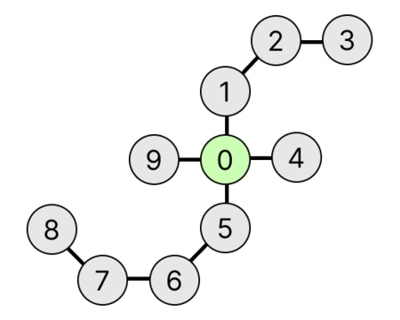

## 문제 설명

다음 절차로 만들어지는 무향 그래프를 팔의 개수가 $X$, 팔의 길이가 $(Y_1, Y_2, \cdots, Y_X)$인 **岩井 트리 그래프**라고 정의합니다.

또한 $\mathrm{sum}~Y$를 $\displaystyle \sum_{i = 1}^X Y_i$로 정의합니다.

- $0$부터 $\mathrm{sum}~Y$까지의 번호가 각각 할당된 $\mathrm{sum}~Y+1$개의 정점을 준비합니다.
- 변수 $s$를 $0$으로 초기화합니다.
- $i=1,2,\cdots,X$ 순서로 다음 조작을 반복합니다.
  - 정점 $s+1$과 정점 $s+2$, 정점 $s+2$와 정점 $s+3$, $\cdots$, 정점 $s+Y_i-1$와 정점 $s+Y_i$를 각각 간선으로 연결합니다.
  - 정점 $0$과 정점 $s+1$을 간선으로 연결합니다.
  - $s$에 $Y_i$를 더합니다.

이 岩井 트리 그래프의 정점 $i$와 정점 $j$ 사이의 거리를 $f(i,j)$로 정의합니다.

$\displaystyle \sum_{i = 0}^{\mathrm{sum}~Y} \sum_{j = i + 1}^{\mathrm{sum}~Y} f(i,j)$를 $998\,244\,353$으로 나눈 나머지를 구하세요.

## 입력

입력은 다음 형식으로 표준 입력에서 주어집니다.

```text
$X$
$Y_1\ Y_2\ \cdots\ Y_X$
```

$X$는 팔의 개수이고, $Y_i$는 $i$번째 팔의 길이입니다.

## 제한

- $1 \leq X \leq 2\times 10^5$
- $1 \leq Y_i \leq 10^9$
- 입력으로 주어지는 값은 모두 정수입니다.

## 출력

$\displaystyle \sum_{i = 0}^{\mathrm{sum}~Y} \sum_{j = i + 1}^{\mathrm{sum}~Y} f(i,j)$를 $998\,244\,353$으로 나눈 나머지를 출력하세요.

## 예제

### 예제 1 {file=""}

#### 입력

```text
4
3 1 4 1
```

#### 출력

```text
134
```

팔의 개수가 $4$, 팔의 길이가 $(3,1,4,1)$인 岩井 트리 그래프는 다음과 같습니다.


이 岩井 트리 그래프에서 $\displaystyle \sum_{i = 0}^{\mathrm{sum}~Y} \sum_{j = i + 1}^{\mathrm{sum}~Y} f(i,j)$의 값은 $134$입니다.

### 예제 2 {file=""}

#### 입력

```text
9
9 9 8 2 4 4 3 5 3
```

#### 출력

```text
7526
```

### 예제 3 {file=""}

#### 입력

```text
5
1000000000 1000000000 1000000000 1000000000 1000000000
```

#### 출력

```text
742397401
```

$998\,244\,353$으로 나눈 나머지를 구해야 한다는 점에 주의하세요.
