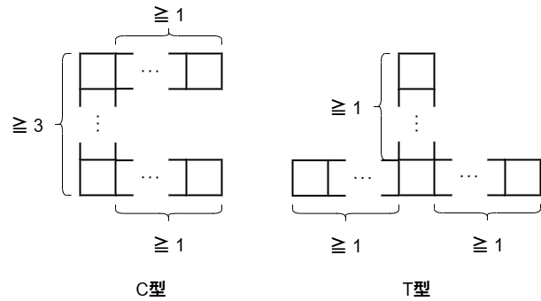
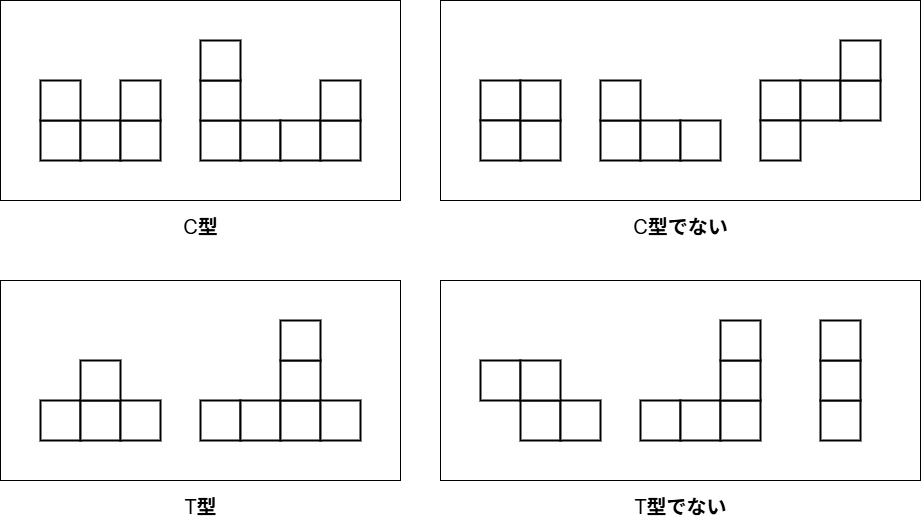
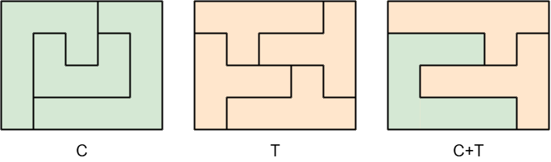

## 문제 설명

같은 크기의 정사각형을 변끼리 이어 붙여 만든 도형을 폴리오미노라고 합니다. 이하, 폴리오미노를 구성하는 정사각형의 변 길이를 $1$로 합니다.

다음과 같이 $C$형 폴리오미노와 $T$형 폴리오미노를 정의합니다.

- $C$형: 직선으로 $3$개 이상의 정사각형을 이어 붙이고, 그 양 끝에서 같은 방향으로 각각 $1$개 이상의 정사각형을 직선으로 이어 붙여 만든 폴리오미노입니다.
- $T$형: 정사각형 $1$개에서 정확히 $3$방향으로 각각 $1$개 이상의 정사각형을 직선으로 이어 붙여 만든 폴리오미노입니다.

이 정의의 이미지는 다음과 같습니다. 폴리오미노의 방향은 정의에 포함되지 않는다는 점에 주의하세요.



또한 $C$형과 $T$형의 구체적인 예를 다음과 같이 제시합니다.



이제 $H$행 $W$열의 직사각형 격자에 이 폴리오미노들을 다음 조건을 만족하도록 빈틈없이 배치한다고 합시다.

- 폴리오미노가 격자 밖으로 나가서는 안 되고, 서로 다른 폴리오미노가 겹쳐서는 안 됩니다.
- 폴리오미노를 구성하는 각 정사각형은 격자의 정확히 $1$칸을 완전히 덮어야 합니다.

다음 각 케이스에 대해 조건을 만족하는 배치가 존재하면 배치 예시를 $1$개 제시하고, 존재하지 않으면 그 사실을 보고하세요.

- 케이스 $C$: $C$형 폴리오미노만 사용합니다.
- 케이스 $T$: $T$형 폴리오미노만 사용합니다.
- 케이스 $CT$: $C$형 폴리오미노와 $T$형 폴리오미노를 각각 $1$개 이상 사용합니다.

## 입력

입력은 다음 형식으로 표준 입력에서 주어집니다.

```text
$H\ W$
```

## 제한

- $2\leq H,W\leq 200$
- 입력은 모두 정수입니다.

## 출력

답을 다음 형식으로 출력하세요. $output_C$, $output_T$, $output_{CT}$는 각각 케이스 $C$, 케이스 $T$, 케이스 $CT$에 대한 출력을 나타냅니다.

```text
$output_C$
$output_T$
$output_{CT}$
```

각 케이스에서 조건을 만족하는 배치가 존재하지 않으면 $-1$을, 존재하면 다음 형식으로 그 예시를 $1$개 출력하세요.

```text
$K$
$A_{1, 1}\ A_{1, 2}\ \cdots\ A_{1, W}$
$A_{2, 1}\ A_{2, 2}\ \cdots\ A_{2, W}$
$\vdots$
$A_{H, 1}\ A_{H, 2}\ \cdots\ A_{H, W}$
```

$K$는 사용하는 폴리오미노의 개수이고, $A_{i,j}$는 격자의 위에서 $i$번째 행, 왼쪽에서 $j$번째 열의 칸을 덮는 폴리오미노를 나타내는 $1$ 이상 $K$ 이하의 정수입니다.

위에서 $i$번째 행, 왼쪽에서 $j$번째 열의 칸을 $(i,j)$로 나타내기로 하면, $(i_1,j_1)$과 $(i_2,j_2)$를 덮는 폴리오미노가 서로 다를 때 $A_{i_1,j_1}\neq A_{i_2,j_2}$이고, 같을 때 $A_{i_1,j_1}=A_{i_2,j_2}$가 성립해야 합니다.

마지막에 개행을 출력하세요.

각 케이스의 내용과 출력 형식은 다음 예제도 참고하세요.

## 예제

### 예제 1 {file=""}

#### 입력

```text
4 5
```

#### 출력

```text
3
1 1 1 2 2
1 3 1 3 2
1 3 3 3 2
1 2 2 2 2
4
2 2 2 2 1
3 2 1 1 1
3 3 3 4 1
3 4 4 4 4
3
3 3 3 3 3
2 2 2 3 1
2 1 1 1 1
2 2 2 2 1
```

출력 예제의 내용을 나타내는 그림을 다음과 같이 제시합니다.

이 예제에서는 케이스 $C$에서 $C$형 폴리오미노 $3$개, 케이스 $T$에서 $T$형 폴리오미노 $4$개, 케이스 $CT$에서 $C$형 폴리오미노 $1$개와 $T$형 폴리오미노 $2$개의 합계 $3$개를 사용해 배치합니다.



### 예제 2 {file=""}

#### 입력

```text
2 2
```

#### 출력

```text
-1
-1
-1
```

주어진 직사각형이 너무 작아서 $C$형도 $T$형도 $1$개조차 배치할 수 없습니다.
