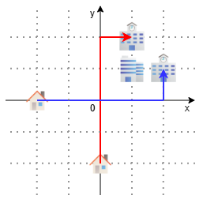

## 문제 설명

$xy$ 평면 위에 마을이 있습니다.

현재 이 마을에는 건물이 $4$개만 있으며, 각 건물의 이름과 좌표는 다음과 같습니다.

- 집 $A$: $(a_x, a_y)$
- 집 $B$: $(b_x, b_y)$
- 학교 $A$: $(c_x, c_y)$
- 학교 $B$: $(d_x, d_y)$

단, $a_x, b_x, c_x, d_x$는 모두 다르고, $a_y, b_y, c_y, d_y$도 모두 다릅니다.

이 마을에는 학생 Alice와 Bob이 살고 있습니다. Alice는 집 $A$에 살며 학교 $A$에 다니고, Bob은 집 $B$에 살며 학교 $B$에 다닙니다.

$2$명은 시각 $0$에 각각 자신이 사는 집을 출발하여 다니는 학교를 향해 이동하기 시작합니다.

$2$명은 각각 시각이 $1$만큼 지날 때마다 $x$축 또는 $y$축과 평행한 방향으로 정확히 거리 $1$만큼 이동할 수 있습니다. 단, 이동하려는 점에 **자신이 사는 집 또는 다니는 학교가 아닌** 건물이 있으면 이동할 수 없습니다.

또한 $2$명은 모두 다음 규칙에 따라 이동합니다.

- 가능한 한 이른 시각에 목적지에 도착할 수 있도록 이동합니다. 조건을 만족하는 경로가 여러 개라면 그중 $1$개를 같은 확률로 선택합니다.
- 이미 목적지에 도착했다면 이동하지 않습니다.
- 목적지에 도착하는 경로가 $1$개도 없다면 그 자리에 머물며 이동하지 않습니다.

이제 이 마을의 시장인 당신은 무슨 일이 있어도 통학 중 Alice와 Bob이 만나게 하고 싶습니다. 그래서 시장의 권한을 사용해 목적을 이루기로 했습니다.

$2$명이 출발하기 전에, 영역 $|x|, |y| \leq 200$에 포함된 격자점 중 현재 건물이 없는 곳을 최대 $4\,000$곳 지정하여 건물을 지을 수 있습니다.

건물을 적절히 지어 Alice와 Bob이 통학 중 어떤 정해진 시각에 격자점에서 반드시 만나게 할 수 있을까요?

바꾸어 말하면, 다음 조건을 만족하는 건물 배치가 존재하는지 판정하세요.

- 어떤 음이 아닌 정수 $t$가 존재하여, 시각 $t$에 Alice와 Bob이 확률 $1$로 같은 격자점에 있습니다.

존재한다면 그 예를 $1$개 출력하고, 존재하지 않는다면 그 사실을 보고하세요.

## 입력

입력은 다음 형식으로 표준 입력에서 주어집니다. 여기서 $case_i$는 $i$번째 케이스를 의미합니다.

```text
$T$
$case_1$
$case_2$
$\vdots$
$case_T$
```

각 테스트 케이스는 다음 형식으로 주어집니다.

```text
$a_x\ a_y\ b_x\ b_y\ c_x\ c_y\ d_x\ d_y$
```

## 제한

- 입력은 모두 정수입니다.
- $1 \leq T \leq 100$
- $-100 \leq a_x, a_y, b_x, b_y, c_x, c_y, d_x, d_y \leq 100$
- $a_x, b_x, c_x, d_x$는 모두 다릅니다.
- $a_y, b_y, c_y, d_y$도 모두 다릅니다.

## 출력

각 케이스에 대해 조건을 만족하는 건물 배치가 존재하지 않으면 $-1$을 출력하세요. 존재한다면 다음 형식으로 그 예를 $1$개 출력하세요.

```text
$K$
$x_1\ y_1$
$x_2\ y_2$
$\vdots$
$x_K\ y_K$
```

$K$는 새로 지을 건물의 수이고, $x_i, y_i$는 $i$번째 건물을 지을 격자점의 좌표입니다. $K$는 $4\,000$ 이하인 음이 아닌 정수여야 합니다.

각 케이스의 출력 마지막에는 줄 바꿈을 출력하세요.

## 예제

### 예제 1 {file=""}

#### 입력

```text
1
-2 0 0 -2 2 1 1 2
```

#### 출력

```text
1
1 1
```

점 $(1, 1)$에 새로 건물을 지으면 Alice는 $(-2, 0) \rightarrow (-1, 0) \rightarrow (0, 0) \rightarrow (1, 0) \rightarrow (2, 0) \rightarrow (2, 1)$이라는 경로를, Bob은 $(0, -2) \rightarrow (0, -1) \rightarrow (0, 0) \rightarrow (0, 1) \rightarrow (0, 2) \rightarrow (1, 2)$라는 경로를 반드시 이동합니다.

시각 $2$에 $2$명이 반드시 만나므로 정답입니다.


