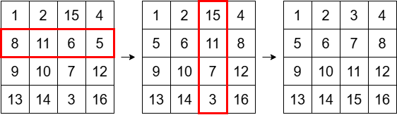

## 문제 설명

$N$행 $N$열의 격자판이 있고, 위에서 $i$번째 행, 왼쪽에서 $j$번째 열에 있는 칸을 $(i,\ j)$로 나타냅니다.

각 칸에는 정수가 쓰여 있으며, 쓰인 정수는 $1$ 이상 $N^2$ 이하이고 모두 다릅니다.

이제 다음 $2$가지 연산이 있습니다.

- 연산 $1$: 행을 $1$개 선택하고, 그 행을 좌우로 뒤집습니다.
- 연산 $2$: 열을 $1$개 선택하고, 그 열을 위아래로 뒤집습니다.

이 연산을 총 $0$회 이상 $4N^2$회 이하 수행할 수 있습니다.

단, 연산 전체에서 홀수 번째에는 연산 $1$을, 짝수 번째에는 연산 $2$를 수행해야 합니다. 즉, 연산 순서는 연산 $1$ → 연산 $2$ → 연산 $1$ → 연산 $2$ → $\cdots$이어야 합니다.

처음에 칸 $(i,\ j)$에 쓰인 숫자가 $A_{i,j}$일 때, 연산을 끝낸 뒤 칸 $(i,\ j)$에 쓰인 숫자가 $(i - 1) \times N + j$가 되도록 할 수 있을까요?

가능하다면 그러한 연산 순서의 예를 구하고, 불가능하다면 그 사실을 보고하세요.

$T$개의 테스트 케이스가 주어지므로 각각에 답하세요.

## 입력

입력은 다음 형식으로 표준 입력에서 주어집니다. 여기서 $case_i$는 $i$번째 테스트 케이스를 의미합니다.

```text
$T$
$case_1$
$case_2$
$\vdots$
$case_T$
```

각 테스트 케이스는 다음 형식으로 주어집니다.

```text
$N$
$A_{1,1}\ A_{1,2}\ \cdots\ A_{1,N}$
$A_{2,1}\ A_{2,2}\ \cdots\ A_{2,N}$
$\vdots$
$A_{N,1}\ A_{N,2}\ \cdots\ A_{N,N}$
```

## 제한

- 입력은 모두 정수입니다.
- $1 \leq T \leq 10^4$
- $2 \leq N \leq 300$
- $1 \leq A_{i,j} \leq N^2$
- 서로 다른 $2$개의 위치 $(i_1, j_1)$과 $(i_2, j_2)$에 대해 $A_{i_1,j_1} \neq A_{i_2,j_2}$입니다.
- $1$개의 입력 파일에서 $N^2$의 합은 $9 \times 10^4$를 넘지 않습니다.

## 출력

각 테스트 케이스에 대해 조건을 만족하는 연산 순서가 존재하지 않으면 $-1$을, 존재하면 다음 형식으로 그 예를 출력하세요.

```text
$K$
$B_1\ B_2\ \cdots\ B_K$
```

여기서 $K$는 연산의 총 횟수입니다. $i$가 홀수이면 $B_i$는 $i$번째 연산에서 선택하는 행이 위에서 몇 번째 행인지를 나타내고, $i$가 짝수이면 $B_i$는 $i$번째 연산에서 선택하는 열이 왼쪽에서 몇 번째 열인지를 나타냅니다.

각 테스트 케이스에 대한 출력의 마지막에는 개행을 출력하세요.

## 예제

### 예제 1 {file=""}

#### 입력

```text
2
4
1 2 15 4
8 11 6 5
9 10 7 12
13 14 3 16
2
1 2
3 4
```

#### 출력

```text
2
2 3
0
```

$1$번째 테스트 케이스에서는 위에서 $2$번째 행, 왼쪽에서 $3$번째 열을 이 순서대로 뒤집습니다. 그러면 격자판에 쓰인 숫자는 다음 그림과 같이 변하고, 위에서 $i$번째 행, 왼쪽에서 $j$번째 칸에 쓰인 숫자가 $(i - 1) \times N + j$가 되므로 정답입니다.



$2$번째 테스트 케이스에서는 처음부터 조건을 만족하므로 연산을 수행할 필요가 없습니다.
