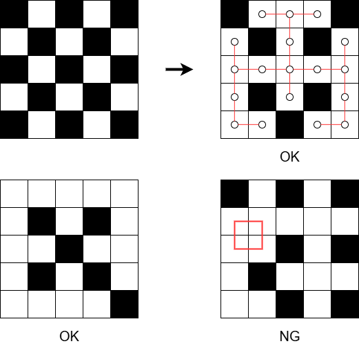

## 문제 설명

$N \times N$ 크기의 격자가 있고, 격자는 흑백의 체커보드 무늬로 칠해져 있습니다.

격자의 위에서 $i$번째 행, 왼쪽에서 $j$번째 열에 있는 칸을 $(i, j)$로 나타냅니다. 칸 $(i, j)$는 $(i + j) \bmod 2 = 0$이면 검은색, $(i + j) \bmod 2 = 1$이면 흰색으로 칠해져 있습니다.

이제 검은 칸을 $0$개 이상 흰색으로 다시 칠하여, 흰 칸 전체가 트리를 이루도록 할 수 있는지 판정하세요. 가능하다면 $1$가지 예를 제시하고, 불가능하다면 그 사실을 보고하세요.

흰 칸 전체가 트리를 이룬다는 것은 흰 칸 각각을 정점으로 하고, 격자에서 상하좌우로 인접한 흰 칸 사이에 간선을 추가하여 얻어지는 그래프가 $1$개의 트리가 된다는 뜻입니다.

## 입력

입력은 다음 형식으로 표준 입력에서 주어집니다.

```text
$N$
```

$N$은 정수입니다.

## 제한

- $2 \leq N \leq 2\,000$
- 입력은 모두 정수입니다.

## 출력

조건을 만족하는 칸의 칠하기가 존재하지 않으면 $-1$을 출력하세요. 존재하면 다음 형식으로 그 $1$가지 예를 출력하세요.

```text
$S_1$
$S_2$
$\vdots$
$S_N$
```

$S_i$는 길이 $N$인 문자열입니다. $S_i$의 $j$번째 문자는 칠한 뒤의 칸 $(i, j)$가 흰색이면 `.`, 검은색이면 `#`이어야 합니다.

마지막에 줄바꿈을 출력하세요.

## 예제

### 예제 1 {file=""}

#### 입력

```text
5
```

#### 출력

```text
#...#
.#.#.
.....
.#.#.
..#..
```

예제 출력에 대응하는 격자의 칠하기를 아래 그림의 위쪽에 나타냈습니다.

아래쪽 왼쪽의 칠하기는 조건을 만족하는 또 다른 해이고, 아래쪽 오른쪽의 칠하기는 빨간 선으로 표시된 위치에 순환을 포함하므로 조건을 만족하지 않습니다.



### 예제 2 {file=""}

#### 입력

```text
2
```

#### 출력

```text
#.
..
```
