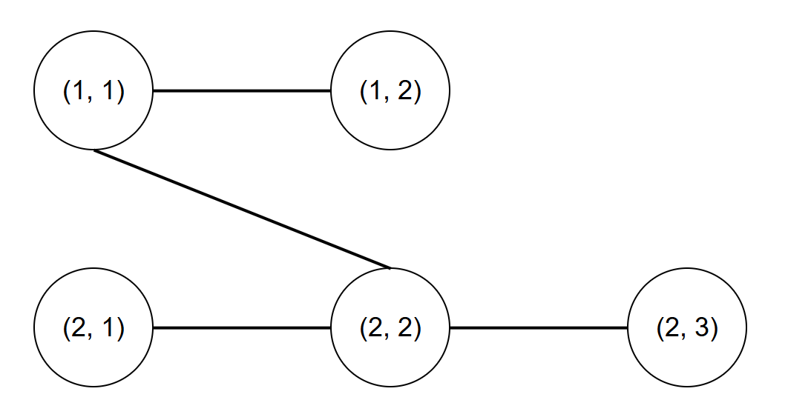

## 문제 설명

길이 $N$인 수열 $(A_1, A_2, \cdots, A_N)$과 길이 $N-1$인 수열 $(B_2, B_3, \cdots, B_N)$, $(C_2, C_3, \cdots, C_N)$, $(P_2, P_3, \cdots, P_N)$이 주어집니다.

$M = \sum_{1 \le i \le N} A_i$로 정의합니다.

$M$개의 정점을 가진 트리 $G(V, E)$를 다음과 같이 정의합니다.

- $1 \le i \le N$, $1 \le j \le A_i$를 만족하는 모든 $i$, $j$에 대해 $(i, j) \in V$입니다. 이 정점을 정점 $(i, j)$라고 부릅니다.
- $1 \le i \le N$, $1 \le j < A_i$를 만족하는 모든 $i$, $j$에 대해 정점 $(i, j)$와 정점 $(i, j+1)$을 연결하는 간선이 존재합니다.
- $2 \le i \le N$을 만족하는 모든 $i$에 대해 정점 $(i, B_i)$와 정점 $(P_i, C_i)$를 연결하는 간선이 존재합니다.
- 이외에 정점을 연결하는 간선은 존재하지 않습니다.

제한에 의해 $G(V, E)$가 트리라는 것이 보장됩니다.

다음 값을 구하고 $998\,244\,353$으로 나눈 나머지를 출력하세요.

$\displaystyle\sum_{u \in V}\sum_{v \in V} \operatorname{dist}(u, v)$

여기서 $\operatorname{dist}(u, v)$는 정점 $u$와 정점 $v$를 양 끝점으로 하는 단순 경로에 포함된 간선의 수입니다.

## 입력

입력은 다음 형식으로 주어집니다.

```text
$N$
$A_1\ A_2\ \cdots\ A_N$
$B_2\ B_3\ \cdots\ B_N$
$C_2\ C_3\ \cdots\ C_N$
$P_2\ P_3\ \cdots\ P_N$
```

제$1$번째 줄에 정수 $N$이 주어집니다.

제$2$번째 줄에 $N$개의 정수 $A_1, A_2, \cdots, A_N$이 주어집니다.

제$3$번째 줄에 $N-1$개의 정수 $B_2, B_3, \cdots, B_N$이 주어집니다.

제$4$번째 줄에 $N-1$개의 정수 $C_2, C_3, \cdots, C_N$이 주어집니다.

제$5$번째 줄에 $N-1$개의 정수 $P_2, P_3, \cdots, P_N$이 주어집니다.

## 제한

- 입력은 모두 정수입니다.
- $2 \le N \le 10^5$
- $1 \le A_i \le 10^9$ $(1 \le i \le N)$
- $1 \le B_i \le A_i$ $(2 \le i \le N)$
- $1 \le C_i \le A_{P_i}$ $(2 \le i \le N)$
- $1 \le P_i < i$ $(2 \le i \le N)$

## 출력

답을 출력하세요.

## 예제

### 예제 1 {file=""}

#### 입력

```text
2
2 3
2
1
1
```

#### 출력

```text
36
```

입력으로 주어진 트리 $G(V, E)$는 다음 그림과 같습니다.



### 예제 2 {file=""}

#### 입력

```text
3
2 3 3
1 2
2 2
1 2
```

#### 출력

```text
140
```
