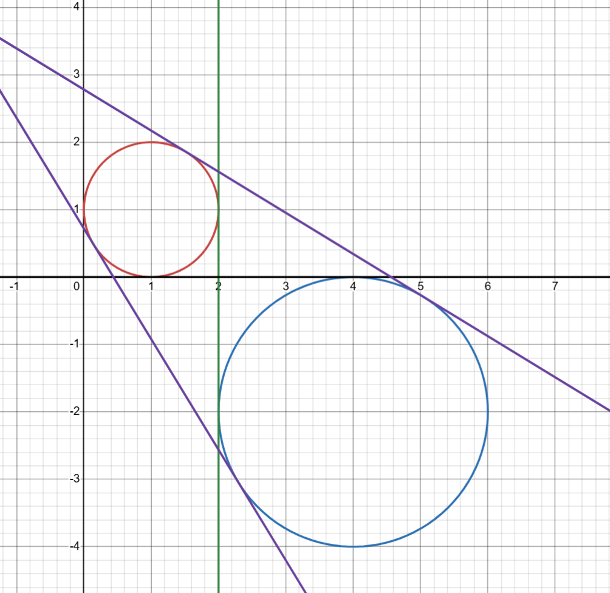

## 문제 설명

직교하는 $2$개의 축인 $x$축과 $y$축으로 이루어진 $xy$평면 위에 $2$개의 원 $1$, $2$가 있습니다. 이 $2$개의 원은 서로 교점이 없고, 어느 원도 다른 원의 내부에 포함되지 않습니다.

원 $1$의 중심은 $(C_{1x},C_{1y})$이고 반지름은 $r_1$입니다. 원 $2$의 중심은 $(C_{2x},C_{2y})$이고 반지름은 $r_2$입니다.

$2$개의 원에 동시에 접하는 직선 $4$개를 모두 구하고, 이 직선들에 특정한 처리를 하여 얻은 실수 $1$개를 출력하세요.

특정한 처리의 내용은 출력 형식을 참고하세요.

주어진 제한 아래에서는 이러한 직선이 정확히 $4$개 존재함을 보일 수 있습니다. (샘플 $1$의 그림을 참고하세요.)


$T$개의 테스트 케이스가 주어지므로, 각각에 대해 답을 구하세요.

## 입력

```text
$T$
$\text{case}_1$
$\text{case}_2$
$\text{case}_3$
$\vdots$
$\text{case}_T$
```

각 테스트 케이스는 다음 형식으로 주어집니다.

```text
$C_{1x}\ \ C_{1y}\ \ r_1$
$C_{2x}\ \ C_{2y}\ \ r_2$
```

## 제한

- $1\leq T\leq 2\times 10^5$
- $-100\leq C_{1x},C_{1y},C_{2x},C_{2y}\leq 100$
- $(C_{1x},C_{1y})\neq(C_{2x},C_{2y})$
- $0<r_1\leq r_2\leq 100$
- $\sqrt{(C_{2x}-C_{1x})^2+(C_{2y}-C_{1y})^2}>r_1+r_2$
- 입력은 모두 정수입니다.

## 출력

$T$개의 테스트 케이스에 대한 답을 출력하세요.

각 테스트 케이스에서는 먼저 $4$개의 직선을 총 $12$개의 실수 $a_1,a_2,a_3,a_4,b_1,b_2,b_3,b_4,c_1,c_2,c_3,c_4$를 사용하여 다음과 같이 나타냅니다.

- $a_1x+b_1y+c_1=0$
- $a_2x+b_2y+c_2=0$
- $a_3x+b_3y+c_3=0$
- $a_4x+b_4y+c_4=0$

그런 다음 각 식에 대해 다음 처리를 수행합니다.

직선의 식을 $ax+by+c=0$이라고 할 때, $M=\max(|a|,|b|,|c|)$로 정의합니다. 직선의 식의 모든 계수를 $M$으로 나눕니다. 즉, $a,b,c$를 각각 $\frac{a}{M},\frac{b}{M},\frac{c}{M}$으로 바꿉니다.

이 처리를 $4$개의 직선 각각에 수행한 결과가 다음과 같다고 합시다. 처리 후 식의 계수를 나타내는 문자에는 프라임을 붙입니다.

- $a'_1x+b'_1y+c'_1=0$
- $a'_2x+b'_2y+c'_2=0$
- $a'_3x+b'_3y+c'_3=0$
- $a'_4x+b'_4y+c'_4=0$

마지막으로 다음 식으로 정의되는 값 $X$를 구하여 출력하세요.

$X=|a'_1+b'_1+c'_1|+|a'_2+b'_2+c'_2|+|a'_3+b'_3+c'_3|+|a'_4+b'_4+c'_4|$

$X$는 직선의 표현 방법이나 직선의 순서와 관계없이 항상 일정하다는 것을 보일 수 있습니다.

테스트 케이스 $i$에 대한 $X$의 값을 $X_i$라고 할 때, $X_1,X_2,X_3,\ldots,X_T$를 총 $T$줄에 걸쳐 $1$줄에 $1$개씩 출력하세요.

출력 형식

```text
$X_1$
$X_2$
$X_3$
$\vdots$
$X_T$
```

출력은 판정 기준이 되는 답과의 절대 오차가 $10^{-4}$ 이하이면 정답으로 인정됩니다. 판정 기준이 되는 답과 참값의 절대 오차는 $10^{-9}$ 이하임이 보장됩니다.

## 예제

### 예제 1 {file=""}

#### 입력

```text
3
1 1 1
4 -2 2
16 -34 14
-76 99 29
0 -16 8
0 16 8
```

#### 출력

```text
3.0923292192132454
4.8406596632442525
4.0000000000000000
```



샘플 $1$의 $1$번째 테스트 케이스를 설명합니다.

답의 바탕이 되는 직선 $4$개는 각각 다음 식으로 나타낼 수 있습니다. (계수를 명시했습니다.)

이를 특정한 처리에 따라 변환하면 출력 예제의 값이 됩니다.

- $1x+0y-2=0$
- $0x+1y+0=0$
- $(\cos T)x+(\sin T)y-1-\cos T-\sin T=0\quad\left(T=\frac{\pi}{4}+\arcsin\frac{1}{3\sqrt{2}}\right)$
- $(\cos U)x+(\sin U)y-1-\cos U-\sin U=0\quad\left(U=\frac{5}{4}\pi-\arcsin\frac{1}{3\sqrt{2}}\right)$
