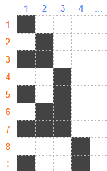

## 문제 설명

무한히 넓은 이차원 격자가 있습니다. 위에서 $r$번째, 왼쪽에서 $c$번째 칸을 칸 $(r,c)$이라고 합니다.

칸 $(r,c)$는 $r$을 이진수로 나타냈을 때 $2^{c-1}$의 자리 값이 $1$이면 검은 칸이고, $0$이면 흰 칸입니다.



당신은 처음에 칸 $(1,1)$에 있습니다. $1$번 이동할 때마다 현재 칸에서 **$8$방향으로 인접한 검은 칸 중 $1$개**를 선택하여 그 칸으로 이동할 수 있습니다.

목적지를 검은 칸 $(R,C)$로 정했을 때, 최소 몇 번 이동하면 도착할 수 있는지 구하세요.

여기서 이 문제의 제한 아래에서는 칸 $(1,1)$에서 어떤 검은 칸으로도 유한 횟수의 이동으로 도달할 수 있음이 증명됩니다.

$T$개의 테스트 케이스가 주어지므로, 각각에 대해 답을 구하세요.

## 입력

입력은 다음 형식으로 표준 입력에서 주어집니다. 여기서 $\mathrm{case}_t\ (1\leq t\leq T)$는 $t$번째 테스트 케이스를 나타냅니다.

```text
$T$
$\mathrm{case}_1$
$\mathrm{case}_2$
$\vdots$
$\mathrm{case}_T$
```

각 테스트 케이스는 다음 형식으로 주어집니다.

```text
$R\ C$
```

## 제한

- $1\leq T\leq 10^5$
- 각 테스트 케이스는 다음 제한을 모두 만족합니다.
  - $1\leq R,C\leq 10^{17}$
  - 칸 $(R,C)$는 검은 칸입니다.
- 입력은 모두 정수입니다.

## 출력

$T$줄 출력하세요. $t$번째 줄에는 $t$번째 테스트 케이스의 답을 출력하세요.

## 예제

### 예제 1 {file=""}

#### 입력

```text
5
2 2
5 1
111 2
998244353 24
99999999999999999 1
```

#### 출력

```text
1
6
114
1015021566
116172782113783824
```

$1$번째 테스트 케이스에서는 $(1,1)\to(2,2)$로 이동하면 $1$번 이동으로 도착할 수 있습니다.

$2$번째 테스트 케이스에서는 $(1,1)\to(2,2)\to(3,2)\to(4,3)\to(5,3)\to(6,2)\to(5,1)$로 이동하면 $6$번 이동으로 도착할 수 있습니다.
