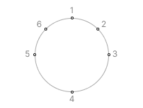
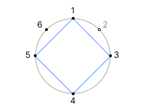

## 문제 설명

둘레의 길이가 $L$인 원이 있고, 그 원주 위에 $N$개의 점이 있습니다.

각 점에는 시계 방향으로 $1$부터 $N$까지의 번호가 순서대로 붙어 있습니다. 점 $i\ (1\leq i\leq N)$는 점 $1$에서 시계 방향으로 $D_i$만큼 이동한 위치에 있습니다. 처음에는 모든 점이 흰색입니다.

이제 원주 위의 점을 독립적이고 균등하게 무작위로 $1$개 선택하는 조작을 반복합니다. 선택한 점이 흰색이면 검은색으로 칠하고, 검은색이면 아무것도 하지 않습니다.

다음 조건 중 $1$가지 이상을 만족하는 순간 조작을 즉시 종료합니다.

- 모든 점이 검은색입니다.
- 서로 다른 검은색 점 $4$개를 꼭짓점으로 하는 사각형이 직사각형인 경우가 존재합니다.

조작 횟수의 기댓값을 $998\,244\,353$을 법으로 하는 값으로 구하세요.

여기서 ‘$998\,244\,353$을 법으로 하는 기댓값’은 다음과 같습니다.

구하려는 기댓값은 반드시 유리수가 된다는 것이 증명되어 있습니다. 또한 이 문제의 제한 아래에서 그 값을 기약분수 $\frac{P}{Q}$로 나타내었을 때 $Q\not\equiv 0\pmod {998\,244\,353}$임이 보장됩니다.

이때 $P\equiv Q\times R\pmod {998\,244\,353}$를 만족하는 $0$ 이상 $998\,244\,353$ 미만의 정수 $R$이 유일하게 존재합니다. 이때의 $R$을 구하세요.

$T$개의 테스트 케이스가 주어지므로, 각각에 대해 답을 구하세요.

## 입력

입력은 다음 형식으로 표준 입력에서 주어집니다. 여기서 $\mathrm{case}_t\ (1\leq t\leq T)$는 $t$번째 테스트 케이스를 나타냅니다.

```text
$T$
$\mathrm{case}_1$
$\mathrm{case}_2$
$\vdots$
$\mathrm{case}_T$
```

각 테스트 케이스는 다음 형식으로 주어집니다.

```text
$N\ L$
$D_1\ D_2\ \dots\ D_N$
```

각 테스트 케이스에서 $1$번째 줄은 점의 개수 $N$과 원의 둘레 $L$을 나타내고, $2$번째 줄은 각 점의 위치 $D_1,D_2,\dots,D_N$을 나타냅니다.

## 제한

- $1\leq T$
- 각 테스트 케이스는 다음 제한을 모두 만족합니다.
  - $1\leq N\leq 2\times 10^5$
  - $N\leq L\leq 10^9$
  - $0=D_1<D_2<\cdots<D_N<L$
  - 입력은 모두 정수입니다.
- $1$개의 입력 파일에서 $N$의 총합은 $2\times 10^5$ 이하입니다.

## 출력

$T$줄 출력하세요. $t$번째 줄에는 $t$번째 테스트 케이스에 대한 답을 출력하세요.

## 예제

### 예제 1 {file=""}

#### 입력

```text
3
6 8
0 1 2 4 6 7
8 19
0 2 3 5 7 11 13 17
12 1024
0 44 177 368 462 504 556 880 974 987 1016 1018
```

#### 출력

```text
499122189
655989168
356515853
```

$1$번째 테스트 케이스에서 원의 초기 상태는 다음과 같습니다.



예를 들어, 점 $1$, 점 $4$, 점 $6$, 점 $4$, 점 $5$, 점 $1$, 점 $3$의 순서로 선택하면, 그림과 같은 사각형이 직사각형을 이루므로 조작이 종료됩니다.



이 예제에서 조작 횟수는 $7$회입니다. 이 테스트 케이스에서 조작 횟수의 기댓값은 $\frac{25}{2}$입니다.
