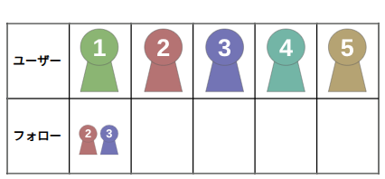
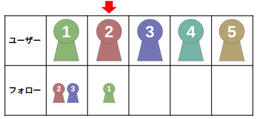
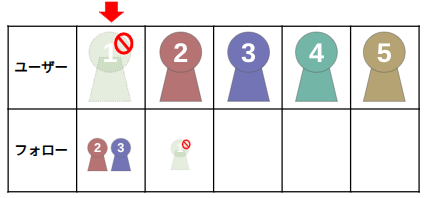
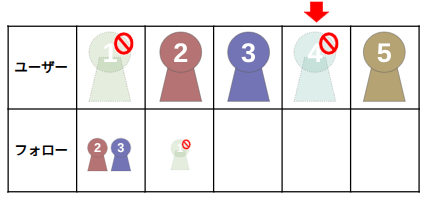
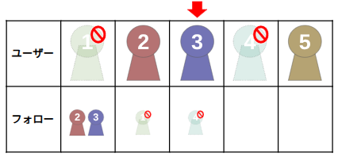
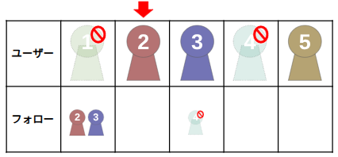
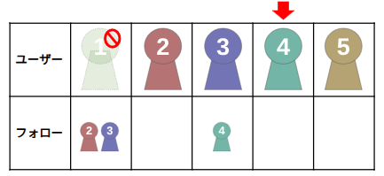

## 문제 설명

yu23578君이 운영하는 SNS "Y23"은 현재 $N$명이 이용하고 있으며, 사용자 $1$부터 사용자 $N$까지 번호가 붙어 있습니다.

"Y23"의 사용자에게는 공개 또는 비공개 상태가 정해져 있으며, 현재 모든 사용자의 상태는 공개입니다.

또한 "Y23"에는 "팔로우" 기능이 있습니다. 현재 $M$개의 팔로우 관계가 있으며, 사용자 $u_i$는 사용자 $v_i$를 팔로우하고 있습니다.

$Q$개의 연산과 문제에 대한 답변을 순서대로 수행하세요. $i$번째 연산에서 $q_i$, $a_i$, $b_i$가 주어질 때 다음과 같이 처리합니다.

- $q_i=1$일 때, 사용자 $a_i$가 사용자 $b_i$를 팔로우하고 있다면 사용자 $b_i$의 팔로우를 해제합니다. 팔로우하고 있지 않다면 사용자 $b_i$를 팔로우합니다.
- $q_i=2$일 때, 사용자 $a_i$의 상태가 공개라면 사용자 $a_i$의 상태를 비공개로 변경하고, 비공개라면 공개로 변경합니다.

연산 후, $a_i$ 이외의 사용자 중에서 사용자 $a_i$에게 팔로우되고 있거나 상태가 공개인 사용자의 수를 출력하세요.

## 입력

```text
$N\ M$
$u_1\ v_1$
$u_2\ v_2$
$\vdots$
$u_M\ v_M$
$Q$
$q_1\ a_1\ b_1$
$q_2\ a_2\ b_2$
$\vdots$
$q_Q\ a_Q\ b_Q$
```

## 제한

- $2 \le N \le 10^9$
- $1 \le M \le \min(\frac{N(N-1)}{2}, 2 \times 10^5)$
- $1 \le u_i,v_i \le N$
- $u_i \ne v_i$
- $i \ne j$라면 $(u_i,v_i) \ne (u_j,v_j)$
- $1 \le Q \le 3\,000$
- $q_i=1$일 때 $1 \le a_i,b_i \le N$
- $q_i=2$일 때 $1 \le a_i \le N$, $b_i=-1$
- $a_i \ne b_i$
- 입력은 모두 정수입니다.

## 출력

각 연산 후의 답을 연산마다 $1$줄에 출력하고, 마지막에 줄 바꿈을 출력하세요.

## 예제

### 예제 1 {file="01_sample_01.txt"}

#### 입력

```text
5 2
1 2
1 3
6
1 2 1
2 1 -1
2 4 -1
1 3 4
1 2 1
2 1 -1
```

#### 출력

```text
4
4
3
3
2
3
```

**설명 (길어서 접힌 내용)**

아래 그림의 ‘ユーザー’는 ‘사용자’, ‘フォロー’는 ‘팔로우’를 뜻합니다.

처음에 사용자의 팔로우 관계는 다음과 같습니다.



$1$번째 질의에서 사용자 $2$가 사용자 $1$을 팔로우합니다. 문제의 조건을 만족하는 사용자는 사용자 $1$, $3$, $4$, $5$로 $4$명입니다.



$2$번째 질의에서 사용자 $1$의 상태가 비공개가 됩니다. 문제의 조건을 만족하는 사용자는 사용자 $2$, $3$, $4$, $5$로 $4$명입니다.



$3$번째 질의에서 사용자 $4$의 상태가 비공개가 됩니다. 문제의 조건을 만족하는 사용자는 사용자 $2$, $3$, $5$로 $3$명입니다.



$4$번째 질의에서 사용자 $3$이 사용자 $4$를 팔로우합니다. 문제의 조건을 만족하는 사용자는 사용자 $2$, $4$, $5$로 $3$명입니다.



$5$번째 질의에서 사용자 $2$가 사용자 $1$의 팔로우를 해제합니다. 문제의 조건을 만족하는 사용자는 사용자 $3$, $5$로 $2$명입니다.



$6$번째 질의에서 사용자 $1$의 상태가 공개가 됩니다. 문제의 조건을 만족하는 사용자는 사용자 $2$, $3$, $5$로 $3$명입니다.



> **번역자 주:** 원문의 마지막 그림은 사용자 $4$가 공개, 사용자 $1$이 비공개인 상태를 나타내며 원문 설명도 사용자 $4$가 공개로 바뀐다고 되어 있습니다. 하지만 예제 입력의 $6$번째 질의는 $2\ 1\ {-1}$이므로, 실제로는 사용자 $1$이 공개로 바뀌고 사용자 $4$는 비공개로 남아야 합니다. 원문 그림과 설명에 오류가 있는 것으로 보입니다. 위 설명은 입력에 맞췄으며, 그림은 원문 그대로 유지했습니다.

### 예제 2 {file="01_sample_02.txt"}

#### 입력

```text
2 1
1 2
2
2 1 -1
2 2 -1
```

#### 출력

```text
1
0
```

조건을 만족하는 사용자가 없는 경우도 있습니다.

### 예제 3 {file="01_sample_03.txt"}

#### 입력

```text
1000000000 9
1 2
12 23
123 235
1234 2357
12345 23578
2345 3578
345 578
45 78
5 8
10
1 3 5
1 89 34
1 314 159
1 44 23
1 1 2
2 1 -1
2 23 -1
2 2357 -1
2 1 -1
2 23578 -1
```

#### 출력

```text
999999999
999999999
999999999
999999999
999999999
999999999
999999998
999999997
999999997
999999997
```
