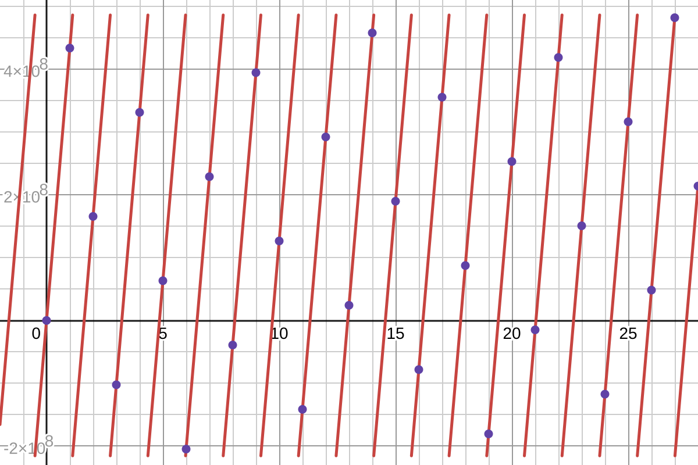
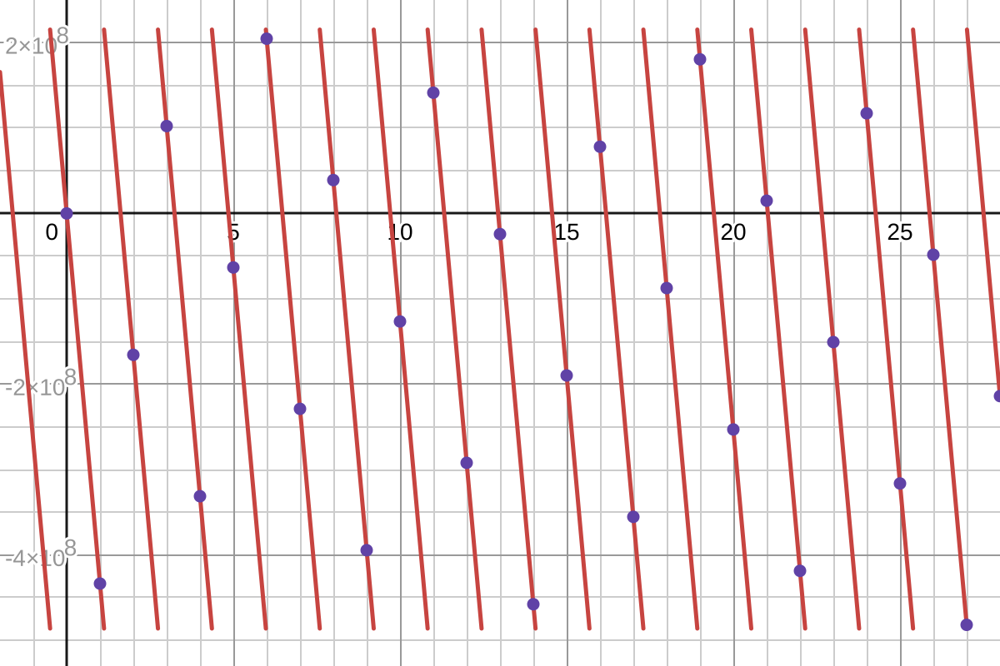
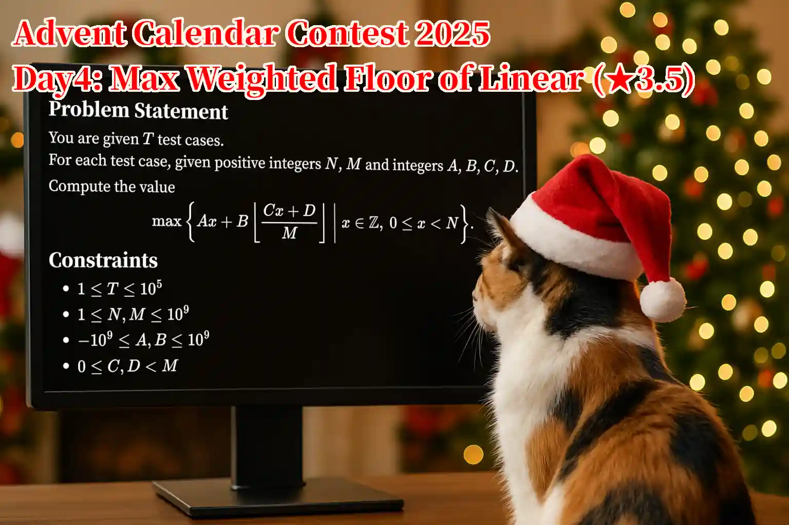

## 공지

예상 실행 시간은 가장 빠른 풀이가 약 $0.100$초, 출제자 예상 풀이가 C++에서 $0.200$~$0.300$초, PyPy3에서 $0.500$~$0.900$초입니다.

## 문제 설명

$T$개의 테스트 케이스가 있습니다.

각 테스트 케이스에 대해 양의 정수 $N,M$과 정수 $A,B,C,D$가 주어집니다.

정수 $x$를 $0$ 이상 $N$ 미만의 범위에서 움직였을 때, 식 $Ax+B\left\lfloor(Cx+D)/M\right\rfloor$이 가질 수 있는 값 중 최댓값을 구하세요.

즉, 다음 값을 구하세요.

$\max\left\lbrace Ax+B\left\lfloor(Cx+D)/M\right\rfloor\mid x\in\mathbb{Z},\ 0\leq x\lt N\right\rbrace$

$\lfloor\cdot\rfloor$는 바닥 함수이며, 실수에 대해 그 이하인 가장 큰 정수를 반환하는 함수입니다.

## 입력

```text
$T$
$N_1\ M_1\ A_1\ B_1\ C_1\ D_1$
$N_2\ M_2\ A_2\ B_2\ C_2\ D_2$
$\vdots$
$N_T\ M_T\ A_T\ B_T\ C_T\ D_T$
```

$(i+1)$번째 줄에 $i$번째 테스트 케이스의 $N_i,M_i,A_i,B_i,C_i,D_i$가 공백으로 구분되어 주어집니다.

## 제한

- $1\leq T\leq 10^5$
- $1\leq N,M\leq 10^9$
- $-10^9\leq A,B\leq 10^9$
- $0\leq C,D\lt M$
- 입력은 모두 정수입니다.

## 출력

$T$개의 줄에 답을 출력하세요. 마지막에 개행을 출력하세요.

## 예제

### 예제 1 {file="01_sample_01.txt"}

#### 입력

```text
8
1 1 0 0 0 0
5 3 7 2 2 1
3 2 -6 7 1 1
4 2 1 -10 1 0
6 3 -8 9 2 2
10 5 -3 10 2 0
12 10 -1 7 4 1
12 4 -18 19 3 3
```

#### 출력

```text
0
34
1
1
2
6
18
3
```

$f(x)=Ax+B\left\lfloor(Cx+D)/M\right\rfloor$로 두면,

- $N=1$, $M=1$, $A=0$, $B=0$, $C=0$, $D=0$일 때 $0\leq x\lt N$에서 $f(x)$의 값은 $\lbrack 0\rbrack$이고, $x=0$일 때 최댓값 $f(0)=0$을 가집니다.
- $N=5$, $M=3$, $A=7$, $B=2$, $C=2$, $D=1$일 때 $0\leq x\lt N$에서 $f(x)$의 값은 $\lbrack 0, 9, 16, 25, 34\rbrack$이고, $x=4$일 때 최댓값 $f(4)=34$를 가집니다.
- $N=3$, $M=2$, $A=-6$, $B=7$, $C=1$, $D=1$일 때 $0\leq x\lt N$에서 $f(x)$의 값은 $\lbrack 0, 1, -5\rbrack$이고, $x=1$일 때 최댓값 $f(1)=1$을 가집니다.
- $N=4$, $M=2$, $A=1$, $B=-10$, $C=1$, $D=0$일 때 $0\leq x\lt N$에서 $f(x)$의 값은 $\lbrack 0, 1, -8, -7\rbrack$이고, $x=1$일 때 최댓값 $f(1)=1$을 가집니다.

### 예제 2 {file="01_sample_02.txt"}

#### 입력

```text
10
65536 52220 7325 -20393 18757 11822
65536 47257 -20148 27317 34855 9762
65536 58215 -20112 35971 32549 36876
65536 57269 -19804 32041 35397 53181
65536 60607 14512 -37473 23471 16441
65536 57995 26034 -33647 44873 14564
65536 56689 -24409 39848 34725 14205
65536 50405 22027 -35447 31322 8
65536 25573 11413 -18490 15785 7935
65536 53895 19237 -33308 31127 29265
```

#### 출력

```text
15775
5642
22785
29754
27308
25196
9985
35441
12752
15221
```

### 예제 3 {file="01_sample_03.txt"}

#### 입력

```text
10
1000000000 102334155 433494437 -701408733 63245986 31415926
1000000000 102334155 -433494437 701408733 63245986 31415926
1000000000 484213958 185444158 -300051715 299263911 32091580
1000000000 771251471 185127374 -485073613 294346581 538843377
1000000000 679842423 -216301801 395451124 371856676 421561913
1000000000 687384999 -262204151 424255264 424827257 346851418
1000000000 432108097 -119358786 164913823 312744541 344218736
1000000000 779304889 -280890788 483327461 452901153 335911945
1000000000 452352635 109686923 -286225731 173349784 301388694
1000000000 971385323 370977589 -600253428 600350066 12805751
```

#### 출력

```text
486080765
215327987
280165601
146171564
245214372
214077322
131370897
208333696
95522302
592340299
```

- $f(x)=433\,494\,437x-701\,408\,733\left\lfloor(63\,245\,986x+31\,415\,926)/102\,334\,155\right\rfloor$



- $f(x)=-433\,494\,437x+701\,408\,733\left\lfloor(63\,245\,986x+31\,415\,926)/102\,334\,155\right\rfloor$



## 참고 이미지

Advent Calendar Contest 2025의 $4$일차 문제이며 제목은 「선형식의 가중 바닥 함수 최댓값」, 난이도는 $3.5$입니다.

일본어 문제문 버전입니다.


영어 문제문 버전입니다.


