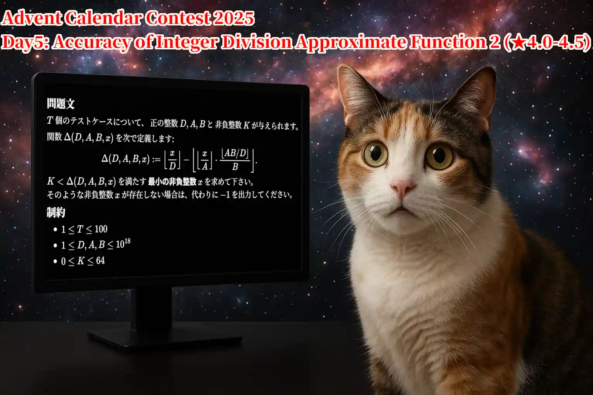
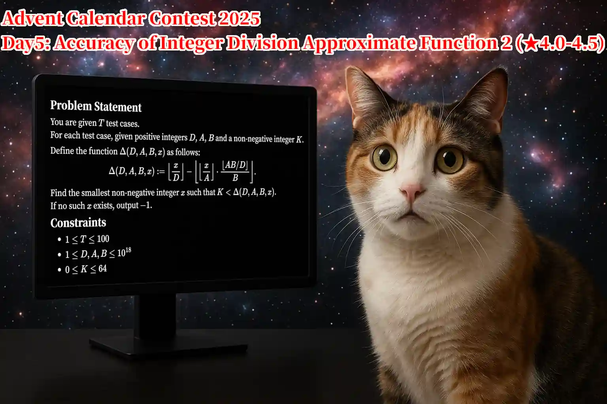

주의: 이 문제에서는 다배정밀도 정수의 사용을 권장합니다.

예상 실행 시간: 가장 빠른 풀이 약 $0.050$초, 출제자 예상 풀이(PyPy3) $0.100$~$0.300$초

이전 시리즈 문제: [No.2440 정수 나눗셈 근사 함수의 정확도](https://yukicoder.me/problems/no/2440)

## 이야기

이 이야기는 문제를 푸는 데 반드시 읽을 필요는 없습니다.

みざー君은 $0\leq x<2^{128}$ 범위에서 $\lfloor x/10^{19}\rfloor$를 빠르게 계산하고 싶었습니다.

みざー君은 $10^{19}$로 버림 나눗셈을 하는 대신, $2^{64}$로 버림 나눗셈을 한 다음 $\lfloor 2^{128}/10^{19}\rfloor$를 곱하고, 마지막으로 $2^{64}$로 버림 나눗셈을 하는 근사 함수의 오차를 검토했습니다.

즉, $D=10^{19}$, $A=2^{64}$, $B=2^{64}$로 두고, 음이 아닌 정수 $x$에 대해 다음과 같이 정의되는 오차 함수 $\Delta$를 생각했습니다.

- $\Delta(D,A,B,x) := \left\lfloor\dfrac{x}{D}\right\rfloor-\left\lfloor\left\lfloor\dfrac{x}{A}\right\rfloor\cdot\dfrac{\lfloor AB/D\rfloor}{B}\right\rfloor$
- $\Delta(10^{19},2^{64},2^{64},x) = \left\lfloor\dfrac{x}{10^{19}}\right\rfloor-\left\lfloor\left\lfloor\dfrac{x}{2^{64}}\right\rfloor\cdot\dfrac{34\,028\,236\,692\,093\,846\,346}{2^{64}} \right\rfloor$
- $\lfloor 2^{128}/10^{19}\rfloor = 34\,028\,236\,692\,093\,846\,346$

$D=10^{19}$, $A=2^{64}$, $B=2^{64}$에서 오차 함수 $\Delta$를 평가하면 다음이 성립합니다.

- $0\leq x<156\,624\,322\,790\,854\,844\,120\,000\,000\,000\,000\,000\,000$일 때 $0\leq\Delta\leq 2$가 보장됩니다.
- $x=156\,624\,322\,790\,854\,844\,120\,000\,000\,000\,000\,000\,000$일 때 $\Delta=3$입니다.
- $0\leq x<1\,164\,985\,662\,416\,622\,730\,250\,000\,000\,000\,000\,000\,000$일 때 $0\leq\Delta\leq 3$이 보장됩니다.
- $x=1\,164\,985\,662\,416\,622\,730\,250\,000\,000\,000\,000\,000\,000$일 때 $\Delta=4$입니다.
- $2^{128}<1\,164\,985\,662\,416\,622\,730\,250\,000\,000\,000\,000\,000\,000$이므로 $0\leq x<2^{128}$ 범위에서는 $0\leq\Delta\leq 3$이 보장됩니다.

みざー君은 오차 $\Delta$가 음이 아닌 정수 $K$를 초과하는 최소의 $x$를 구하는 문제에 관심을 가졌고, 이 문제를 다음과 같이 정의했습니다.

$D=10^{19}$, $A=2^{64}$, $B=2^{64}$는 이번 문제의 입력 제한 범위 밖입니다.

## 문제 설명

$T$개의 테스트 케이스가 있습니다.

각 테스트 케이스에 대해 양의 정수 $D$, $A$, $B$와 음이 아닌 정수 $K$가 주어집니다.

다음 함수 $\Delta(D,A,B,x)$와 $x_{\min}(D,A,B,K)$를 정의합니다.

- $\Delta(D,A,B,x) := \left\lfloor\dfrac{x}{D}\right\rfloor-\left\lfloor\left\lfloor\dfrac{x}{A}\right\rfloor\cdot\dfrac{\lfloor AB/D\rfloor}{B}\right\rfloor$
- $x_{\min}(D,A,B,K) := \min\lbrace x\in\mathbb{Z}_{\ge 0}\mid K<\Delta(D,A,B,x) \rbrace$
- $\mathbb{Z}_{\ge 0}$은 $0$을 포함하는 음이 아닌 정수 전체의 집합을 나타냅니다.
- $\lfloor\cdot\rfloor$는 바닥 함수입니다.

$K<\Delta(D,A,B,x)$를 만족하는 음이 아닌 정수 $x$가 존재한다면, $x_{\min}(D,A,B,K)$, 즉 $K<\Delta(D,A,B,x)$를 만족하는 가장 작은 음이 아닌 정수 $x$를 답하세요.

$K<\Delta(D,A,B,x)$를 만족하는 음이 아닌 정수 $x$가 존재하지 않는다면 $-1$을 답하세요.

출력해야 하는 값은 $64$비트 정수로 나타낼 수 있는 범위를 초과할 수 있습니다.

## 입력

입력은 다음 형식으로 주어집니다.

```text
$T$
$D_1\ A_1\ B_1\ K_1$
$D_2\ A_2\ B_2\ K_2$
$\vdots$
$D_T\ A_T\ B_T\ K_T$
```

각 테스트 케이스의 입력은 $1$줄에 $D_i$, $A_i$, $B_i$, $K_i$를 공백으로 구분하여 주어집니다.

## 제한

- $1\leq T\leq 100$
- $1\leq D\leq 10^{18}$
- $1\leq A\leq 10^{18}$
- $1\leq B\leq 10^{18}$
- $0\leq K\leq 64$
- 입력은 모두 정수입니다.

## 출력

$T$줄 출력하세요.

$i$번째 줄에는 $i$번째 테스트 케이스의 답을 출력하세요. $(1\leq i\leq T)$

출력해야 하는 값은 $64$비트 정수로 나타낼 수 있는 범위를 초과할 수 있습니다.

마지막에 개행을 출력하세요.

## 예제

### 예제 1 {file="01_sample_01.txt"}

#### 입력

```text
2
1 1 1 0
998244353 1000000000 1000000000 2
```

#### 출력

```text
-1
1391680038999995155
```

- $1$번째 테스트 케이스에서는 $D=1$, $A=1$, $B=1$, $K=0$입니다.
  - $\Delta(1,1,1,x) := \lfloor x/1\rfloor-\lfloor\lfloor x/1\rfloor\cdot 1/1\rfloor=\lfloor x\rfloor-\lfloor x\rfloor=0$
  - 따라서 $\Delta(1,1,1,x)=0$입니다.
  - 그러므로 $K=0<\Delta(1,1,1,x)$를 만족하는 $x$가 존재하지 않으며, 답은 $-1$입니다.
- $2$번째 테스트 케이스에서는 $D=998\,244\,353$, $A=10^9$, $B=10^9$, $K=2$입니다.
  - $\Delta(998\,244\,353,10^9,10^9,x) := \lfloor x/998\,244\,353\rfloor-\lfloor\lfloor x/10^9\rfloor\cdot 1\,001\,758\,734/10^9\rfloor$
  - $\lfloor 10^9\cdot 10^9/998\,244\,353\rfloor=1\,001\,758\,734$
  - $0\leq x<1\,391\,680\,038\,999\,995\,155$일 때 $\Delta(998\,244\,353,10^9,10^9,x)\leq 2$입니다.
  - 또한 $\Delta(998\,244\,353,10^9,10^9,1\,391\,680\,038\,999\,995\,155)=1\,394\,127\,635-1\,394\,127\,632=3$입니다.
  - 따라서 $x_{\min}(998\,244\,353,10^9,10^9,2)=1\,391\,680\,038\,999\,995\,155$입니다.

### 예제 2 {file="01_sample_02.txt"}

#### 입력

```text
15
6 4 5 0
6 4 5 1
6 4 5 2
6 4 9 0
6 4 9 1
8 12 4 0
10 3 2 0
10 3 2 1
10 3 2 4
5 3 1 0
5 3 1 2
12 18 25 2
20 30 7 4
15 25 9 3
15 25 10 3
```

#### 출력

```text
6
54
114
6
-1
8
10
20
50
5
15
948
1340
-1
720
```

### 예제 3 {file="01_sample_03.txt"}

#### 입력

```text
20
1000000 64000000 1234567 3
1000000 64000000 987654321 7
1048576 33554432 1000003 0
1048576 33554432 123 5
536870912 16384 16384 2
536870912 32768 8192 4
786432 1310720 6000000 6
786432 1310720 6000001 6
4194304 67108864 1024 9
4194304 67108864 1025 9
3145728 5242880 1 8
7340032 5242880 11 1
1045430272 134217728 1073741232 9
1030750208 201326592 1073740858 8
1024458752 167772160 1073740873 9
1018167296 234881024 1073741497 7
1013972992 268435456 1073741362 9
420196140727489673 679891637638612258 999999999999999989 7
999999999999999999 999999999999999998 999999999999999989 7
1000000000000000000 999999999999999999 999999999999999999 7
```

#### 출력

```text
4000000
8000000
1048576
6291456
1610612736
2684354560
-1
55050254155776
41943040
41943040
66060288
51380224
1274842250977276329984
1658692265100711034880
1555361789906621825024
1657972676523719655424
2434969170292362969088
9007968880765895055838800035237338317
599999999999999992200000000000000015199999999999999992
5999999999999999991000000000000000002000000000000000000
```

출력해야 하는 값은 $64$비트 정수로 나타낼 수 있는 범위를 초과할 수 있습니다.

이 문제는 Advent Calendar Contest 2025의 $5$일차 문제이며, 제목은 「정수 나눗셈 근사 함수의 정확도 2」, 난이도는 $4.0$~$4.5$입니다.




