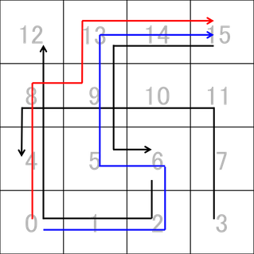
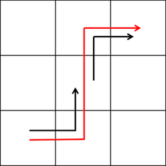
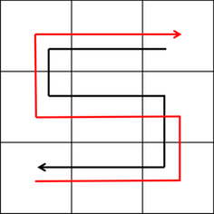

## 주의

제약 때문에 C++/Java/C# 등 빠른 언어를 사용하지 않으면 모든 테스트 케이스를 통과할 수 없습니다. 00, 01, 02 테스트 케이스는 LL로도 통과할 수 있습니다.

참고로 출제자가 예상 풀이로 해결했을 때의 대략적인 실행 시간은 다음과 같습니다.

- C++: $0.45$ sec
- Python2: $6$ sec (TLE)
- PyPy2: $1.5$ sec (TLE)

[2016/2/9 추가] 입출력 때문인지 C#도 상당히 힘든 것 같습니다. 현재까지 C#으로 AC한 사람은 $1$명뿐입니다($758$ ms).

## 이야기

Manaさん이 아침에 눈을 떠 보니 온 도시에 자신의 키보다 높은 눈이 쌓여 있었습니다. 오늘은 Mitsuruさん의 집에 놀러 가려고 했지만, 이대로라면 놀러 가기는커녕 밖으로 나갈 수도 없습니다.

그래서 Manaさん은 눈을 파헤치며 외출한 어른들이 지나간 흔적을 따라가서 외출하기로 했습니다. 하지만 Manaさん은 몸이 약해서 오랫동안 밖에 있으면 곧 감기에 걸리므로 먼 거리를 걷게 할 수 없습니다. 걱정한 아버지는 Mitsuruさん의 집에 가려면 얼마나 걸어야 하는지 조사해 주기로 했습니다.

## 문제 설명

Manaさん이 사는 도시는 가로 $W$, 세로 $H$인 직사각형이며 $W\times H$개의 정사각형 구획으로 이루어져 있습니다. 각 구획은 가장 남서쪽 구획을 $0$번으로 하여 번호를 붙입니다. $0$번 구획에서 동쪽으로 $w$, 북쪽으로 $h$만큼 이동한 구획의 번호는 $w+h\times W$입니다($0\le w\lt W$, $0\le h\lt H$).

$1$개의 구획에서 이동할 수 있는 방향은 동서남북 $4$방향이며, 인접한 구획 사이의 거리는 모두 $1$입니다. Manaさん의 집은 구획 $0$, Mitsuruさん의 집은 구획 $W\times H-1$에 있다고 합니다.

어른들의 외출은 각자의 집이 있는 구획에서 시작하여, 현재 구획에서 직진해 다른 구획에서 멈추는 행동을 반복하는 방식으로 이루어집니다. 이 직진 중 인접한 $2$개의 구획 $B_1,B_2$ 사이를 지나간 어른이 $1$명이라도 있으면, Manaさん도 $B_1$과 $B_2$ 사이를 양방향으로 이동할 수 있습니다.

예를 들어 아래 그림에서 어른들이 지나간 경로가 검은색 화살표라면, Manaさん이 Mitsuruさん에게 도달할 수 있는 경로는 빨간색과 파란색 화살표입니다.

어른들이 이동한 방향과 반대 방향으로도 Manaさん이 이동할 수 있다는 점에 주의하세요.



어른들의 이동 경로가 주어질 때, Manaさん의 집에서 Mitsuruさん의 집까지 어른들이 지나간 흔적만을 따라 도달하는 최단 거리를 구하세요.

## 입력

```text
$W\ H\ N$
$M_1$
$B_{1,0}\ B_{1,1}\ \dots\ B_{1,M_1}$
$\vdots$
$M_N$
$B_{N,0}\ B_{N,1}\ \dots\ B_{N,M_N}$
```

각 줄의 원소는 공백으로 구분됩니다. $1$번째 줄에 도시의 가로 길이 $W$, 세로 길이 $H$, 외출한 어른의 수 $N$이 주어집니다. $2$번째 줄부터 어른들의 외출 경로 정보가 주어집니다.

$M_i$는 어른 $i$가 외출 중 멈춘 횟수이고, $B_{i,0}$은 어른 $i$의 집이 있는 구획, $B_{i,j}$($j=1,\ldots,M_i$)는 어른 $i$가 $j$번째로 멈춘 구획의 번호입니다. $B_{i,j}$에서 $B_{i,j+1}$로의 이동은 동서남북 중 $1$방향으로 **직진**하며, 멈출 때마다 직진 방향이 바뀝니다.

입력은 모두 정수입니다.

## 제한

- $1\le W,H\le10^3$
- $0\le N\le10^3$
- $1\le M_i\le10^3$
- $0\le B_{i,j}\lt W\times H$
- $j=0,1,\ldots,M_i-1$에 대해
  $B_{i,j}\ne B_{i,j+1}\land\bigl(B_{i,j}\equiv B_{i,j+1}\pmod W\lor\lfloor B_{i,j}\div W\rfloor=\lfloor B_{i,j+1}\div W\rfloor\bigr)$
  이 성립합니다. 여기서 $\lfloor x\rfloor$는 바닥 함수입니다.

### 추가 제약

00, 01, 02 테스트 케이스는 $W,H,N,M_i\le3.0\times10^2$를 만족합니다.

## 출력

Manaさん이 어른들이 지나간 흔적을 따라 Mitsuruさん의 집이 있는 구획에 도달하는 최단 거리를 출력하세요. 도달할 수 없다면 `Odekakedekinai..`를 출력하세요. 마지막에 개행하세요.

## 예제

### 예제 1 {file=""}

#### 입력

```text
3 3 2
2
0 1 4
2
4 7 8
```

#### 출력

```text
4
```

$0→1→4→7→8$ 경로로 도달할 수 있습니다.



### 예제 2 {file=""}

#### 입력

```text
4 4 3
3
6 2 0 12
3
3 11 8 4
3
15 13 5 6
```

#### 출력

```text
6
```

문제에서 예로 든 경우입니다.

### 예제 3 {file=""}

#### 입력

```text
5 3 0
```

#### 출력

```text
Odekakedekinai..
```

외출한 어른이 $1$명도 없었던 경우입니다.

### 예제 4 {file=""}

#### 입력

```text
3 3 1
5
8 6 3 5 2 0
```

#### 출력

```text
8
```

인접한 $2$개의 구획을 각각 어른이 지나갔더라도, 그 $2$개의 구획 사이를 실제로 통과한 어른이 없다면 Manaさん은 그 사이를 지나갈 수 없습니다. 예를 들어 $1$과 $4$는 어른이 지나간 구획이지만 $2$개의 구획 사이를 통과한 것은 아니므로 $1→4$로 이동할 수 없습니다.



### 예제 5 {file=""}

#### 입력

```text
3 3 1
9
1 2 5 3 6 7 1 2 8 7
```

#### 출력

```text
Odekakedekinai..
```

Manaさん의 집이 있는 구획만 고립되어 있어 외출할 수 없습니다.


