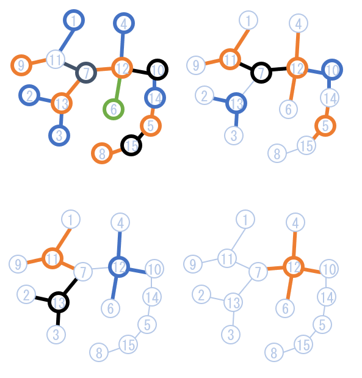

## 이야기

[国立こゃーそ大学](https://yukicoder.me/problems/no/2987)에서는 올해도 학교 축제를 준비하고 있습니다.

## 문제 설명

こゃーそ大学 캠퍼스에는 $N$개의 광장과 $N-1$개의 도로가 있습니다. 각 도로는 정확히 $2$개의 광장을 연결합니다. $N-1$개의 도로를 통해 모든 광장을 서로 오갈 수 있습니다. 광장에는 $1$부터 $N$까지, 도로에는 $1$부터 $N-1$까지 번호가 붙어 있습니다.

광장 $i$에는 $C_i$개의 도로가 연결되어 있으며, 그 번호는 $E_{i,1}, E_{i,2}, \ldots, E_{i,C_i}$입니다.

이제 캠퍼스 지도에 가능한 한 많은 **기어 기호**를 그리려고 합니다. 레벨 $K$의 **기어 기호**는 광장 $1$개와 그 광장에 연결된 도로 $K$개를 선택하여 그릴 수 있습니다. 지도에 여러 기어 기호를 그릴 때는 서로 겹치지 않게 해야 합니다. 즉, 같은 광장을 중심으로 하는 기호를 $2$개 이상 그리거나, 기호를 그리는 전체 과정에서 같은 도로를 $2$번 이상 선택해서는 안 됩니다.

또한 지도에 그리는 기어 기호는 전부 같은 레벨이어야 합니다. $q=1,2,\ldots,N-1$ 각각에 대해 레벨 $q$의 기어 기호를 그릴 수 있는 최대 개수를 구하세요.

## 입력

입력은 다음 형식으로 주어집니다.

```text
$N$
$C_1\ E_{1,1}\ E_{1,2}\ \cdots\ E_{1,C_1}$
$C_2\ E_{2,1}\ E_{2,2}\ \cdots\ E_{2,C_2}$
$\vdots$
$C_N\ E_{N,1}\ E_{N,2}\ \cdots\ E_{N,C_N}$
```

$1$번째 줄에 광장 수 $N$이 주어집니다. 이어지는 $N$개의 줄에는 광장 $i$에 연결된 도로의 개수 $C_i$와 그 도로 번호 $E_{i,1}, E_{i,2}, \ldots, E_{i,C_i}$가 주어집니다.

## 제한

- $2 \leq N \leq 200\,000$
- $1 \leq E_{i,j} \leq N-1$
- $E_{i,j} \neq E_{i,k}$ $(1 \leq i \leq N,\ 1 \leq j < k \leq C_i)$입니다. 즉, $1$개의 광장에 같은 도로가 $2$번 이상 연결되어 있지 않습니다.
- $E_{i,j}$ $(1 \leq i \leq N,\ 1 \leq j \leq C_i)$의 값으로 $1,2,\ldots,N-1$가 각각 정확히 $2$번씩 나타납니다.
- 모든 광장은 서로 오갈 수 있습니다.
- 입력되는 값은 전부 정수입니다.

## 출력

$q=1,2,\ldots,N-1$에 대한 답을 이 순서대로 공백으로 구분하여 출력하세요.

마지막에 개행을 출력하세요.

## 예제

### 예제 1 {file=""}

#### 입력

```text
3
1 1
2 2 1
1 2
```

#### 출력

```text
2 1
```

### 예제 2 {file=""}

#### 입력

```text
15
1 5
1 2
1 7
1 10
2 3 13
1 6
3 9 14 1
1 8
1 11
2 12 4
3 11 9 5
4 12 10 1 6
3 14 2 7
2 4 13
2 3 8
```

#### 출력

```text
14 6 3 1 0 0 0 0 0 0 0 0 0 0
```

아래의 $4$개 그림은 레벨 $1,2,3,4$의 기어 기호를 선택했을 때 기호를 최대 개수로 그리는 방법을 나타냅니다.


