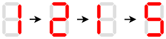
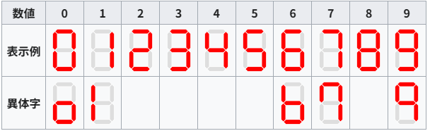
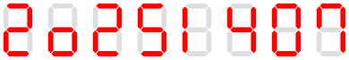

## 문제 설명

오늘은 $12$월 $15$일입니다!

$12$월 $15$일의 월과 일을 나란히 쓰면 $1\,215$라는 정수가 되는데, 이 정수에는 조금 특별한 성질이 있습니다.

그것은 다음과 같이 각 자리를 순서대로 $7$세그먼트 디스플레이에 표시했을 때, $7$개의 세그먼트를 정확히 $2$번씩 사용한다는 것입니다.



양의 정수 $N$이 주어집니다. 다음 조건을 만족하는 $N$ 이상인 정수 중 최솟값을 구하세요.

- 양의 정수의 (맨 앞에 $0$이 오지 않는) 십진 표기의 각 자리를 순서대로 $7$세그먼트 디스플레이에 표시했을 때, $7$개의 세그먼트를 모두 같은 횟수만큼 사용합니다.

표시 형식은 다음 이미지의 ‘표시 예’에 따릅니다. 단, 다음 이미지에서 ‘이체자’가 정해져 있는 숫자는 각 자리마다 ‘표시 예’와 ‘이체자’ 중 $1$가지를 선택해 사용할 수 있습니다.



([출처 - Wikipedia, 2025/11/25](https://ja.wikipedia.org/wiki/7%E3%82%BB%E3%82%B0%E3%83%A1%E3%83%B3%E3%83%88%E3%83%87%E3%82%A3%E3%82%B9%E3%83%97%E3%83%AC%E3%82%A4))

이때 임의의 양의 정수 $N$에 대해 구하는 정수가 존재한다는 것을 보일 수 있습니다.

또한 세그먼트를 사용한 횟수란 해당 세그먼트를 사용하는 숫자가 정수의 십진 표기에 나타난 횟수를 의미합니다. 세그먼트의 상태가 변화했는지는 관계없습니다.

## 입력

입력은 다음 형식으로 표준 입력에서 주어집니다.

```text
$N$
```

$N$은 양의 정수입니다.

## 제한

- 입력은 모두 정수입니다.
- $1\leq N\leq 10^{18}$

## 출력

조건을 만족하는 $N$ 이상인 정수 중 최솟값을 $1$줄에 출력하세요.

마지막에 줄바꿈을 출력하세요.

## 예제

### 예제 1 {file=""}

#### 입력

```text
1201
```

#### 출력

```text
1215
```

$1\,215$는 문제 설명의 이미지와 같이 조건을 만족합니다.

$12$월의 날짜를 $4$자리 정수로 썼을 때 조건을 만족하는 것은 이것뿐입니다.

### 예제 2 {file=""}

#### 입력

```text
8
```

#### 출력

```text
8
```

$8$을 표시하려면 모든 세그먼트를 $1$번씩 사용합니다.

### 예제 3 {file=""}

#### 입력

```text
20251215
```

#### 출력

```text
20251407
```

예를 들어 다음과 같이 표시하면 모든 세그먼트를 $5$번씩 사용할 수 있습니다.



### 예제 4 {file=""}

#### 입력

```text
271828182845904523
```

#### 출력

```text
271828182845904600
```

답이 커지는 경우에 주의하세요.
