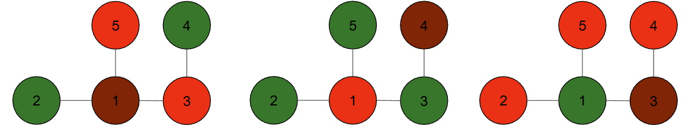

## 이야기

kazuppaくん, AwashAmityOakくん, ゆ～さん, ルクくん은 크리스마스 파티를 준비하고 있습니다.

ゆ～さん의 담당은 크리스마스 트리 장식입니다. AwashAmityOakくん이 사 온 참나무에 장식을 합니다.

ゆ〜「크리스마스 트리는 전나무 아니야?」

작업이 시작되었지만, ゆ～さん은 장식 패턴이 몇 가지나 가능한지 궁금해졌습니다.

## 문제 설명

$N$개의 정점으로 이루어진 트리가 주어집니다. 각 정점과 간선에는 각각 $1,2,\dots$와 같이 번호가 붙어 있으며, 간선 $i$는 정점 $a_i$와 $b_i$를 연결합니다.

### 트리란?

$x$개의 정점과 $x-1$개의 간선으로 이루어진 연결된(모든 정점 사이를 간선을 통해 서로 이동할 수 있는) 무방향 그래프를 트리라고 합니다.

이 트리의 각 정점을 각각 빨강, 초록, 갈색 중 $1$가지 색으로 칠하고 다음 조건을 만족하는 것을 **크리스마스 트리**라고 합니다.

- 빨강, 초록, 갈색 각각에 대해 그 색으로 칠해진 정점이 $1$개 이상 존재합니다.
- 갈색으로 칠해진 정점은 정확히 $1$개입니다.
- 같은 색으로 칠해진 정점끼리는 간선으로 직접 연결되어 있지 않습니다.

크리스마스 트리로 가능한 것은 몇 가지인지 구하세요.

답은 매우 커질 수 있으므로, 그 수를 $998\,244\,353$으로 나눈 나머지를 출력하세요.

$2$개의 크리스마스 트리는 색이 다르게 칠해진 정점이 존재할 때 서로 다른 것으로 구분합니다.

## 입력

```text
$N$
$a_1\ b_1$
$a_2\ b_2$
$\vdots$
$a_{N-1}\ b_{N-1}$
```

입력은 다음 제한을 만족합니다.

## 제한

- $3 \le N \le 2\times 10^5$
- $1\le a_i < b_i \le N$
- 주어지는 그래프는 트리입니다.

## 출력

답을 출력하고, 마지막에 개행을 출력하세요.

## 예제

### 예제 1 {file="01_sample_01.txt"}

#### 입력

```text
5
1 2
1 3
3 4
1 5
```

#### 출력

```text
18
```

예를 들어 다음과 같이 칠한 트리가 크리스마스 트리가 됩니다. (이 밖에도 여러 가지 크리스마스 트리를 생각할 수 있습니다.)



### 예제 2 {file="01_sample_02.txt"}

#### 입력

```text
10
6 9
1 8
2 7
1 3
2 4
5 10
3 5
1 6
1 2
```

#### 출력

```text
46
```

입력 크기가 커서 이 처리가 필요한 경우는 샘플에 없지만, 답을 $998\,244\,353$로 나눈 나머지를 출력한다는 점에 주의하세요.
