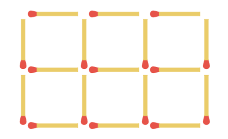

## 문제 설명

이 문제의 실행 시간 제한은 매우 엄격하게 설정되어 있습니다. 출제자 풀이(C++)는 $1\,165$ms에 실행됩니다.

양의 정수 $N$이 주어집니다. 다음 조건을 만족하는 양의 정수쌍 $(H,W)$는 몇 가지인지 구하세요.

다만 답은 매우 커질 수 있으므로, $998\,244\,353$으로 나눈 나머지를 답하세요.

- $N$개 이하의 성냥개비를 사용하여 $H$행 $W$열의 격자를 만들 수 있습니다. 예를 들어, $2$행 $3$열의 격자를 만들려면 성냥개비 $17$개가 필요합니다.



$T$개의 테스트 케이스가 주어지므로, 각각에 대해 답을 구하세요.

## 입력

입력은 다음 형식으로 표준 입력에서 주어집니다. 여기서 $\mathrm{case}_t (1 \leq t \leq T)$는 $t$번째 테스트 케이스를 나타냅니다.

```text
$T$
$\mathrm{case}_1$
$\mathrm{case}_2$
$\vdots$
$\mathrm{case}_T$
```

각 테스트 케이스는 다음 형식으로 주어집니다.

```text
$N$
```

## 제한

- 입력은 모두 정수입니다.
- $1 \leq T \leq 5$
- $4 \leq N \leq 10^{18}$

## 출력

$T$줄 출력하세요. $t$번째 줄에는 $t$번째 테스트 케이스에 대한 답을 출력하세요.

## 예제

### 예제 1 {file=""}

#### 입력

```text
3
10
2025
1000000000000000000
```

#### 출력

```text
5
5919
223288565
```

$N=10$일 때 조건을 만족하는 쌍은 $(H,W)=(1,1),(1,2),(1,3),(2,1),(3,1)$의 $5$가지입니다.

$998\,244\,353$으로 나눈 나머지를 출력해야 한다는 점에 주의하세요.
