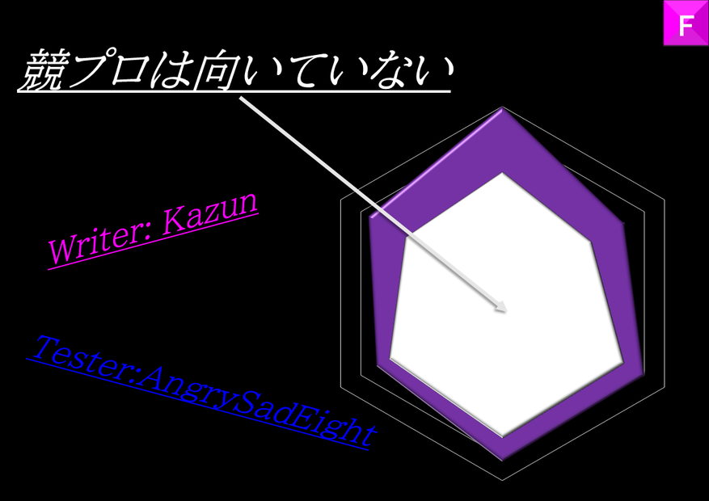

## 문제 비주얼



## 문제 설명

$N$개의 정수 쌍 $(X_i,Y_i)\ (i=1,2,\dots,N)$가 주어집니다.

$i=1,2,\dots,N$ 각각에 대해 다음 질문에 답하세요.

다음 조건을 만족하는 정수 쌍 $(A,B)$가 존재합니까? 존재한다면 그러한 정수 쌍 $(A,B)$를 $1$개 구하세요.

- $-2 \times 10^9 \leq A \leq 2 \times 10^9$.
- $-2 \times 10^9 \leq B \leq 2 \times 10^9$.
- $1 \leq j \leq N$이고 $j \ne i$인 모든 정수 $j$에 대해 $A X_j+B Y_j < A X_i+B Y_i$가 성립합니다.

$T$개의 테스트 케이스에 대해 답하세요.

## 입력

```text
$T$
$\mathrm{Testcase}_1$
$\vdots$
$\mathrm{Testcase}_T$
```

각 테스트 케이스는 다음 형식으로 주어집니다.

```text
$N$
$X_1\ Y_1$
$\vdots$
$X_N\ Y_N$
```

각 테스트 케이스의 $1$번째 줄에 정수 $N$이 주어집니다. 다음 $N$개 줄의 $i$번째 줄에는 정수 쌍 $(X_i,Y_i)$가 공백으로 구분되어 주어집니다.

## 제한

- $1 \leq T \leq 10^5$
- 각 테스트 케이스에 대해:
  - $2 \leq N \leq 2 \times 10^5$
  - $-10^9 \leq X_i \leq 10^9$, $-10^9 \leq Y_i \leq 10^9\quad(1 \leq i \leq N)$
  - $i \ne j$이면 $(X_i,Y_i) \ne (X_j,Y_j)\quad(1 \leq i \leq N,\ 1 \leq j \leq N)$
- 모든 테스트 케이스에 대한 $N$의 합은 $2 \times 10^5$ 이하입니다.
- 입력은 모두 정수입니다.

## 출력

각 테스트 케이스를 $1$번째 테스트 케이스부터 순서대로 다음 형식으로 출력하세요.

각 테스트 케이스에 대해 $N$줄을 출력하세요. $k$번째 줄($1 \leq k \leq N$)에는 $i=k$로 두었을 때 조건을 만족하는 정수 쌍 $(A,B)$가 존재하지 않으면 `No`를 출력하세요. 존재하면 그러한 정수 쌍의 예를 $1$개, $A$, $B$ 순서로 공백으로 구분해 출력하세요.

## 예제

### 예제 1 {file="0_sample_1.txt"}

#### 입력

```text
2
5
1 0
0 -2
-3 0
0 4
0 0
9
0 0
1 1
2 2
3 3
4 4
5 3
6 2
7 1
8 0
```

#### 출력

```text
10 -1
-5 -9
-5 2
2 2
No
-1 0
No
No
No
0 1
No
No
No
1 0
```

$1$번째 테스트 케이스에서는 $i=1$과 $i=5$인 경우를 설명합니다.

- ($i=1$) $(A,B)=(10,-1)$은 조건을 만족합니다. 실제로 $A$, $B$의 절댓값은 $2 \times 10^9$ 이하입니다. 또한 $A X_1+B Y_1=10$이고,
  $A X_2+B Y_2=2<10$, $A X_3+B Y_3=-30<10$, $A X_4+B Y_4=-4<10$, $A X_5+B Y_5=0<10$이므로 조건을 만족합니다. 이 외에도 $(A,B)=(46,10)$ 등도 정답입니다.
- ($i=5$) 조건을 만족하는 정수 쌍 $(A,B)$는 존재하지 않습니다. 특히 $(A,B)=(0,0)$은 조건을 만족하지 않는다는 점에 주의하세요.
