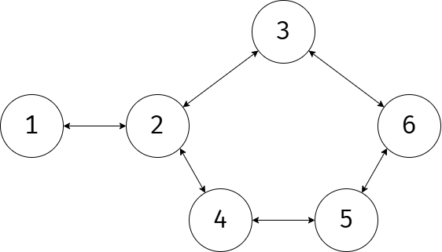

## 문제 설명

정점 수가 $V$, 간선 수가 $E$인 단순 무방향 그래프가 주어집니다. 간선 $i$
($1 \le i \le E$)는 정점 $A_i$와 정점 $B_i$를 연결합니다.

정점 $S$에서 정점 $G$까지 가는 경로 중 통과하는 간선 수가 최소인 경로를 생각합니다.
그러한 경로에서 통과하는 간선 중, 어떤 폐로에 포함된 간선의 수의 최댓값 $M$을 구하세요.

그러한 경로가 존재하지 않으면 $-1$을 출력하세요.

## 입력

입력은 다음 형식으로 주어집니다.

```text
$V\ E\ S\ G$
$A_1\ B_1$
$\vdots$
$A_E\ B_E$
```

$1$번째 줄에 그래프의 정점 수 $V$, 간선 수 $E$, 시작 정점 $S$, 도착 정점 $G$가 주어집니다.

$2$번째 줄부터 $E$개의 줄에 걸쳐, 전체 입력의 $i+1$번째 줄에 간선 $i$가 연결하는 $2$개의 정점 $A_i$, $B_i$가 주어집니다.

각 줄의 값은 공백으로 구분됩니다.

## 제한

- $1 \le V \le 2\times 10^5$
- $1 \le E \le 2\times 10^5$
- $1 \le S,G \le V$이고 $S \ne G$
- $1 \le A_i,B_i \le V$ $(1 \le i \le E)$이고 $A_i \ne B_i$
- 주어지는 그래프는 단순 무방향 그래프입니다.
- 입력은 모두 정수입니다.

## 출력

```text
$M$
```

다음 값을 $1$줄에 출력하고, 마지막에 개행하세요.

- 정점 $S$에서 정점 $G$까지의 최단 경로 중, 통과하는 간선 가운데 어떤 폐로에 포함된 간선 수의 최댓값
- 최단 경로가 존재하지 않으면 $-1$

## 예제

### 예제 1 {file="01_sample_01.txt"}

#### 입력

```text
6 6 1 6
1 2
2 3
2 4
4 5
3 6
5 6
```

#### 출력

```text
2
```



$1$에서 $6$까지 가는 경로 중 통과하는 간선 수가 가장 적은 것은
$1 \rightarrow 2 \rightarrow 3 \rightarrow 6$입니다.

이 경로에서 $2 \rightarrow 3$과 $3 \rightarrow 6$의 $2$개 간선은
어떤 폐로에 포함된 간선이므로, $2$를 출력합니다.
