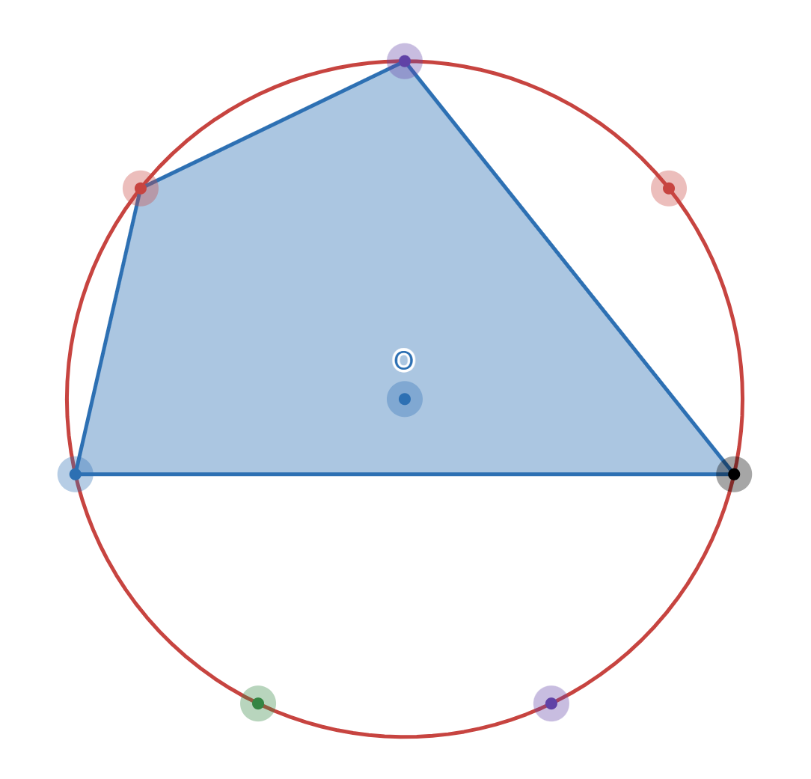
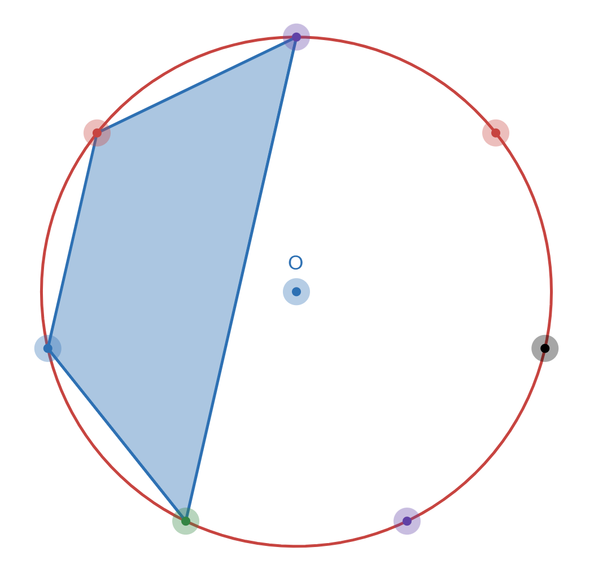

## 이야기

ルクくん은 이상한 아이이므로 정$2^N-1$각형을 그리고 있습니다.

## 문제 설명

점 $O$를 중심으로 하는 원의 원주 위에 $2^N-1$개의 점이 등간격으로 놓여 있고, 각 점에는 $1$부터 $2^N-1$까지 번호가 붙어 있습니다.

이 점들 중 서로 다른 $M$개를 선택하는 방법 중 다음 조건을 만족하는 것의 개수를 $998\,244\,353$으로 나눈 나머지를 구하세요.

- 선택한 $M$개의 점을 꼭짓점으로 하는 $M$각형의 내부(경계선 포함)에 점 $O$가 포함됩니다.

## 입력

입력은 다음 형식으로 표준 입력에서 주어집니다.

```text
$N\ M$
```

## 제한

- $2 \le N \le 10^9$
- $3 \le M \le \min(10^6, 2^N-1)$
- 입력은 모두 정수입니다.

## 출력

답을 출력하세요.

## 예제

### 예제 1 {file=""}

#### 입력

```text
3 4
```

#### 출력

```text
28
```





$1$번째 그림은 중심점 $O$가 포함되는 정례이고, $2$번째 그림은 중심점 $O$가 포함되지 않는 반례입니다.

### 예제 2 {file=""}

#### 입력

```text
5 10
```

#### 출력

```text
44197010
```
