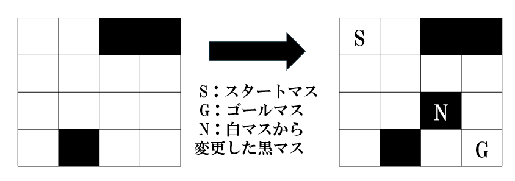
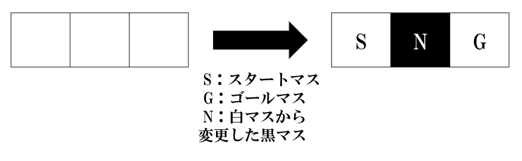

## 문제 설명

정수 $N$, $M$, $B$, $W$가 주어집니다. Alice와 Bob이 다음 게임을 합니다.

- Alice는 $N$행 $M$열의 칸으로 이루어진 미로를 만듭니다. 미로는 검은 칸 $B$개와 흰 칸 $W$개로 구성되어야 합니다. $N \times M = B + W$인 것은 제한으로 보장됩니다.
- 다음으로 Bob은 Alice가 만든 미로에서 서로 다른 흰 칸 $2$개를 골라 각각 시작 칸과 목표 칸으로 정합니다. 또한 시작 칸과 목표 칸이 아닌 흰 칸 $1$개를 골라 검은 칸으로 바꿉니다.
- 마지막으로 시작 칸에서 상하좌우로 인접한 흰 칸으로 반복해서 이동하여 목표 칸에 도달할 수 있으면 Alice가 이기고, 도달할 수 없으면 Bob이 이깁니다.

$2$명이 최적으로 행동할 때 어느 쪽이 이기는지 구하세요.

$T$개의 테스트 케이스가 주어집니다. 각 테스트 케이스에 대해 답을 구하세요.

## 입력

입력은 다음 형식으로 표준 입력에서 주어집니다. 여기서 $\mathrm{case}_i$는 $i$번째 테스트 케이스를 나타냅니다.

```text
$T$
$\mathrm{case}_1$
$\mathrm{case}_2$
$\vdots$
$\mathrm{case}_T$
```

각 테스트 케이스는 다음 형식으로 주어집니다.

```text
$N\ M\ B\ W$
```

## 제한

- 입력은 모두 정수입니다.
- $1 \leq T \leq 10^4$
- $N, M \geq 1$
- $3 \leq N \times M \leq 10^6$
- $W \geq 3$
- $B \geq 0$
- $N \times M = B + W$
- $1$개의 입력 파일에 대한 $N \times M$의 총합은 $10^6$ 이하입니다.

## 출력

$T$줄 출력하세요. $i(1 \leq i \leq T)$번째 줄에는 $i$번째 테스트 케이스의 승자 이름을 출력하세요.

## 예제

### 예제 1 {file="01_sample_01.txt"}

#### 입력

```text
4
4 4 3 13
1 3 0 3
2 4 0 8
495 495 244530 495
```

#### 출력

```text
Alice
Bob
Alice
Alice
```

$1$번째 테스트 케이스에서 가능한 게임 진행 방법 중 $1$가지로 Alice가 다음과 같은 미로를 만들고, Bob이 오른쪽 그림과 같이 시작 칸, 목표 칸, 검은 칸으로 바꿀 흰 칸을 정합니다.



이때 Alice는 시작 칸에서 목표 칸까지 도달할 수 있으므로 Alice가 승리합니다. 실제로 $2$명이 최적으로 행동해도 승리하는 쪽은 Alice임을 알 수 있습니다.

$2$번째 테스트 케이스에서 Alice가 만들 수 있는 미로는 다음의 $1$가지뿐입니다. 이 경우 Bob이 오른쪽 그림과 같이 시작 칸, 목표 칸, 검은 칸으로 바꿀 흰 칸을 정하면 Alice는 시작 칸에서 목표 칸까지 도달할 수 없습니다. 따라서 Bob이 승리합니다.


