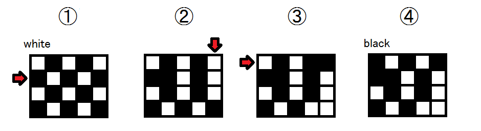

## 문제 설명

높이 $H$칸, 너비 $W$칸인 $H\times W$ 격자가 있습니다. 세로는 $0$행부터 $H-1$행까지, 가로는 $0$열부터 $W-1$열까지 번호가 붙어 있습니다. 각 칸은 흰색 또는 검은색으로 칠해져 있고, 전체가 바둑판무늬입니다. 가장 왼쪽 위 칸은 흰색입니다.

A君은 격자에 다음 $2$가지 작업 중 $1$가지를 할 수 있습니다.

- $x$행($0$부터 시작)을 골라 오른쪽으로 $1$칸 슬라이드합니다. 오른쪽 끝에서 빠져나온 칸은 왼쪽 끝으로 이동합니다.
- $y$열($0$부터 시작)을 골라 아래쪽으로 $1$칸 슬라이드합니다. 아래쪽 끝에서 빠져나온 칸은 위쪽 끝으로 이동합니다.

초기 상태가 $H=4,W=5$일 때 다음 $3$가지 작업을 수행한 그림입니다.

- $1$행을 오른쪽으로 $1$칸 슬라이드합니다. 오른쪽 끝에서 빠져나온 칸은 왼쪽 끝으로 이동합니다.
- $4$열을 아래쪽으로 $1$칸 슬라이드합니다. 아래쪽 끝에서 빠져나온 칸은 위쪽 끝으로 이동합니다.
- $0$행을 오른쪽으로 $1$칸 슬라이드합니다. 오른쪽 끝에서 빠져나온 칸은 왼쪽 끝으로 이동합니다.



이때 최종적으로 왼쪽 위 칸은 검은색이 됩니다.

A君이 수행한 작업이 입력으로 주어질 때, 모든 작업 후 왼쪽 위 칸의 색을 구하세요.

## 주의

LL 계열 언어로는 어려울 수 있습니다.

## 입력

```text
$H\ W$
$N$
$S_0\ K_0$
$S_1\ K_1$
$\vdots$
$S_{N-1}\ K_{N-1}$
```

$H,W$는 각각 세로·가로 칸 수입니다. $N$은 A君이 수행한 작업 수입니다. $S_i$는 $i$번째 작업 종류로, 행 작업이면 `R`, 열 작업이면 `C`입니다. $K_i$는 작업할 행 또는 열 번호입니다.

## 제한

- $1\le H,W\le10\,000$
- $1\le N\le1\,000\,000$
- $S_i=$`R`이면 $0\le K_i\le H-1$, $S_i=$`C`이면 $0\le K_i\le W-1$입니다.

## 출력

모든 작업 후 왼쪽 위 칸의 색을 $1$줄에 출력하세요. 흰색이면 `white`, 검은색이면 `black`을 출력합니다. 마지막에 개행을 잊지 마세요.

## 예제

### 예제 1 {file=""}

#### 입력

```text
4 5
3
R 1
C 4
R 0
```

#### 출력

```text
black
```

문제에서 설명한 예와 같습니다.

### 예제 2 {file=""}

#### 입력

```text
5 5
4
C 3
R 2
C 3
R 4
```

#### 출력

```text
white
```

왼쪽 위 칸은 $1$번도 움직이지 않습니다.

### 예제 3 {file=""}

#### 입력

```text
6 5
10
C 0
C 2
R 5
C 3
R 0
C 2
R 3
C 1
C 2
R 0
```

#### 출력

```text
white
```

### 예제 4 {file=""}

#### 입력

```text
1 2
5
C 0
R 0
C 0
R 0
C 1
```

#### 출력

```text
white
```
