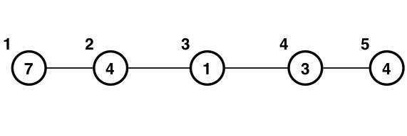

## 문제 설명

$N$개의 정점과 $M$개의 간선으로 이루어진 단순 무방향 그래프가 있습니다. $1 \leq i \leq N$에 대해 정점 $i$에는 정수 $A_i$가 쓰여 있습니다. $1 \leq i \leq M$에 대해 간선 $i$는 정점 $U_i$와 $V_i$를 연결합니다. 이 그래프 위를 뱀이 이동합니다.

뱀의 위치는 머리부터 순서대로 $k$개의 정점을 나열한 $(x_1,\dots,x_k)$로 나타냅니다. 뱀은 항상 다음 조건을 만족합니다.

- $1 \leq i \leq k-1$에 대해 정점 $x_i$와 $x_{i+1}$은 간선으로 연결되어 있습니다.
- $\displaystyle \max_{1 \leq i \leq k} A_{x_i} - \min_{1 \leq i \leq k} A_{x_i} \leq X$

이 뱀의 길이는 $k$입니다. $x_1,\dots,x_k$가 서로 다를 필요는 **없습니다**.

뱀은 다음 이동을 반복합니다.

- 머리가 있는 정점 $x_1$에 인접한 정점 $p$를 선택합니다.
- 그다음 뱀의 길이에 따라 다음과 같이 이동합니다.
  - 뱀의 길이가 $K$ 미만이면 머리 쪽에서 길이가 $1$ 늘어납니다. 뱀의 위치는 $(p,x_1,\dots,x_k)$가 됩니다.
  - 뱀의 길이가 $K$이면 꼬리 쪽에서 길이가 $1$ 줄어든 다음 머리 쪽에서 길이가 $1$ 늘어납니다. 뱀의 위치는 먼저 $(x_1,\dots,x_{k-1})$이 되었다가, 그다음 $(p,x_1,\dots,x_{k-1})$가 됩니다.

다음 조건을 만족하는 서로 다른 순서쌍 $(i,j)$ ($1 \leq i,j \leq N$)의 개수를 구하세요. 즉, $i \ne j$인 순서쌍을 셉니다.

- 정점 $i$에 있는 길이 $1$인 뱀이 여러 번 이동하여 뱀의 머리를 정점 $j$까지 도달시킬 수 있습니다.

## 입력

입력은 다음 형식으로 표준 입력에서 주어집니다.

```text
$N\ M\ X\ K$
$A_1\ \cdots\ A_N$
$U_1\ V_1$
$\vdots$
$U_M\ V_M$
```

## 제한

- $2 \leq N \leq 2 \times 10^5$
- $1 \leq M \leq \min(\frac{N\,(N-1)}{2},2 \times 10^5)$
- $1 \leq X \leq 10^9$
- $2 \leq K \leq N$
- $1 \leq U_i,V_i \leq N$
- 주어지는 그래프는 단순합니다.
- $1 \leq A_i \leq 10^9$
- 입력은 모두 정수입니다.

## 출력

답을 출력하세요.

마지막에 개행을 출력하세요.

## 예제

### 예제 1 {file="01_sample_01.txt"}

#### 입력

```text
5 4 3 3
7 4 1 3 4
1 2
2 3
3 4
4 5
```

#### 출력

```text
14
```

주어진 그래프는 아래 그림과 같으며, $X=3$, $K=3$입니다.

- 정점 $1$에서 출발하여 도달할 수 있는 정점은 $2$입니다.
- 정점 $2$에서 출발하여 도달할 수 있는 정점은 $1,3,4,5$입니다.
- 정점 $3$에서 출발하여 도달할 수 있는 정점은 $2,4,5$입니다.
- 정점 $4$에서 출발하여 도달할 수 있는 정점은 $2,3,5$입니다.
- 정점 $5$에서 출발하여 도달할 수 있는 정점은 $2,3,4$입니다.

따라서 구하는 쌍의 개수는 $14$입니다.



### 예제 2 {file="01_sample_02.txt"}

#### 입력

```text
5 4 3 2
7 4 1 3 4
1 2
2 3
3 4
4 5
```

#### 출력

```text
20
```
