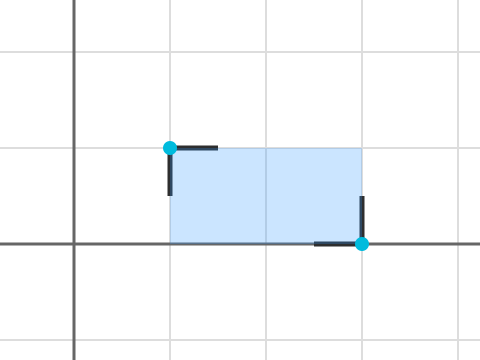

## 문제 설명

평면 위에 $N$개의 점 $1,\dots,N$이 있습니다. 점 $i$의 좌표는 $(x_i,y_i)$입니다.

각 점에 다음 조작을 정확히 $1$번씩 적용합니다.

- $s_i$를 $0$, $90$, $180$, $270$ 중에서 선택하고, 선분 $(x_i,y_i)$와 $(x_i+0.5,y_i)$를 잇는 선분을 $(x_i,y_i)$를 중심으로 반시계 방향으로 각각 $s_i$도와 $s_i+90$도로 회전한 선분 $2$개를 그립니다.

그 후, 새로 칠할 수 있는 부분이 없어지거나 더 이상 칠할 수 없게 될 때까지 다음 조작을 반복합니다.

- $1\leq i,j\leq N$인 서로 다른 점 $i,j$를 골라, 그린 선분들이 「」(갈고리 괄호) 모양을 이루도록 하고 그 안쪽을 칠합니다.
  - 더 엄밀히 말하면, $x_i<x_j$, $y_i>y_j$, $s_i=270$, $s_j=90$을 모두 만족하는 서로 다른 정수 $i,j$를 골라, $(x_i,y_i)$, $(x_i,y_j)$, $(x_j,y_j)$, $(x_j,y_i)$를 꼭짓점으로 하는 직사각형 내부를 칠합니다.

최종적으로 칠해진 부분의 둘레(구멍을 포함)의 합을, $4^N$가지 경우에 대해 모두 더한 값을 $998\,244\,353$으로 나눈 나머지를 구하세요.

## 입력

입력은 다음 형식으로 주어집니다.

```text
$N$
$x_1\ y_1$
$\vdots$
$x_N\ y_N$
```

## 제한

- $1\leq N\leq 2\times 10^5$
- $-10^9\leq x_i,y_i\leq 10^9$
- 입력은 모두 정수입니다.

## 출력

최종적으로 칠해진 부분의 둘레(구멍을 포함)의 합을 $998\,244\,353$으로 나눈 나머지를 출력하세요. 마지막에 개행을 출력하세요.

## 예제

### 예제 1 {file="01_sample_01.txt"}

#### 입력

```text
2
1 1
3 0
```

#### 출력

```text
6
```

$s_1=270$, $s_2=90$인 경우에만 둘레가 $6$이고, 그 외의 경우 둘레는 $0$입니다.



### 예제 2 {file="01_sample_02.txt"}

#### 입력

```text
10
-9570757 -8684416
-86136813 2285372
-47853785 -4113671
-9570757 -8684416
-66995299 -1371224
66995299 -2285373
-86136813 457074
-9570757 -7770267
-28712271 4113670
-86136813 457074
```

#### 출력

```text
591562628
```

$998\,244\,353$으로 나눈 값을 출력하세요.
