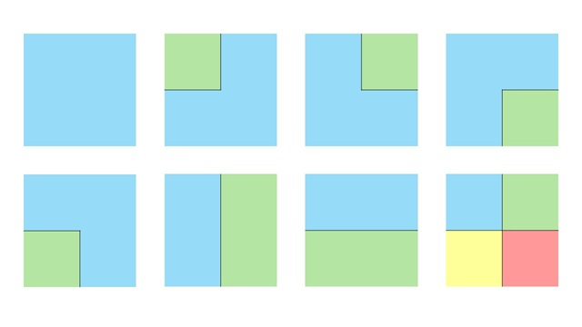
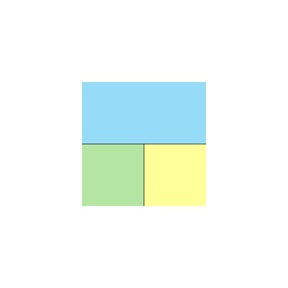

## 문제 설명

남북으로 $N$행, 동서로 $M$열인 격자 모양의 $N \times M$개 구획으로 이루어진 교토시를 여러 **특별구**로 나눕니다.

각 특별구는 동서남북으로 연결되어 있어야 합니다. 즉, 같은 특별구에 속하는 임의의 $2$개 구획 사이를, 변을 공유하며 인접한 같은 특별구의 구획만 따라 이동할 수 있어야 합니다.

인접한 $2$개 구획이 서로 다른 특별구에 속한다면, $2$개 구획을 나누는 경계에 대로를 설치합니다. 단, 교통 체증을 막기 위해 격자 내부에 T자 교차로를 만들 수 없습니다. 즉, 격자 내부의 임의의 교차점에서 그 교차점에 연결되는 대로의 개수가 정확히 $3$개가 되어서는 안 됩니다.

조건을 만족하는 특별구 분할의 개수를 $998\,244\,353$으로 나눈 나머지를 구하세요.

단, $2$개의 분할 방법은 임의의 $2$개 구획에 대해 $2$개 구획이 같은 특별구에 속하는지가 일치할 때, 그리고 그때에만 같은 분할로 간주합니다.

## 입력

입력은 다음 형식으로 표준 입력에서 주어집니다.

```text
$N\ M$
```

## 제한

- $1 \le N, M \le 3\,000$
- 입력은 모두 정수입니다.

이 문제에는 서브태스크에 의한 부분점이 설정되어 있습니다.

| 서브태스크 이름 | 배점 | 제한 |
| --- | --- | --- |
| 부분점 $1$ | $10$% ($30$점) | $N = 1$ |
| 만점 | $90$% ($270$점) | 추가 제한 없음 |

## 출력

답을 $1$줄에 출력하세요.

## 예제

### 예제 1 {file="01_sample_01.txt"}

#### 입력

```text
2 2
```

#### 출력

```text
8
```

$2 \times 2$개의 구획을 내부에 T자 교차로가 생기지 않도록 특별구로 나누는 방법은 다음 $8$가지입니다.



예를 들어 다음과 같이 $3$개의 특별구로 나누면 중앙 교차점에 모이는 대로가 $3$개가 되어 T자 교차로가 생기므로 조건을 만족하지 않습니다.



### 예제 2 {file="01_sample_02.txt"}

#### 입력

```text
1 1
```

#### 출력

```text
1
```

구획이 $1$개뿐이므로 나누지 않고 전체를 $1$개의 특별구로 만드는 $1$가지 방법뿐입니다. 내부에 교차점이 존재하지 않으므로 T자 교차로가 생기지도 않습니다.

### 예제 3 {file="01_sample_03.txt"}

#### 입력

```text
2026 529
```

#### 출력

```text
996014394
```

$998\,244\,353$으로 나눈 나머지를 구해야 한다는 점에 주의하세요.
