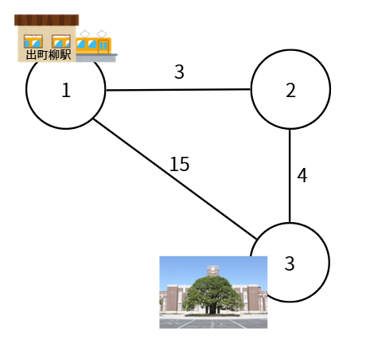
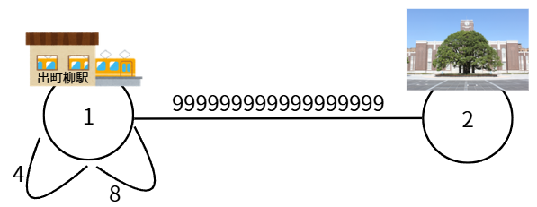

## 이야기

현재 당신은 出町柳駅(지점 $1$)에 있습니다. 京大時計台前(지점 $N$)에서 열리는 신입생 환영 행사에 참가하고 싶습니다.

## 문제 설명

이 지역에는 $N$개의 지점과 $M$개의 양방향 도로가 있습니다. $i$번째 도로는 지점 $u_i$와 지점 $v_i$를 연결하며, 이 도로를 통과하는 데는 $t_i$분이 걸립니다. 같은 쌍의 지점을 연결하는 도로가 여러 개 있을 수도 있고, 같은 지점끼리 연결하는 루프와 같은 도로가 있을 수도 있습니다. 또한 지점 $1$에서 몇 개의 도로를 통과하면 모든 지점에 도달할 수 있습니다.

당신은 시각 $0$에 지점 $1$에서 출발하여 도로로 연결된 지점으로 이동하는 일을 반복합니다. 같은 지점이나 도로를 여러 번 지나 시간을 조절해도 됩니다. 단, 멈춰 서 있는 것은 낭비이므로 멈추지 않습니다.

신입생 환영 행사는 시각 $0$에 처음 시작하고, 그 뒤로 $K$분마다 반복해서 시작합니다. 지점 $N$에 있을 때 당신은 신입생 환영 행사장에 **입장**할 수 있습니다. 지점 $N$에 도착해도 바로 입장하지 않고 다시 이동을 계속해도 됩니다.

하지만 어중간한 시각에 입장하면 이미 분위기가 무르익어 있어 조금 어색합니다. 그래서 **어색함**을 다음과 같이 정의합니다.

- 실제로 행사장에 **입장한** 시각을 기준으로, 그 직전에 시작한 행사로부터 경과한 시간(분)

행사가 시작하는 시각과 정확히 동시에 입장했다면 어색함은 $0$입니다.

당신은 어색함을 가능한 한 작게 만들고 싶습니다. 가능한 어색함의 최솟값을 구하세요.

## 입력

입력은 다음 형식으로 표준 입력에서 주어집니다.

```text
$N\ M\ K$
$u_1\ v_1\ t_1$
$\vdots$
$u_M\ v_M\ t_M$
```

$1$번째 줄에 지점의 수 $N$, 도로의 수 $M$, 행사 시작 간격 $K$가 공백으로 구분되어 주어집니다.

이후 $M$개의 줄에 $i$번째 도로가 연결하는 지점 $u_i$, $v_i$와 통과하는 데 걸리는 시간 $t_i$가 공백으로 구분되어 주어집니다.

## 제한

- $2 \le N \le 2\times 10^5$
- $1 \le M \le 2\times 10^5$
- $1 \le K \le 10^{18}$
- $1 \le u_i, v_i \le N$
- $1 \le t_i \le 10^{18}$
- 지점 $1$에서 몇 개의 도로를 통과하면 모든 지점에 도달할 수 있습니다.
- 입력은 모두 정수입니다.

이 문제에는 부분점이 설정되어 있습니다.

| 부분점 이름 | 배점 | 조건 |
| --- | --- | --- |
| 부분점 $1$ | $40$% ($120$점) | $2 \le N \le 2\,000$, $1 \le M \le 2\,000$, $1 \le K \le 2\,000$, $1 \le t_i \le 2\,000$ |
| 만점 | $60$% ($180$점) | 추가 제한은 없습니다. |

## 출력

답을 $1$줄에 출력하세요.

## 예제

### 예제 1 {file=""}

#### 입력

```text
3 3 10
1 2 3
2 3 4
1 3 15
```

#### 출력

```text
1
```

지점 $3$에서는 시각 $0, 10, 20, \ldots$에 신입생 환영 행사가 열립니다.

지점 $1$에서 지점 $3$으로 직접 가면 $15$분이 걸립니다. 이때 입장하면 직전 행사는 시각 $10$에 시작했으므로 어색함은 $5$입니다.

반면 $1 \rightarrow 2 \rightarrow 1 \rightarrow 3$으로 이동하면 $3+3+15=21$분이 걸립니다. 이때 입장하면 직전 행사는 시각 $20$에 시작했으므로 어색함은 $1$입니다.

어떻게 이동해도 어색함 $0$을 달성할 수 없으므로 어색함의 최솟값은 $1$입니다.



### 예제 2 {file=""}

#### 입력

```text
2 3 4
1 1 4
1 1 8
1 2 999999999999999999
```

#### 출력

```text
1
```

$1 \rightarrow 2 \rightarrow 1 \rightarrow 2$로 이동한 뒤 입장하면 어색함 $1$을 달성할 수 있습니다.

같은 쌍의 지점을 연결하는 도로가 여러 개 있을 수도 있고, 같은 지점에서 출발하여 같은 지점으로 돌아오는 도로가 있을 수도 있습니다.

또한 京大時計台前에 도착해도 행사장에 입장하지 않고 이동을 계속해도 된다는 점에 주의하세요.

出町柳駅에서 京大까지는 생각보다 멉니다.



### 예제 3 {file=""}

#### 입력

```text
6 9 30
1 2 6
2 3 3
3 4 6
2 5 12
5 6 3
1 4 15
3 6 18
4 5 9
1 6 21
```

#### 출력

```text
3
```

### 예제 4 {file=""}

#### 입력

```text
7 21 30
1 2 9
1 3 3
1 4 24
1 5 15
1 6 9
1 7 6
2 3 24
2 4 15
2 5 12
2 6 6
2 7 21
3 4 9
3 5 6
3 6 24
3 7 15
4 5 21
4 6 15
4 7 12
5 6 12
5 7 3
6 7 21
```

#### 출력

```text
0
```
