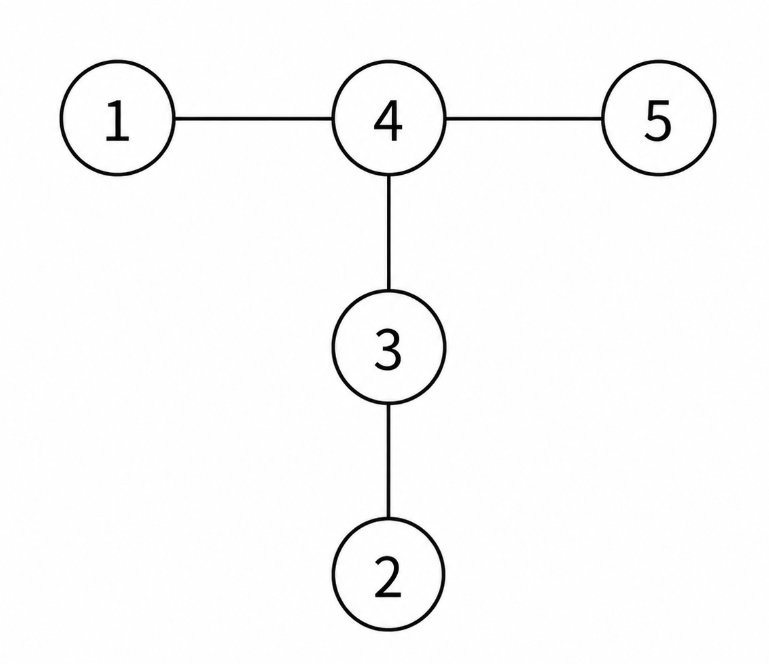

## 문제 설명

양의 정수 $N$이 주어집니다.

라벨이 붙은 $N$개의 정점으로 이루어진 단순 연결 무방향 트리 $T$와 양의 정수 $M$($1\leq M\leq N$)에 대해, 다음 조작으로 얻는 길이 $2N-1$의 수열을 $f(T,M)$이라고 합니다.

- 정점 $M$에서 DFS를 시작하여 방문한 정점을 나열한 수열입니다. 단, 인접한 정점 중 아직 방문하지 않은 정점은 라벨 순서대로 방문합니다.

가능한 모든 $T$에 대한 $f(T,M)$의 전도수 합을 소수 $998\,244\,353$으로 나눈 나머지를 $g(M)$이라고 합니다. $g(1),g(2),\ldots,g(N)$을 구하세요.

### $f$의 예



그림과 같은 트리 $T$의 경우,

- $f(T,1)=(1,4,3,2,3,4,5,4,1)$
- $f(T,3)=(3,2,3,4,1,4,5,4,3)$

가 됩니다.

## 입력

```text
$N$
```

## 제한

- $1\leq N\leq 10^6$

## 출력

$g(1),g(2),\ldots,g(N)$을 각각 $1$줄에 $1$개씩, 총 $N$줄에 걸쳐 출력하세요.
마지막에 개행을 출력하세요.

## 예제

### 예제 1 {file=""}

#### 입력

```text
3
```

#### 출력

```text
11
10
11
```

### 예제 2 {file=""}

#### 입력

```text
4
```

#### 출력

```text
127
119
119
127
```
