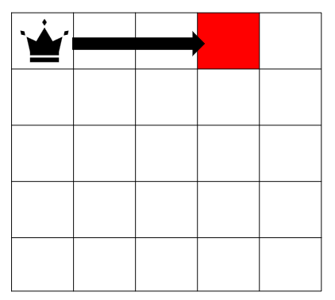
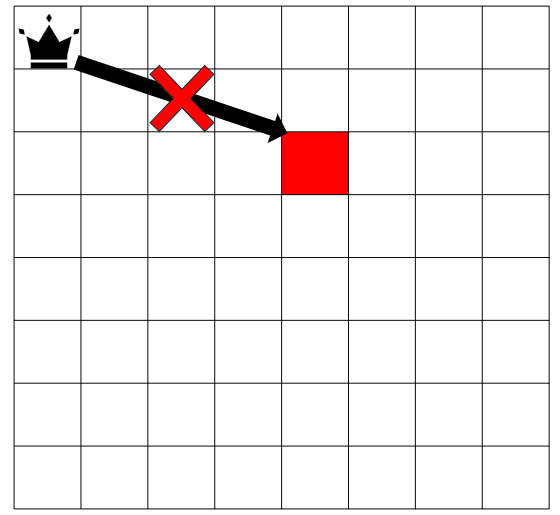

## 문제 설명

세로로 $N$칸, 가로로 $N$칸인 격자가 있습니다. 위에서 $i$번째($1 \leq i \leq N$), 왼쪽에서 $j$번째($1 \leq j \leq N$)인 칸을 칸 $(i,j)$로 나타냅니다.

칸 $(1,1)$에 퀸 말이 $1$개 있습니다. 이 퀸 말은 격자 범위 안에서는 자유롭게 드나들 수 있지만, 격자 범위 밖으로는 드나들 수 없습니다.

칸 $(1,1)$이 아닌 칸 $(h,w)$가 주어집니다. 이 퀸 말을 정확히 $1$번 움직여 칸 $(h,w)$에 도달할 수 있는지 판정하세요.

### 퀸 말의 이동 방법

퀸 말은 $1$번의 이동에서 세로, 가로, 대각선 방향으로 지나가는 경로의 모든 칸이 드나들 수 있는 동안 원하는 칸 수만큼 이동할 수 있습니다. 단, 현재 있는 칸에 그대로 머무는 것은 $1$번의 이동으로 셀 수 없습니다.

정확히 말하면, 칸 $(i,j)$에 있는 퀸 말은 양의 정수 $k$에 대하여 다음 조건을 만족할 때, 그리고 그때에만 해당 칸으로 이동할 수 있습니다.

- 칸 $(i,j+k)$: 모든 정수 $l$($1 \leq l \leq k$)에 대하여 칸 $(i,j+l)$이 퀸 말이 드나들 수 있는 칸입니다.
- 칸 $(i,j-k)$: 모든 정수 $l$($1 \leq l \leq k$)에 대하여 칸 $(i,j-l)$이 퀸 말이 드나들 수 있는 칸입니다.
- 칸 $(i+k,j)$: 모든 정수 $l$($1 \leq l \leq k$)에 대하여 칸 $(i+l,j)$가 퀸 말이 드나들 수 있는 칸입니다.
- 칸 $(i-k,j)$: 모든 정수 $l$($1 \leq l \leq k$)에 대하여 칸 $(i-l,j)$가 퀸 말이 드나들 수 있는 칸입니다.
- 칸 $(i+k,j+k)$: 모든 정수 $l$($1 \leq l \leq k$)에 대하여 칸 $(i+l,j+l)$이 퀸 말이 드나들 수 있는 칸입니다.
- 칸 $(i+k,j-k)$: 모든 정수 $l$($1 \leq l \leq k$)에 대하여 칸 $(i+l,j-l)$이 퀸 말이 드나들 수 있는 칸입니다.
- 칸 $(i-k,j+k)$: 모든 정수 $l$($1 \leq l \leq k$)에 대하여 칸 $(i-l,j+l)$이 퀸 말이 드나들 수 있는 칸입니다.
- 칸 $(i-k,j-k)$: 모든 정수 $l$($1 \leq l \leq k$)에 대하여 칸 $(i-l,j-l)$이 퀸 말이 드나들 수 있는 칸입니다.

## 입력

입력은 다음 형식으로 표준 입력에서 주어집니다.

```text
$N$
$h\ w$
```

## 제한

- 모든 입력은 정수입니다.
- $2 \leq N \leq 8$
- $1 \leq h,w \leq N$
- $(h,w) \neq (1,1)$

## 출력

퀸 말이 칸 $(h,w)$에 도달할 수 있다면 `Yes`를, 도달할 수 없다면 `No`를 출력하세요.

## 예제

### 예제 1 {file="01_sample_01.txt"}

#### 입력

```text
5
1 4
```

#### 출력

```text
Yes
```

퀸 말은 정확히 $1$번의 이동으로 칸 $(1,4)$에 도달할 수 있습니다. 따라서 `Yes`를 출력합니다.



### 예제 2 {file="01_sample_02.txt"}

#### 입력

```text
8
3 5
```

#### 출력

```text
No
```

퀸 말은 정확히 $1$번의 이동으로 칸 $(3,5)$에 도달할 수 없습니다. 따라서 `No`를 출력합니다.



### 예제 3 {file="01_sample_03.txt"}

#### 입력

```text
8
8 8
```

#### 출력

```text
Yes
```
