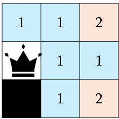

## 문제 설명

세로 $H$칸, 가로 $W$칸의 격자가 있습니다. 위에서 $i$($1 \leq i \leq H$)번째, 왼쪽에서 $j$($1 \leq j \leq W$)번째 칸을 칸 $(i,j)$라고 합니다.

이 격자의 칸 $(x,y)$에는 벽 $1$개가 놓여 있습니다. 이외의 칸에는 벽이 없습니다.

처음에 칸 $(h,w)$에 퀸 말 $1$개가 놓여 있습니다. 이 퀸 말은 격자 안에서 벽이 없는 칸으로 자유롭게 드나들 수 있지만, 벽이 있는 칸이나 격자 밖의 칸으로는 드나들 수 없습니다.

$1 \leq i \leq H$, $1 \leq j \leq W$, $(i,j) \neq (x,y)$를 만족하는 정수 $(i,j)$에 대하여, 처음 칸 $(h,w)$에 놓인 퀸 말을 칸 $(i,j)$로 이동시키는 데 필요한 이동 횟수의 최솟값을 $D(i,j)$로 정의합니다.

$\displaystyle\sum_{1 \leq i \leq H, 1 \leq j \leq W, (i,j) \neq (x,y)} D(i,j)$를 구하세요.

$T$개의 테스트 케이스가 주어지므로, 각각에 대해 답을 구하세요.

### 퀸 말의 이동 방법

퀸 말은 $1$번의 이동에서 세로, 가로 또는 대각선 방향으로, 지나가는 경로의 칸이 모두 드나들 수 있는 한 원하는 칸 수만큼 이동할 수 있습니다. 단, 현재 있는 칸에 그대로 머무르는 것은 $1$번의 이동으로 셀 수 없습니다.

정확히 말하면, 칸 $(i,j)$에 있는 퀸 말은 양의 정수 $k$에 대하여 다음 조건을 만족할 때, 그리고 그때에 한해서 해당 칸으로 이동할 수 있습니다.

- 칸 $(i,j+k)$로 이동할 수 있는 조건은 $1 \leq l \leq k$를 만족하는 모든 정수 $l$에 대해 칸 $(i,j+l)$이 퀸 말이 드나들 수 있는 칸인 것입니다.
- 칸 $(i,j-k)$로 이동할 수 있는 조건은 $1 \leq l \leq k$를 만족하는 모든 정수 $l$에 대해 칸 $(i,j-l)$이 퀸 말이 드나들 수 있는 칸인 것입니다.
- 칸 $(i+k,j)$로 이동할 수 있는 조건은 $1 \leq l \leq k$를 만족하는 모든 정수 $l$에 대해 칸 $(i+l,j)$가 퀸 말이 드나들 수 있는 칸인 것입니다.
- 칸 $(i-k,j)$로 이동할 수 있는 조건은 $1 \leq l \leq k$를 만족하는 모든 정수 $l$에 대해 칸 $(i-l,j)$가 퀸 말이 드나들 수 있는 칸인 것입니다.
- 칸 $(i+k,j+k)$로 이동할 수 있는 조건은 $1 \leq l \leq k$를 만족하는 모든 정수 $l$에 대해 칸 $(i+l,j+l)$이 퀸 말이 드나들 수 있는 칸인 것입니다.
- 칸 $(i+k,j-k)$로 이동할 수 있는 조건은 $1 \leq l \leq k$를 만족하는 모든 정수 $l$에 대해 칸 $(i+l,j-l)$이 퀸 말이 드나들 수 있는 칸인 것입니다.
- 칸 $(i-k,j+k)$로 이동할 수 있는 조건은 $1 \leq l \leq k$를 만족하는 모든 정수 $l$에 대해 칸 $(i-l,j+l)$이 퀸 말이 드나들 수 있는 칸인 것입니다.
- 칸 $(i-k,j-k)$로 이동할 수 있는 조건은 $1 \leq l \leq k$를 만족하는 모든 정수 $l$에 대해 칸 $(i-l,j-l)$이 퀸 말이 드나들 수 있는 칸인 것입니다.

## 입력

입력은 다음 형식으로 표준 입력에서 주어집니다. 여기서 $\mathrm{case}_i$는 $i$번째 테스트 케이스를 나타냅니다.

```text
$T$
$\mathrm{case}_1$
$\mathrm{case}_2$
$\vdots$
$\mathrm{case}_T$
```

각 테스트 케이스는 다음 형식으로 주어집니다.

```text
$H\ W\ h\ w\ x\ y$
```

## 제한

- 입력은 모두 정수입니다.
- $1 \leq T \leq 10^5$
- $2 \leq H,W \leq 10^6$
- $1 \leq h,x \leq H$
- $1 \leq w,y \leq W$
- $(h,w) \neq (x,y)$

## 출력

$T$줄 출력하세요. $i$번째 줄에는 $i$번째 테스트 케이스의 답을 출력하세요.

## 예제

### 예제 1 {file="01_sample_01.txt"}

#### 입력

```text
4
3 3 2 1 3 1
2 2 1 1 2 2
20 26 7 24 8 1
1000000 1000000 2026 724 2026 801
```

#### 출력

```text
9
2
969
1999997998404
```

테스트 케이스 $1$에서 각 칸 $(i,j)$에 대한 $D(i,j)$의 값은 다음 그림과 같습니다.



따라서 $\displaystyle\sum_{1 \leq i \leq 3, 1 \leq j \leq 3, (i,j) \neq (3,1)} D(i,j)$의 값은 $1+1+2+0+1+1+1+2=9$입니다.

테스트 케이스 $2$에서는 $D(1,1)=0$, $D(1,2)=1$, $D(2,1)=1$이므로 답은 $0+1+1=2$입니다.
