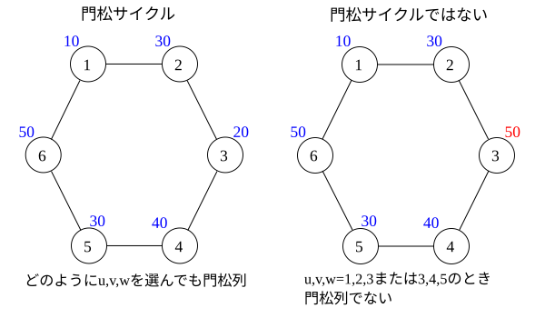
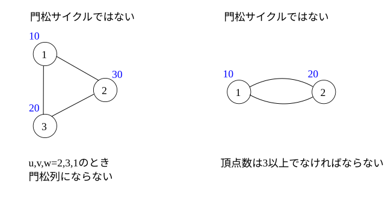
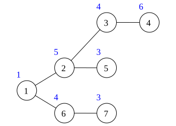
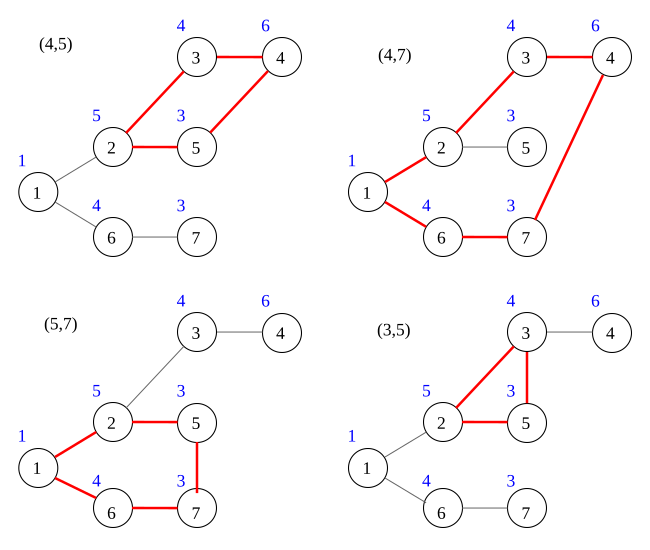

## 문제 설명

$3$개의 원소로 이루어진 수열 $A_1,A_2,A_3$가 다음 $2$가지 조건을 만족하면 카도마츠 열이라고 합니다.

- $A_1,A_2,A_3$가 모두 다릅니다.
- $3$개의 원소 중 $A_2$가 가장 크거나 가장 작습니다.

정점 $i$가 값 $A_i$를 갖는 그래프의 사이클이 다음 $2$가지 조건을 만족하면 카도마츠 사이클이라고 합니다.

- 사이클의 정점 수가 $3$ 이상입니다.
- 사이클에서 연속한 $3$개의 정점을 $u,v,w$라 할 때, 모든 $u,v,w$에 대해 수열 $A_u,A_v,A_w$가 카도마츠 열입니다.

아래 그림의 그래프에서는 왼쪽 위 사이클만 카도마츠 사이클입니다.



- 왼쪽: 카도마츠 사이클. $u,v,w$를 어떻게 선택해도 카도마츠 열입니다.
- 오른쪽: 카도마츠 사이클이 아닙니다. $u,v,w=1,2,3$ 또는 $3,4,5$일 때 카도마츠 열이 아닙니다.



- 왼쪽: 카도마츠 사이클이 아닙니다. $u,v,w=2,3,1$일 때 카도마츠 열이 되지 않습니다.
- 오른쪽: 카도마츠 사이클이 아닙니다. 정점 수가 $3$ 이상이어야 합니다.

정점 $i$가 값 $A_i$를 갖는 $N$개 정점의 트리가 있습니다. 이 트리에 정점 $u$와 정점 $v$($u\ne v$)를 잇는 간선을 새로 추가하면 정확히 $1$개의 사이클이 생깁니다. 이렇게 생긴 사이클이 카도마츠 사이클인지 $Q$개의 간선에 대해 각각 답하세요. 카도마츠 사이클이면 `YES`, 아니면 `NO`를 $1$줄씩 출력하세요.

## 입력

```text
$N$
$A_1\ A_2\ \dots\ A_N$
$x_1\ y_1$
$x_2\ y_2$
$\vdots$
$x_{N-1}\ y_{N-1}$
$Q$
$u_1\ v_1$
$u_2\ v_2$
$\vdots$
$u_Q\ v_Q$
```

$1$번째 줄에 트리의 정점 수 $N$, $2$번째 줄에 정점 $i$의 값 $A_i$가 공백으로 구분되어 주어집니다. 다음 $N-1$줄에 기존 간선 정보가 주어지며, $i$번째 간선은 $x_i$와 $y_i$를 잇습니다. 그다음 줄에 새로 추가할 간선 수 $Q$가 주어지고, 이어지는 $Q$줄에 $u_i,v_i$가 주어집니다.

각 간선은 트리에 독립적으로 추가됩니다. $i$번째 간선의 추가는 $j$번째($i\ne j$) 그래프에 영향을 주지 않습니다.

입력은 모두 정수입니다.

## 제한

- $2\le N\le10^5$
- $1\le A_i\le10^5$
- $1\le x_i,y_i\le N$, $x_i\ne y_i$
- 트리는 다중 간선과 자기 루프가 없고 연결되어 있음이 보장됩니다.
- $1\le Q\le10^5$
- $1\le u_i,v_i\le N$, $u_i\ne v_i$

입출력량이 많으므로 가능한 한 빠른 입출력을 사용하세요. 실행 시간 제한 $4$초 중 $2$초는 입출력을 위해 설정되어 있습니다.

## 출력

각 간선을 추가해 생기는 사이클이 카도마츠 사이클이면 `YES`, 아니면 `NO`를 각 간선마다 $1$줄에 출력하세요.

## 예제

### 예제 1 {file=""}

#### 입력

```text
7
1 5 4 6 3 4 3
1 2
2 3
3 4
2 5
1 6
6 7
4
4 5
4 7
5 7
3 5
```

#### 출력

```text
YES
YES
NO
NO
```



아래 그림은 이 트리에 간선을 추가한 것입니다. 각 간선은 서로 독립적으로 추가된다는 점에 주의하세요.



### 예제 2 {file=""}

#### 입력

```text
7
1 5 4 6 3 4 3
1 2
2 3
3 4
4 5
5 6
6 7
5
1 2
1 5
3 7
6 1
1 4
```

#### 출력

```text
NO
NO
NO
YES
YES
```
