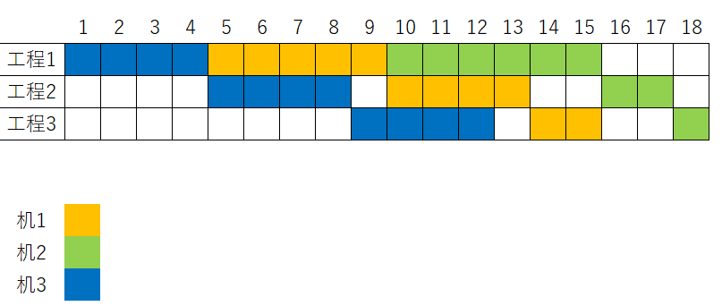

## 이야기

ばるとーく工務店에서는 주문 제작 책상을 만들고 있습니다.

어느 날, 이 공방에 다음과 같은 의뢰가 들어왔습니다.

$N$대의 책상을 $D$일 이내에 납품해 주세요.

## 문제 설명

공방의 장인에 따르면 책상 $1$대를 만들려면 공정 $1$ → 공정 $2$ → 공정 $3$을 이 순서대로 수행해야 한다고 합니다. 책상 $i$를 만드는 데에는 공정 $1$, 공정 $2$, 공정 $3$에 각각 $A_i$, $B_i$, $C_i$일이 걸립니다.

이 공방에는 각 공정을 수행하기 위한 전용 기계가 $1$대씩 있으며, 각 기계는 동시에 작업 중인 제품(=제작 중인 책상) $1$대만 처리할 수 있습니다. 작업 중인 제품은 제작하기로 결정되는 즉시 생산 라인에 올리므로, 어떤 공정이 끝난 작업 중인 제품은 다음 공정의 기계가 비는 즉시 작업을 받습니다.

따라서 책상은 어떤 순서로 만들어도 되지만, 모든 공정이 끝날 때까지 작업을 중단할 수 없습니다. 또한 공정 사이에서 투입 순서를 바꿀 수 없습니다. 예를 들어 공정 $1$을 먼저 시작한 작업 중인 제품은 공정 $2$도 먼저 시작해야 합니다.

가능한 한 빠른 날에 납품할 수 있도록 제작 순서를 최적으로 선택했을 때, 모든 책상을 작업 시작 후 $D$일 이내에 완성할 수 있는지 판정하세요. 단, 납품은 모든 제품이 완성될 때까지 할 수 없으며, 모든 제품이 완성된 날에 즉시 이루어집니다.

## 입력

```text
$N\ D$
$A_1\ B_1\ C_1$
$A_2\ B_2\ C_2$
$\vdots$
$A_N\ B_N\ C_N$
```

## 제한

- $1\leq N\leq13$
- $1\leq D\leq5\times10^3$
- $1\leq A_i,B_i,C_i\leq100$ ($1\leq i\leq N$)
- 입력은 모두 정수입니다.

### 부분점

| 부분문제 | 배점 | 조건 |
| --- | ---: | --- |
| 부분문제 $1$ | $20$% ($60$점) | $(A,B,C)$에 대해, $\min(A_i)\geq\max(B_i)$ 또는 $\min(C_i)\geq\max(B_i)$를 만족하는 입력. $N\leq13$ |
| 부분문제 $2$ | $10$% ($30$점) | 부분문제 $1$의 조건을 반드시 만족하지는 않음. $N\leq10$ |
| 부분문제 $3$ | $70$% ($210$점) | 부분문제 $1$의 조건을 반드시 만족하지는 않음. $N\leq13$ |

각 부분문제 번호에 대응하는 샘플을 AC하지 않으면 $0$점입니다. 즉, 부분문제 $1$에서는 샘플 $1$을, 부분문제 $2$에서는 샘플 $2$를, 부분문제 $3$에서는 샘플 $3$을 AC해야 합니다.

또한 부분문제 $2$만 AC할 수 있는 코드를 작성하는 경우, 부분문제 $1$의 코드 테스트에서 TLE가 발생할 수 있습니다. 따라서 이러한 코드를 제출한다면 부분문제 $2$의 제한을 만족하지 않을 때 즉시 실행을 종료하는 것을 권장합니다.

## 출력

조건을 만족하는 제작 순서가 존재한다면 `Yes`를, 존재하지 않는다면 `No`를 $1$줄에 출력하세요. 마지막에 개행을 출력하세요.

## 예제

### 예제 1 {file=""}

#### 입력

```text
3 18
5 4 2
6 2 1
4 4 4
```

#### 출력

```text
Yes
```

예를 들어 책상 $3$ → 책상 $1$ → 책상 $2$ 순서로 만들면 납기인 $18$일에 맞출 수 있습니다.

이때 제작 과정을 그림으로 나타내면 다음과 같습니다.



### 예제 2 {file=""}

#### 입력

```text
6 422
75 100 15
74 75 20
80 57 53
48 42 1
5 68 1
78 55 94
```

#### 출력

```text
No
```

### 예제 3 {file=""}

#### 입력

```text
11 724
73 98 9
33 16 64
98 58 61
84 49 27
13 63 4
50 56 78
98 99 1
90 58 35
93 30 76
14 41 4
3 4 84
```

#### 출력

```text
No
```
