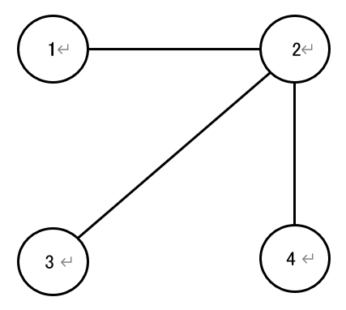

## 문제 설명

ばるとーく王国에는 $1$번부터 $N$번까지 번호가 붙은 $N$개의 도시가 있습니다. 왕국 전체에는 $M$개의 도로가 있으며, $i$번째 도로는 도시 $u_i$와 도시 $v_i$를 양방향으로 연결합니다.

각 도시는 반드시 $1$개 이상의 다른 도시와 양방향으로 오갈 수 있는 도로로 연결되어 있으며, 모든 도시는 도로를 사용해 서로 오갈 수 있음이 보장됩니다. 또한 $2$개의 도시 사이의 도로는 많아야 $1$개이며, $1$개의 도시만으로 끝나는 도로는 존재하지 않습니다.

모험을 좋아하는 소년 ばる君은 $1$일째에 도시 $1$에 있습니다. $2$일째 이후에는 매일, ばる君이 현재 있는 도시와 연결된 도로 중 $1$개를 같은 확률로 선택해 그 도로를 지나 그날 방문할 도시로 이동합니다. 각 날의 이동은 서로 독립입니다.

어느 날, 왕국의 점쟁이가 ばる君에게 다음과 같이 예언했습니다.

> “당신은 $S$일째에 반드시 도시 $A$를 방문할 것입니다.”

이 예언이 참일 때, ばる君이 $T$일째($1 \leq T < S$)에 도시 $B$를 방문했을 조건부확률을 법 $998\,244\,353$에서의 값으로 구하세요.
이 문제의 제한 아래에서는 조건부확률이 유일하게 정의된다는 것이 보장됩니다.

### 조건부확률의 법 $998\,244\,353$에서의 값이란?

구하는 조건부확률은 반드시 유리수가 된다는 것을 증명할 수 있습니다.

또한 이 문제의 제한 아래에서는 그 값을 기약분수 $\frac{p}{q}$로 나타냈을 때 $q \not\equiv 0\pmod{998\,244\,353}$가 된다는 것도 증명할 수 있습니다. 따라서 $R \times q \equiv p \pmod{998\,244\,353}$, $0 \leq R < 998\,244\,353$를 만족하는 정수 $R$이 유일하게 정해집니다. 이 $R$을 출력하세요.

## 입력

```text
$N\ M$
$u_1\ v_1$
$u_2\ v_2$
$\vdots$
$u_M\ v_M$
$S\ T\ A\ B$
```

## 제한

- $2 \leq N \leq 50$
- $N-1 \leq M \leq \dfrac{N(N-1)}{2}$
- $1 \leq u_i,v_i \leq N$, $u_i \neq v_i$ (자기 자신으로 연결되는 도로는 없습니다.)
- $i \neq j$일 때 $\{u_i,\ v_i\} \neq \{u_j,\ v_j\}$ (다중 간선은 없습니다.)
- 각 도시는 반드시 $1$개 이상의 다른 도시와 양방향으로 오갈 수 있는 도로로 연결되어 있습니다.
- 모든 도시는 도로를 사용해 서로 오갈 수 있습니다(각 도시는 연결되어 있습니다).
- $1 \leq A,B \leq N$
- $1 \leq T < S \leq 10^{18}$
- ばる君이 $S$일째에 도시 $A$에 있을 확률은 $0$이 아님이 보장됩니다.
- ばる君이 $S$일째에 도시 $A$에 있을 확률이 법 $998\,244\,353$에서 $0$이 아님이 보장됩니다.
- 구하는 조건부확률은 분모가 $998\,244\,353$와 서로소인 기약분수로 나타낼 수 있습니다.
- 입력은 모두 정수입니다.

## 출력

구하는 조건부확률을 법 $998\,244\,353$에서의 값으로 $1$줄에 출력하세요.

마지막에 개행을 출력하세요.

## 예제

### 예제 1 {file="01_sample01.txt"}

#### 입력

```text
4 3
1 2
2 3
2 4
5 3 1 3
```

#### 출력

```text
332748118
```

도시는 다음과 같은 형태입니다.



$1$일째에 도시 $1$에서 출발하면, 날마다 위치는 다음과 같습니다.

- $1$일째: 도시 $1$에 있습니다(확률 $1$).
- $2$일째: 도시 $2$에 있습니다(확률 $1$).
- $3$일째: 도시 $1,3,4$ 중 $1$개에 있습니다(각각 확률 $\dfrac{1}{3}$).
- $4$일째: 도시 $2$에 있습니다(확률 $1$).
- $5$일째: 도시 $1,3,4$ 중 $1$개에 있습니다(각각 확률 $\dfrac{1}{3}$).

따라서 계산은 다음과 같습니다.

분자
$= P(\text{3일째에 도시 3} \land \text{5일째에 도시 1}) = \dfrac{1}{3} \times \dfrac{1}{3} = \dfrac{1}{9}$
(이 경우에는 이 $2$개의 사건이 우연히 독립이므로 이 계산이 성립합니다.)

분모
$= P(\text{5일째에 도시 1}) = \dfrac{1}{3}$

따라서 구하는 조건부확률은
$\dfrac{\frac{1}{9}}{\frac{1}{3}} = \dfrac{1}{3}$입니다.

$3 \times 332\,748\,118 \equiv 1 \pmod{998\,244\,353}$이므로 출력은 $332\,748\,118$입니다.

### 예제 2 {file="01_sample02.txt"}

#### 입력

```text
10 20
1 5
1 7
1 9
1 10
2 5
2 6
2 7
3 4
3 6
4 5
4 6
4 7
4 8
4 9
4 10
5 7
6 8
6 10
8 9
8 10
500 100 1 1
```

#### 출력

```text
629589520
```

### 예제 3 {file="01_sample03.txt"}

#### 입력

```text
10 45
1 2
1 3
1 4
1 5
1 6
1 7
1 8
1 9
1 10
2 3
2 4
2 5
2 6
2 7
2 8
2 9
2 10
3 4
3 5
3 6
3 7
3 8
3 9
3 10
4 5
4 6
4 7
4 8
4 9
4 10
5 6
5 7
5 8
5 9
5 10
6 7
6 8
6 9
6 10
7 8
7 9
7 10
8 9
8 10
9 10
1000000000000000000 333333333333333333 3 8
```

#### 출력

```text
312640670
```
