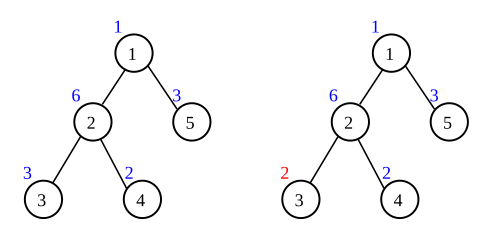
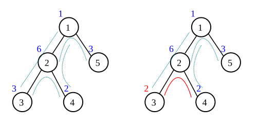

## 문제 설명

$3$개의 원소로 이루어진 수열 $A_1,A_2,A_3$가 다음 $2$가지 조건을 만족하면 카도마츠 열이라고 합니다.

- $A_1,A_2,A_3$가 모두 다릅니다.
- $3$개의 원소 중 $A_2$가 가장 크거나 가장 작습니다.

정점 $i$가 값 $A_i$를 갖는 트리가 다음을 만족하면 카도마츠 트리라고 합니다.

차수가 $2$ 이상인 정점 $v$와 $v$에 인접한 서로 다른 $2$개의 정점 $u,w$를 골랐을 때, 모든 $u,v,w$에 대해 수열 $A_u,A_v,A_w$가 카도마츠 열입니다. (이는 연속한 $3$개의 정점 $u,v,w$를 어떻게 골라도 수열 $A_u,A_v,A_w$가 카도마츠 열이라는 뜻과 같습니다.)

예를 들어 아래 그림의 왼쪽 트리는 $u,v,w$를 어떻게 골라도 카도마츠 열이 되므로 카도마츠 트리입니다. 오른쪽 트리는 $u,v,w=3,2,4$일 때 $A_3,A_2,A_4=2,6,2$가 카도마츠 열이 되지 않으므로 카도마츠 트리가 아닙니다. (원 안의 검은 숫자는 정점 번호이고, 원 밖의 색깔 있는 숫자는 정점의 값입니다.)



비정기적으로 열리는 카도마츠 트리 품평회에서는 트리를 다음과 같이 점수화합니다.

1. 트리가 카도마츠 트리가 아니면 $0$점입니다.
2. 카도마츠 트리이면 트리에 포함된 카도마츠 열의 개수를 점수로 합니다. 차수가 $2$ 이상인 정점 $v$와 인접한 서로 다른 $2$개의 정점 $u,w$에 대해 $A_u,A_v,A_w$가 카도마츠 열이면 정점 집합 $\{u,v,w\}$를 카도마츠 열 $1$개로 셉니다. $\{u,v,w\}$와 $\{w,v,u\}$는 같은 것으로 보아 중복해서 세지 않습니다.

예를 들어 아래 그림의 왼쪽 트리에는 $\{2,1,5\},\{3,2,1\},\{3,2,4\},\{4,2,1\}$의 총 $4$개의 카도마츠 열이 포함되므로 $4$점입니다. 오른쪽 트리는 $\{3,2,4\}$가 카도마츠 열이 되지 않아 카도마츠 트리가 아니므로 $0$점입니다.



かど松さん이 $N$개 정점의 트리를 $1$개 갖고 있으며 정점 $i$는 값 $A_i$를 갖습니다. 이 트리의 부분 트리 $1$개를 품평회에 출품하려고 합니다. 출품할 수 있는 트리는 $1$개뿐일 때 얻을 수 있는 최대 점수를 구하세요.

## 입력

```text
$N$
$A_1\ A_2\ \dots\ A_N$
$x_1\ y_1$
$x_2\ y_2$
$\vdots$
$x_{N-1}\ y_{N-1}$
```

$1$번째 줄에 트리의 정점 수 $N$, $2$번째 줄에 정점 $i$의 값 $A_i$가 공백으로 구분되어 주어지고, 다음 $N-1$줄에 간선 정보가 주어집니다. $i$번째 간선은 정점 $x_i$와 $y_i$를 잇습니다.

입력은 모두 정수입니다.

## 제한

- $1\le N\le5\times10^4$
- $1\le A_i\le10^3$
- $1\le x_i,y_i\le N$
- $x_i\ne y_i$
- 트리는 다중 간선과 자기 루프가 없고 연결되어 있음이 보장됩니다.

## 출력

かど松さん이 얻을 수 있는 최대 점수를 출력하세요.

## 예제

### 예제 1 {file=""}

#### 입력

```text
5
1 6 3 2 3
1 2
2 3
2 4
1 5
```

#### 출력

```text
4
```

문제에서 설명한 왼쪽 트리의 예입니다. 원래 카도마츠 트리이므로 그대로 출품하면 됩니다.

### 예제 2 {file=""}

#### 입력

```text
5
1 6 2 2 3
1 2
2 3
2 4
1 5
```

#### 출력

```text
2
```

문제에서 설명한 오른쪽 트리의 예입니다. 값 $2$인 정점 중 $1$개를 제거했을 때 점수가 최대가 됩니다.

### 예제 3 {file=""}

#### 입력

```text
6
1 2 1 2 1 2
1 2
2 3
3 4
4 5
5 6
```

#### 출력

```text
0
```

`[1]-[2]` 같은 부분 트리는 정의상 카도마츠 트리지만, 트리에 카도마츠 열이 포함되지 않으므로 결국 $0$점입니다.
